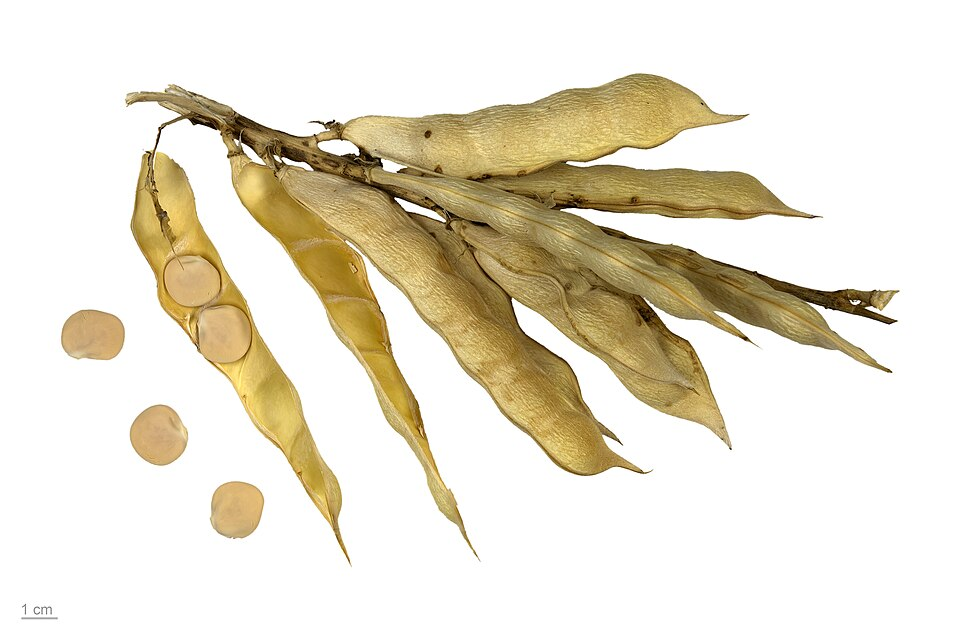

# White Lupin

> **Node ID**: plants.edible-plants.white-lupin
> **Domain**: [Plants](./index.md)
> **Dependencies**: See prerequisites
> **Enables**: [`Edible Plants`](edible-plants.md)
> **Timeline**: Years 0-5
> **Outputs**: edible_plant_material
> **Critical**: No

## Overview

> *Lupinus albus, white lupin, legume, seeds*

> *Image: Roger Culos, CC BY-SA 4.0*

White Lupin

*Lupinus albus* (Fabaceae) is a legumes & pulse species of major importance for civilization bootstrapping. White Lupin provides seeds/nuts as its primary edible product.

Edible parts: Oil, Oil, Seed Oil. Seed - cooked. Used as a protein-rich vegetable or savoury dish in any of the ways that cooked beans are used, they can also be roasted or ground into a powder and mixed with cereal flours in making bread etc. If the seed is bitter this is due to the presence of toxic alkaloids and the seed should be thoroughly leached by soaking it and then discarding the soak water before cooking. Seeds contain 32 - 40% protein, 8 - 12% oil. The roasted seeds can be used as a snack in much the same way as peanuts. An edible oil is obtained from the seed. The roasted seed is used as a coffee substitute.

For civilization bootstrapping, white lupin is significant because of its role as a legumes & pulse. Reliable food production is the foundation upon which all other technological development rests. Understanding the cultivation, processing, and storage of *Lupinus albus* enables communities to establish food security and allocate labor to non-subsistence activities.

*Lupinus albus* is a member of the Fabaceae family. As a legumes & pulse, it provides essential calories, protein, or other nutrients needed to sustain human populations during the bootstrap process. The ability to produce food reliably from cultivated plants is what separates sedentary civilizations from hunter-gatherer societies, because food surplus allows specialization of labor into toolmaking, construction, and eventually metallurgy and beyond.

This species grows as a perennial or annual depending on climate and management. Propagation is primarily by Pre-soak the seed for 24 hours in warm water and sow in mid spring in situ. You may need to protect the seed from mice. Germination should take place within 2 weeks.. Harvest timing depends on the plant part used: seeds/nuts are typically ready at specific growth stages or seasons.

## Prerequisites

### Materials

- Propagation material: Pre-soak the seed for 24 hours in warm water and sow in mid spring in situ. You may need to protect the seed from mice. Germination should take place within 2 weeks.
- Compost or organic matter for soil amendment
- Mulch material for moisture retention and weed suppression

### Equipment

- Hoe or digging stick for soil preparation and planting
- Sickle, machete, or harvesting knife for crop harvest
- Drying racks or flat drying surfaces for post-harvest processing
- Storage containers: woven baskets, ceramic jars, or sacks for dried product
- Winnowing baskets or screens if processing grains or seeds

### Knowledge

- Species identification: Lupinus albus is a ANNUAL growing to 1.2 m (4ft) by 0.3 m (1ft in) at a medium rate. See above for USDA hardiness. It is hardy to UK zone 7. It is in flower from June to July, and the seeds ripen from August to September. The species is hermaphrodite (has both male and female organs) and is pollinat
- Understanding of planting timing relative to local frost dates and rainy seasons
- Knowledge of soil preparation, seed depth, and spacing requirements
- Recognition of common pests and diseases and their early indicators
- Safe preparation methods for any toxic or bitter compounds (see Safety)

### Infrastructure

- Field or garden site with suitable climate, soil type, and sun exposure
- Reliable water access for germination and establishment phase
- Fenced or protected area if animal browsing is a risk
- Storage structure protected from moisture, rodents, and insects

## Process Description

### Cultivation and Propagation

An easily grown plant, succeeding in any moderately good soil. It prefers a light acid soil but tolerates adverse conditions. Requires a sunny position. The white lupin is sometimes cultivated, especially in S. Europe, for its edible seed and also as a green manure crop. There are some named varieties, many of which have bitter seeds that contain toxic alkaloids and require leaching before they are eaten but some sweet varieties have also been developed. These sweet varieties are perfectly wholesome as food for humans and include the cultivar 'Kiev'. There is some confusion between this species and L. nanus. A deep rooting plant. This species has a symbiotic relationship with certain soil bacteria, these bacteria form nodules on the roots and fix atmospheric nitrogen. Some of this nitrogen is utilized by the growing plant but some can also be used by other plants growing nearby. When removing plant remains at the end of the growing season, it is best to only remove the aerial parts of the plant, leaving the roots in the ground to decay and release their nitrogen. Lupinus albus, commonly known as white lupin, is generally suited to USDA Hardiness Zones 6 through 9 when grown as an annual crop, although it can sometimes be cultivated in Zone 5 with a long enough growing season and protection from late frosts. It is a cool-season legume that prefers mild temperatures and does not tolerate extreme heat or prolonged frost. Ideal temperatures for growth range between 50–75°F (10–24°C). In warmer climates, it’s typically grown over the cooler months, while in cooler climates it’s planted in spring after the last frost. Though not frost-hardy once mature, it can handle cool soils at germination and is sometimes fall-sown in Mediterranean climates. Propagation: Pre-soak the seed for 24 hours in warm water and sow in mid spring in situ. You may need to protect the seed from mice. Germination should take place within 2 weeks.

### Harvesting

White lupin is ready for harvest when pods turn from green to yellow-brown and the seeds rattle inside. The pods dehisce (split open) when fully dry, so harvest promptly to avoid seed loss:

1. Cut plants at ground level with sickles when 75-80% of pods have changed color. Gather cut plants into bundles and dry on racks or tarps in the sun for 3-5 days until pods are brittle.
2. Thresh dried bundles by beating with a flail or trampling. Winnow to separate seeds from chaff. Clean seeds should be uniform in color (cream-white for white lupin) with no visible mold or insect damage.
3. Seed yields: 1-2.5 tonnes/ha under dryland conditions; up to 3-4 tonnes/ha with irrigation and good management. Seed protein content: 32-40%, one of the highest among grain legumes.

### ⚠ Alkaloid Removal (Critical Processing Step)

Bitter white lupin varieties contain toxic quinolizidine alkaloids — primarily **lupanine** and **sparteine** — at concentrations of 1-4% of seed dry weight. These alkaloids are bitter-tasting and toxic: ingestion of untreated bitter lupin seeds causes nausea, vomiting, dizziness, cardiac arrhythmia, and in severe cases respiratory paralysis. **All bitter lupin seeds must be debittered before consumption.** Three traditional methods are used:

#### Method 1: Running Water Soak (3-7 days)

The most common traditional method used in Mediterranean countries:

1. Soak whole dry seeds in abundant cold water for 12-24 hours to rehydrate.
2. Drain and transfer soaked seeds to a mesh bag, basket, or perforated container. Place in a stream of clean running water, or suspend in a tank with continuously flowing water.
3. Maintain the soak for 3-7 days. The water leaches the water-soluble alkaloids out of the seeds. Test for readiness by tasting a seed — properly debittered seeds are mildly bland, not bitter.
4. If running water is unavailable, soak in a large container and change the water 3-4 times per day for 5-7 days. This requires more water but is effective.
5. After debittering, boil the seeds in fresh water for 1-2 hours until tender. Drain and serve, or preserve in brine.

#### Method 2: Repeated Boiling (2-3 days)

Used where running water is scarce:

1. Soak dry seeds in water for 12 hours. Drain.
2. Cover soaked seeds with fresh water, bring to a rolling boil, and boil for 30-60 minutes. Drain the bitter cooking water (it contains extracted alkaloids — **do not consume**).
3. Repeat the boil-and-drain cycle 4-6 times over 2-3 days, using fresh water each time. Taste-test a seed after the 4th boil — if still bitter, continue boiling.
4. After the final boil, the seeds should be tender and bland. Drain and use immediately, or preserve in salt brine.

#### Method 3: Salt Brine Method

A variant used in some traditional processing:

1. Soak seeds for 24 hours in fresh water. Drain.
2. Prepare a 5-10% salt brine (50-100 g salt per liter of water). Soak seeds in the brine for 5-7 days, changing the brine daily. The salt slows fermentation and bacterial growth while allowing alkaloid extraction.
3. After brine soaking, boil seeds in fresh water for 1-2 hours until tender. The salt is removed during boiling. Taste-test before consuming.

#### Sweet Lupin Varieties

Modern plant breeding has produced **sweet lupin** varieties with alkaloid content below 0.02% — low enough to be safe for consumption without debittering. These varieties (including *L. albus* 'Kiev Mutant', *L. angustifolius* cultivars) are the standard for commercial lupin production in Australia and Europe. Sweet lupins still benefit from soaking (to improve digestibility and remove anti-nutritional factors like trypsin inhibitors) but do not require the extended debittering process.

**Important**: Never assume a lupin variety is sweet unless confirmed by source or taste test. Bitter lupins taste intensely bitter even in small quantities. If in doubt, always debitter.

### Cooking and Flour Production

After debittering (or when using sweet varieties), lupin seeds can be prepared in several ways:

1. **Boiled lupin beans**: Boil debittered seeds in salted water for 1-2 hours until tender. Eat as a snack (common in Mediterranean countries — lupini beans), or add to salads and stews. The texture is firm and slightly creamy.
2. **Roasted lupin**: Soak seeds 12 hours, drain, then dry-roast in a pan or oven at 180°C for 15-20 minutes, stirring frequently. Produces a crunchy, nutty snack. Can be ground into roasted lupin flour.
3. **Lupin flour**: Grind dry, debittered seeds in a stone mill to produce a high-protein flour (32-40% protein). Mix with wheat or other cereal flours at 10-30% to boost protein content in breads and pasta. Lupin flour is gluten-free but produces dense bread when used alone — best as a supplement to wheat flour.
4. **Lupin coffee**: Roast dry seeds at 200°C until dark brown. Grind coarsely and brew like coffee. Produces a caffeine-free hot beverage with a nutty flavor.

### Process Parameters

| Parameter | Range | Notes |
|-----------|-------|-------|
| Seed protein content | 32-40% | Among highest for grain legumes |
| Seed oil content | 8-12% | Used for soap and cooking |
| Seed yield | 1-2.5 tonnes/ha | Dryland; up to 3-4 t/ha irrigated |
| Alkaloid content (bitter) | 1-4% | Lupanine, sparteine — toxic |
| Alkaloid content (sweet) | <0.02% | Safe without debittering |
| Running water soak time | 3-7 days | Traditional debittering |
| Repeated boiling cycles | 4-6 changes over 2-3 days | Alternative debittering |
| Brine soak concentration | 5-10% salt | For 5-7 days |
| Boil time (post-debitter) | 1-2 hours | Until tender |
| Roast temperature | 180-200°C | 15-20 minutes |
| Flour protein content | 32-40% | High-protein supplement flour |
| Growing period | 100-150 days | Cool-season legume |
| Optimal growth temp | 10-24°C | Does not tolerate extreme heat |

### Distribution and Growing Conditions

S. Europe to Asia. TEMPERATE ASIA: Turkey (west) EUROPE: Former Yugoslavia, Albania, Bulgaria, Greece (incl. Crete)

### Identification

Lupinus albus is a ANNUAL growing to 1.2 m (4ft) by 0.3 m (1ft in) at a medium rate. See above for USDA hardiness. It is hardy to UK zone 7. It is in flower from June to July, and the seeds ripen from August to September. The species is hermaphrodite (has both male and female organs) and is pollinated by Bees. The plant is self-fertile. It can fix Nitrogen. It is noted for attracting wildlife. Suitable for: light (sandy) and medium (loamy) soils. Suitable pH: mildly acid, neutral and basic (mildly alkaline) soils and can grow in very acid soils. It cannot grow in the shade. It prefers moist soil.

### Edible Parts and Preparation

## Quantitative Parameters

### Growing Parameters

| Parameter | Value | Notes |
|-----------|-------|-------|
| Edible parts | Seeds/Nuts | Primary harvest |

## Processing and Storage

### Non-Food Uses

Cosmetic Fibre Green manure Oil Oil. The seed contains up to 12% oil. This is used in making soap. A fibre obtained from the stems is used for making cloth etc. A cosmetic face-mask can be made from lupin flour, this is used to invigorate tired skin. A useful spring-sown green manure crop, especially on light soils. It is deep rooting, fairly fast growing, produces a good bulk and fixes atmospheric nitrogen. Dynamic accumulator.

### Storage

Dry seeds thoroughly to below 14% moisture content before storage. Spread in thin layers on drying racks in full sun, stirring periodically. Test dryness by biting: properly dried seeds crack rather than dent. Store in airtight containers (ceramic jars with tight lids, sealed woven bags) in a cool, dry, dark location. Protect from rodents and insects with tight lids or by mixing with inert ash. Under good conditions, dried grains and legumes store for 1-5 years with minimal loss.

### Material Handling

Handle white lupin produce with clean hands and tools to prevent contamination. Remove field heat promptly after harvest by moving product to shade. Process within the recommended timeframe to prevent quality loss. Compost crop residues and processing waste to return organic matter to the soil. Label stored products with harvest date, variety, and any treatments applied.

## Scaling Notes

- **Bench scale**: Individual plants or small garden plot (10-50 plants). Output for direct household consumption. Useful for seed saving, variety selection, and learning the crop's behavior under local conditions.
- **Pilot scale**: Field planting of 0.1 to 1 hectare (500-5,000 plants). Staggered planting or sequential harvests to extend availability. Requires basic hand tools and family-level labor. Surplus can be traded or stored.
- **Production scale**: Multi-hectare cultivation with mechanized planting, harvesting, and processing. Requires plow animals or tractors, grain mills or processing equipment, and bulk storage facilities. Enables community-level food security and trade.

Key scaling challenges include maintaining genetic diversity at plantation scale, managing pest and disease pressure in monoculture, and matching post-harvest processing capacity to harvest volume. Seed saving and variety selection at bench scale directly informs decisions about which cultivars to scale up.

## Troubleshooting

| Problem | Probable Cause | Solution |
|---------|---------------|----------|
| Poor germination | Old seed, wrong soil temperature, planted too deep, or insufficient moisture | Use fresh seed; verify germination temperature range; plant at recommended depth; maintain soil moisture during germination |
| Pest damage | Insect infestation or browsing animals | Hand-pick pests; use companion planting with repellent species; install fencing for larger pests |
| Disease (fungal/bacterial) | Poor air circulation, excessive moisture, infected seed | Space plants adequately; avoid overhead watering; use clean seed from disease-free plants; practice crop rotation |
| Low yield | Nutrient deficiency, water stress, overcrowding, or shade | Amend soil with compost or manure; ensure adequate water at critical growth stages; thin to recommended spacing; plant in full sun |
| Storage losses | Insufficient drying, rodent/insect damage, high humidity | Dry product thoroughly before storage; use sealed containers; inspect stored product regularly; keep storage area clean and dry |

## Safety Considerations

Working with *Lupinus albus* involves the following hazards:

- **⚠ ALKALOID TOXICITY WARNING**: Bitter lupin varieties contain quinolizidine alkaloids (lupanine, sparteine) at 1-4% of seed dry weight. These compounds are toxic if consumed without proper debittering. Symptoms include nausea, vomiting, dizziness, sweating, blurred vision, cardiac arrhythmia, and in severe cases respiratory paralysis. **Always debitter bitter lupin seeds using one of the methods described above before consumption. Never eat untreated bitter lupin seeds.** Sweet lupin varieties (alkaloid content <0.02%) are safe after normal cooking. If you cannot confirm the variety, assume it is bitter and debitter it.
- **Toxicity**: Parts of this plant may contain compounds that are toxic when raw or improperly prepared. Always follow proper preparation procedures before consumption. Verify with multiple authoritative sources.
- Tool injuries during harvest and processing — use sharp tools in good condition and cut away from the body
- Allergic reactions to plant compounds — sensitive individuals should test small quantities first
- Sun exposure and heat stress during field work — schedule heavy work for early morning or late afternoon
- Musculoskeletal strain from repetitive harvesting motions — vary tasks and take regular breaks

### Personal Protective Equipment

- Sturdy gloves when handling plants with irritant sap, spines, or rough surfaces
- Long sleeves and trousers for field work to reduce skin exposure to irritants and insects
- Eye protection when using cutting tools overhead or near face level
- Sun hat and sunscreen for extended field work

### Emergency Procedures

- For suspected plant poisoning: stop eating immediately, save a sample of the plant material, and seek medical attention. Do not induce vomiting unless directed by a medical professional.
- For tool lacerations: apply direct pressure with a clean cloth, elevate the wound, and seek medical attention for cuts deeper than skin level.
- For allergic reaction (swelling, difficulty breathing): discontinue exposure immediately and seek emergency medical help.

## Quality Control

### Acceptance Criteria

- Harvest product shows expected color, texture, size, and flavor for the variety grown
- No visible mold, rot, pest damage, or foreign material in stored product
- Dried products are brittle throughout with no flexible or moist spots
- Seeds intended for storage test at below 14% moisture content

### Testing Methods

- **Visual inspection**: check for discoloration, mold, insect damage, or foreign material
- **Bite test (seeds/grains)**: properly dried seeds crack cleanly; under-dried seeds dent or feel leathery
- **Smell test**: fresh product has characteristic aroma; off-odors indicate spoilage or contamination
- **Snap test (dried products)**: properly dried material snaps rather than bends

### Sampling Protocol

For field-scale production, inspect every 10th plant during harvest for disease and pest damage. Grade each batch by size and quality before storage. Record yield per unit area to track productivity trends across seasons and identify declining performance early.

## Variations and Alternatives

### Medicinal Uses

Diuretic Emmenagogue Hypoglycaemic Vermifuge. The seeds, taken internally, are diuretic, emmenagogue, hypoglycaemic and vermifuge. When bruised and soaked in water they are used as a poultice on ulcers etc.

### Other Uses

### Related Species

- [Garden Pea](garden-pea.md)
- [Lentil](lentil.md)
- [Chickpea](chickpea.md)
- [Cowpea](cowpea.md)
- [Fava Bean](fava-bean.md)

### Cultivar Selection

Within *Lupinus albus*, considerable variation exists in yield, disease resistance, climate adaptation, and quality characteristics. When establishing a white lupin crop, select varieties adapted to local conditions: day length, temperature range, rainfall pattern, and soil type. Landrace varieties — locally adapted populations maintained by traditional farmers — often outperform modern cultivars under low-input conditions because they have been selected for resilience rather than maximum yield under optimal conditions.

Seed saving from the best-performing plants each generation gradually adapts the variety to local conditions. Select for vigor, disease resistance, appropriate maturity timing, and product quality. Maintain genetic diversity by saving seed from multiple plants rather than a single individual, which preserves the population's ability to adapt to changing conditions and disease pressures.

### Crop Rotation and Companion Planting

*Lupinus albus* is a nitrogen-fixing legume, making it an excellent predecessor crop for nitrogen-demanding cereals and brassicas. The root nodules host Rhizobium bacteria that convert atmospheric nitrogen into plant-available forms, leaving residual nitrogen in the soil after harvest. Rotate with non-legume crops to break pest and disease cycles.

Companion planting with aromatic herbs or flowering plants can deter pests and attract beneficial insects. Avoid planting near species that compete for the same nutrients or harbor shared pathogens.

*Lupinus albus* is a nitrogen-fixing legume that produces substantial biomass, making it valuable as both a food crop and a green manure. The deep taproot breaks up compacted soil layers and brings nutrients to the surface. Rotate with cereals to break disease cycles. Lupin's alkaloid content (in bitter varieties) deters grazing animals, which can be an advantage or disadvantage depending on the context. Sweet (low-alkaloid) varieties require more protection from pests.

### Toxicity Warning

Bitter lupin varieties contain quinolizidine alkaloids (lupinine, sparteine) that are toxic if consumed without proper processing. Traditional preparation involves soaking seeds in running water for several days to leach out the alkaloids. Sweet lupin varieties have been bred for low alkaloid content and require less processing. Always verify the variety before consumption.

## References

- [Edible Plants](edible-plants.md) — parent capability
- [Plants Domain](./index.md) — domain overview and related capabilities
- [Agave](agave.md) — example plant article format
- [Food Processing](../food-processing/index.md) — downstream processing of harvested crops
- [Agriculture](../agriculture/index.md) — cultivation systems and crop rotation
- Family: Fabaceae
- Data sourced from Food Plants International, Wikipedia, and iNaturalist via the Edible Plant Database (ZIM)
- Plants for a Future (pfaf.org) — supplementary cultivation and use data

---
*Part of the [Bootciv Tech Tree](../index.md) · [Plants](./index.md) · [All Domains](../index.md)*
