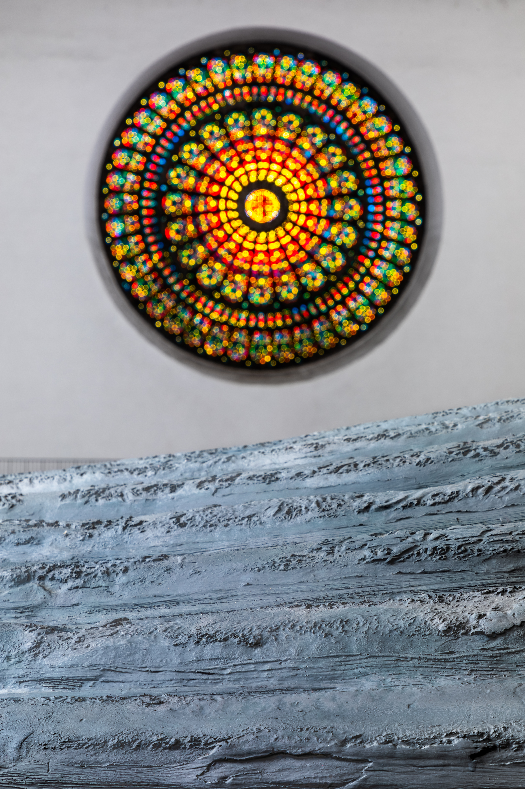
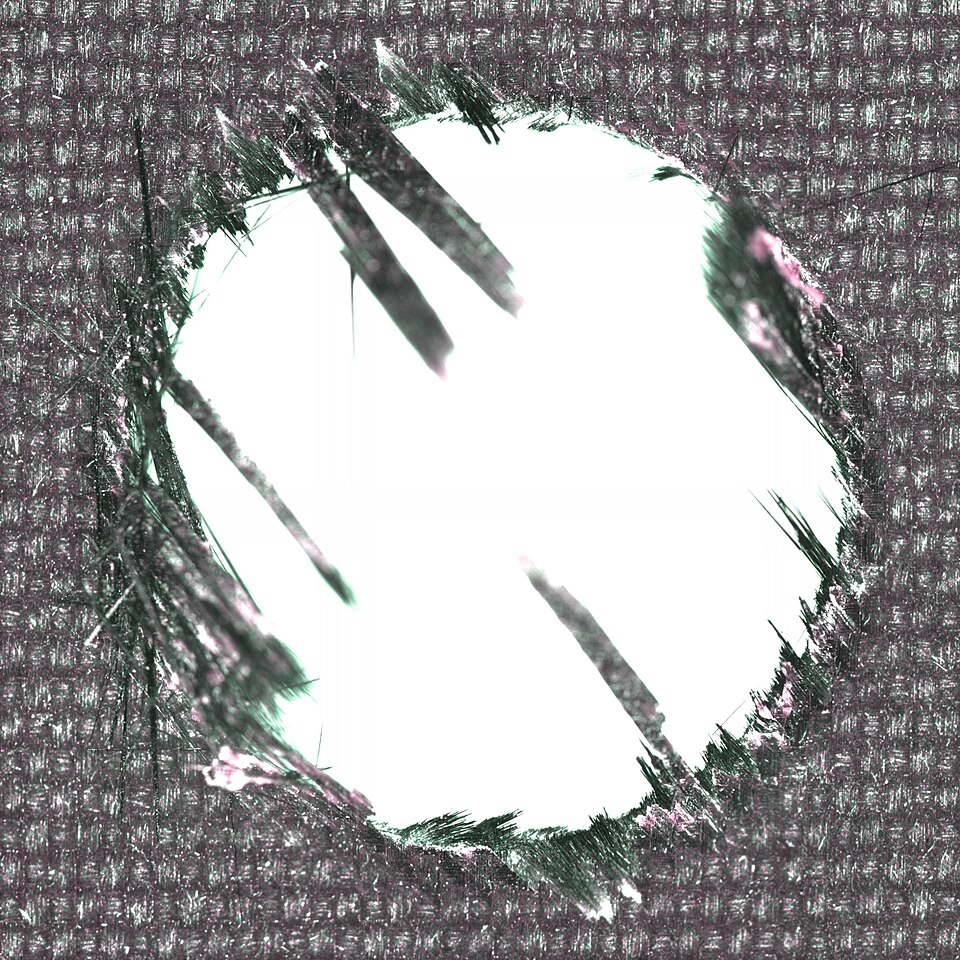
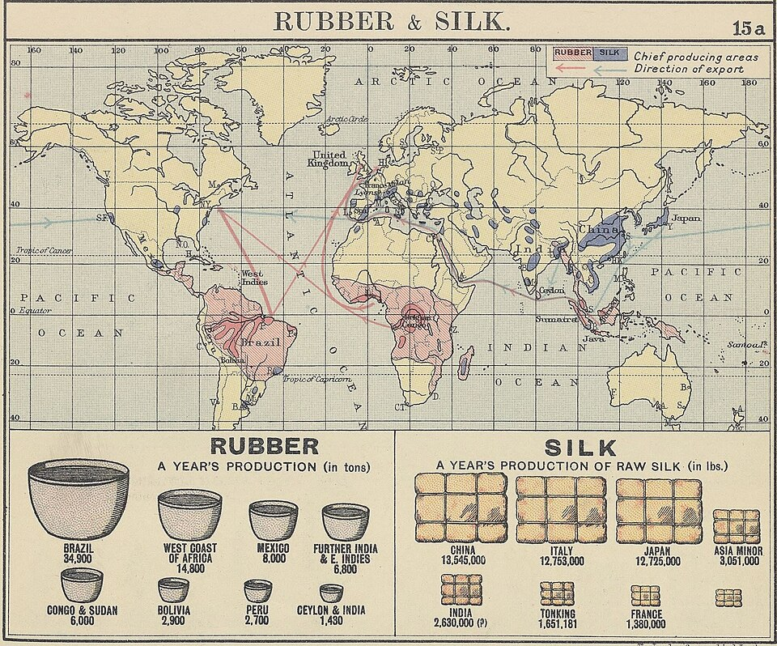
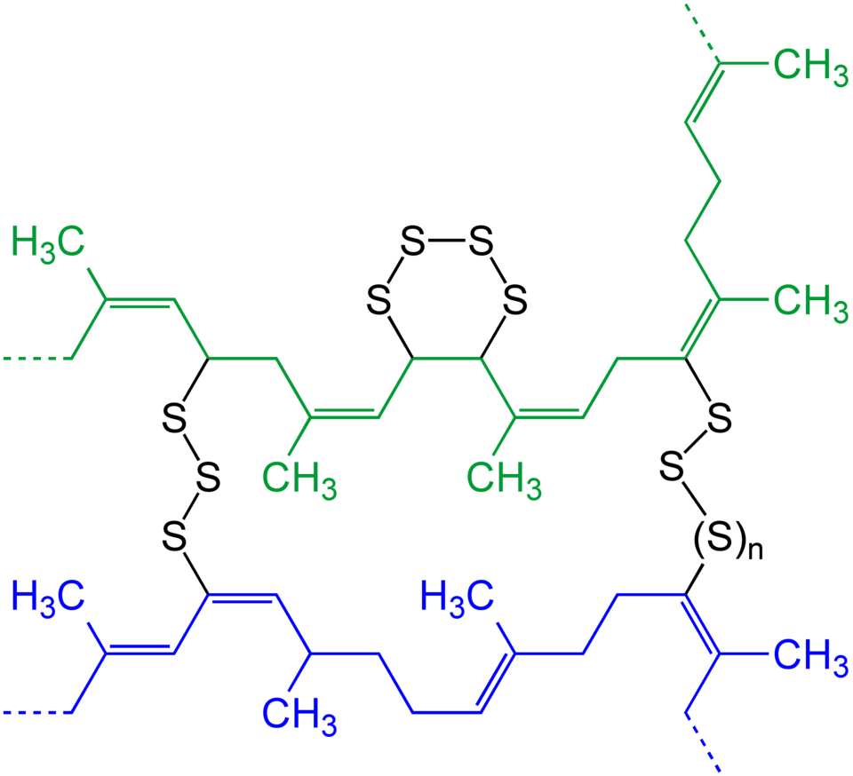
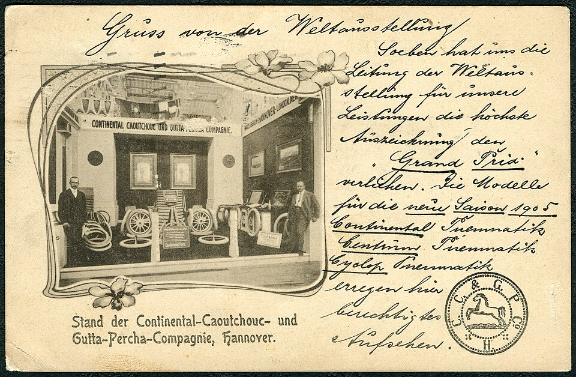
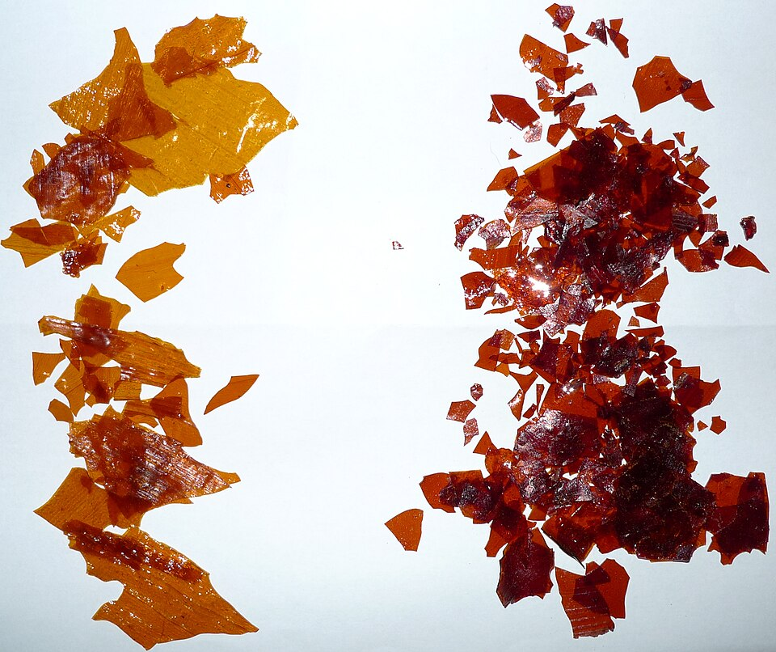
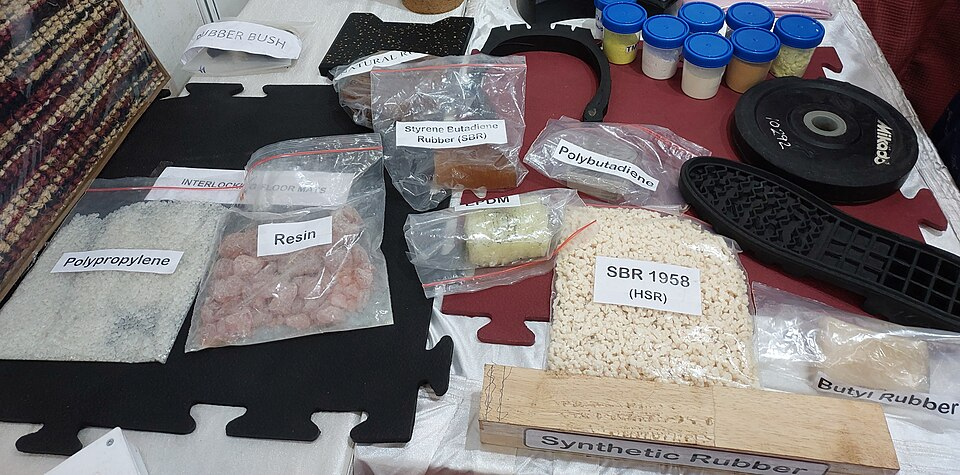
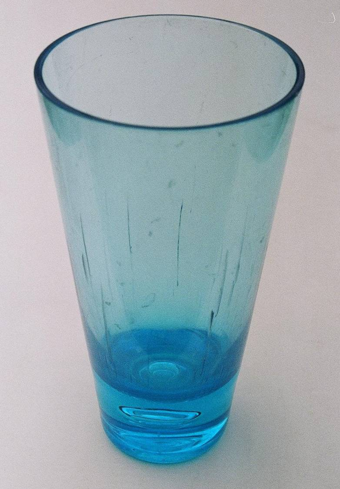
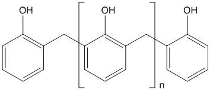
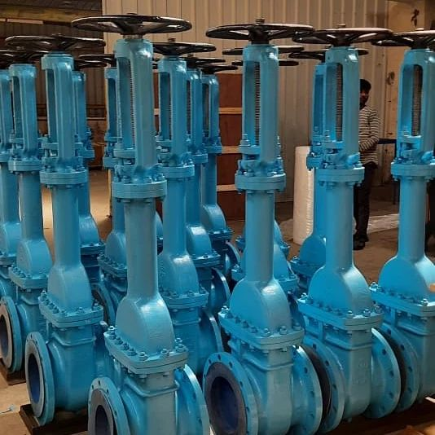

# Polymers & Composites

> *Image: Dietmar Rabich, CC BY-SA 4.0*

> *Detail of The Cast Whale Project — a polymer sculpture by Gil Shachar*

> *Image: Dietmar Rabich, CC BY-SA 4.0*

Capabilities in this domain:

> *Image: 4ewip, CC BY-SA 4.0*

- [Composite Materials](composites.md) — Fiberglass production (E-glass fiber from silica/boron batch, 5-25 μm filaments), hand layup, vacuum bagging, resin transfer molding, and filament winding.

> *Image: Larrick, Don, Public domain*

- [Rubber Production](rubber.md) — Natural and synthetic rubber production, vulcanization, and rubber product manufacturing.

> *Image: Jü, CC0*

- [Natural Rubber & Vulcanization](natural.md) — Latex collection, coagulation, mastication, compounding with sulfur and carbon black, and vulcanization.

> *Image: George Philip and Son (Londres). Auteur du texte, Public domain*

- [Vulcanization & Hardness Scales](rubber.vulcanization.md) — Sulfur cross-linking process converting raw rubber into durable elastomers with stable mechanical properties, enabling tires, seals, gaskets, and hoses.

> *Image: differents, CC BY-SA 3.0*

- [Gutta-Percha Processing](gutta-percha.md) — Processing of gutta-percha for underwater electrical insulation, dental fillings, and tool handles.

> *Image: Nuberger13 at en.wikipedia, Public domain*

- [Shellac Production](shellac.md) — Shellac resin production from lac bug secretion for wood finishing, electrical insulation, and phonograph records.

> *Image: Vis M, CC BY-SA 4.0*

- [Synthetic Rubbers](synthetic.md) — Nitrile rubber (NBR), neoprene, and silicone elastomers for oil resistance, wire insulation, and high-temperature seals.

> *Image: George Philip and Son (Londres). Auteur du texte, Public domain*

- [Elastomers in Semiconductor Equipment](rubber.semiconductor-apps.md) — Fluorinated and specialty elastomers for semiconductor seals, gaskets, and liners that withstand aggressive chemicals, elevated temperatures, and ultra-clean conditions.

> *Image: Jim.henderson, CC0*

- [Thermoplastic Polymers](thermoplastics.md) — Polyethylene (LDPE/HDPE — films, containers, wire insulation), PVC (rigid pipe, flexible tubing, requires heat stabilizers), nylon (bearings, gears, engineering components), polystyrene (labware, insulation foam), and PTFE/Teflon (chemically inert, ultra-low friction, -200°C to +260°C, for seals and non-stick surfaces).

> *Image: International Union of Pure and Applied Chemistry (IUPAC), CC BY-SA 4.0*

- [Thermosetting Polymers](thermosets.md) — Phenol-formaldehyde (Bakelite — electrical insulators, photoresist binders), epoxy resins (structural adhesive, die attach, IC encapsulation), phenolic/epoxy FR-4 laminate (PCB substrate), unsaturated polyester resin (fiberglass matrix), and polyurethane (foams, elastomers).

> *Image: Valvesonlyusa03, CC0*

- [Seals, Gaskets & Packing](seals-gaskets.md) — O-ring manufacturing (molding, durometer selection, groove dimensions), gasket cutting from sheet materials (rubber, cork-rubber, PTFE, compressed fiber), compression packing for valve stems and pump shafts, and lip seal construction for rotating shafts.

[↑ Back to Tech Tree](../../index.md)
