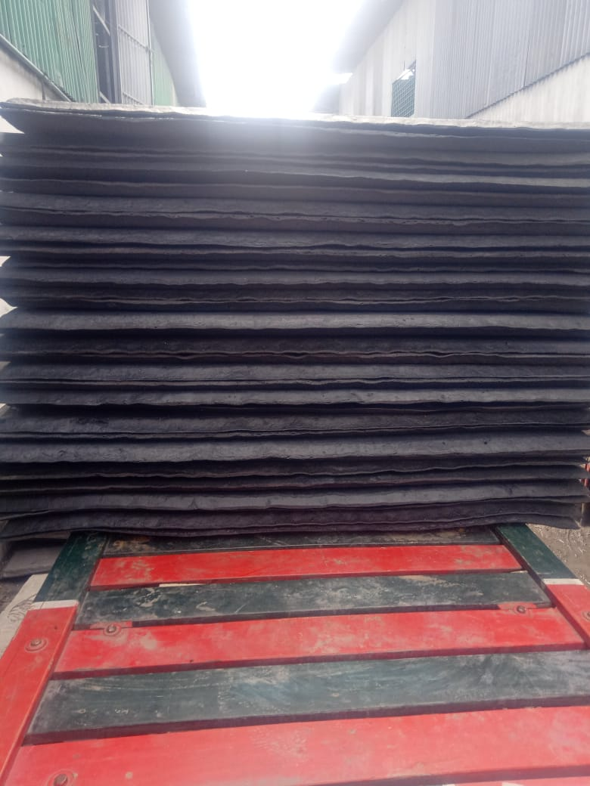

# Synthetic Rubbers

> **Node ID**: polymers.rubber.synthetic
> **Domain**: [Polymers](./index.md)
> **Dependencies**: See prerequisites
> **Enables**: [`Chemistry`](../chemistry/index.md), [`Petroleum & Alternative Chemistry`](../chemistry/petroleum-alternatives.md), [`Metal Forming`](../metals/forming.md)
> **Timeline**: Years 20-50
> **Outputs**: nitrile_rubber, neoprene, silicone_elastomers
> **Critical**: No

## Overview

> *Raw synthetic rubbers*

> *Image: Vis M, CC BY-SA 4.0*

Synthetic rubbers are elastomers produced by polymerizing petroleum-derived or chemically synthesized monomers. Unlike natural rubber (cis-1,4-polyisoprene from Hevea trees), synthetic rubbers can be tailored for specific resistance properties: oil, heat, ozone, chemicals, or flame. Three families anchor industrial synthetic rubber production: nitrile rubber (NBR), polychloroprene (neoprene), and silicone elastomers.

Nitrile rubber, a copolymer of acrylonitrile and butadiene, excels at resisting oils, fuels, and solvents. The acrylonitrile content (typically 18 to 50 percent) controls the balance between oil resistance and low-temperature flexibility. Higher acrylonitrile content improves oil resistance but raises the glass transition temperature, making the rubber stiff at cold temperatures. NBR is the standard material for fuel hoses, O-rings, gaskets, and oil seals in engines and hydraulic systems.

Neoprene (polychloroprene) was one of the first synthetic rubbers developed, originally intended as a natural rubber substitute. DuPont commercialized it in 1932 under the name Duprene, later shortened to neoprene. The chlorine atom on the polymer backbone provides inherent flame resistance, moderate oil resistance, and excellent ozone and weather resistance. Neoprene finds use in wetsuits, industrial hoses, conveyor belts, and electrical insulation where its combination of properties makes it hard to replace. Neoprene is more expensive than NBR on a per-kilogram basis, but its balance of properties means it gets specified where nothing else will do.

Silicone elastomers (polydimethylsiloxane, PDMS) occupy the high-temperature end of the rubber spectrum. Their inorganic silicon-oxygen backbone, with organic methyl groups attached to silicon, gives them thermal stability from minus 60 to over 200 degrees C, far beyond what carbon-backbone rubbers can tolerate. Silicone rubber is flexible, biocompatible, and electrically insulating. It is used for high-temperature seals, medical tubing, food-contact molds, and electrical insulation on wires and connectors. The price per kilogram is 5 to 20 times that of NBR or neoprene, which limits its use to applications where its unique temperature range or biocompatibility is essential.

Primary outputs: `nitrile_rubber`, `neoprene`, `silicone_elastomers`.

## Prerequisites

### Materials

- **Butadiene (CH2=CH-CH=CH2)**: A four-carbon diene monomer derived from steam cracking of naphtha. The primary building block for NBR and many other synthetic rubbers. Butadiene is stored as a liquefied gas under pressure and handled with the same precautions as LPG
- **Acrylonitrile (CH2=CH-CN)**: A three-carbon monomer with a nitrile group. Provides oil and fuel resistance when copolymerized with butadiene. Produced by ammoxidation of propylene (the SOHIO process). Acrylonitrile is a volatile, flammable liquid with significant toxicity by both inhalation and skin absorption
- **Chloroprene (CH2=CCl-CH=CH2)**: The monomer for neoprene. Produced from butadiene via chlorination and dehydrochlorination. The chlorine substituent gives neoprene its flame and oil resistance
- **Chlorosilanes or cyclical siloxanes**: The starting materials for silicone elastomers. Dimethyldichlorosilane, produced by the Rochow process (copper-catalyzed reaction of silicon metal with methyl chloride), is hydrolyzed and polymerized to form PDMS. The Rochow process is the key enabling technology for silicone production and requires metallurgical-grade silicon as a feedstock
- **Catalysts and initiators**: Free-radical initiators (potassium persulfate, organic peroxides) for emulsion polymerization. Ziegler-Natta or anionic catalysts for stereoregular polymerization. Platinum complex catalysts for addition-cure silicone systems
- **Fillers and reinforcing agents**: Carbon black (for NBR), silica, clay, and calcium carbonate. Fillers modify mechanical properties and reduce cost. Carbon black is the most important reinforcing filler: it increases tensile strength by a factor of 5 to 10 compared to unfilled rubber, and dramatically improves abrasion resistance. The reinforcing effect comes from the high surface area of carbon black particles (20 to 150 m2/g depending on grade) and the physical and chemical bonds that form between the particle surface and the polymer chains

### Equipment

- **Reactor vessels**: Jacketed stainless steel or glass-lined reactors with agitators. Emulsion polymerization reactors (NBR, neoprene) are typically 10 to 50 cubic meters. Bulk polymerization reactors for silicone are smaller but operate at higher temperatures
- **Agitators and baffles**: High-shear mixers for emulsion systems. Proper agitation controls particle size and heat removal in exothermic polymerizations. Inadequate mixing leads to large latex particles, broad molecular weight distribution, and localized hot spots that cause gel formation
- **Coagulation and washing system**: For emulsion processes, acid or salt solutions break the emulsion, coagulating the rubber as crumb. Washing removes residual soap and unreacted monomer. The coagulation step must be carefully controlled: too much coagulant creates fine particles that are difficult to filter, too little leaves rubber in the wastewater stream
- **Dryer**: Band dryers or fluidized bed dryers remove water from coagulated rubber crumb. Target moisture below 1 percent. Excessive drying temperatures degrade the rubber (crosslinking, oxidation) while insufficient drying leaves moisture that causes porosity in molded parts downstream
- **Banbury mixer or two-roll mill**: For compounding raw polymer with fillers, plasticizers, and curing agents before shaping. The Banbury mixer is the standard for large-scale compounding. The two-roll mill is used for smaller batches and for adding heat-sensitive curatives to pre-mixed masterbatch

### Knowledge

- Copolymerization kinetics: how monomer reactivity ratios determine the composition drift during polymerization and how to control it by semi-batch monomer addition
- Glass transition temperature (Tg) and how monomer composition shifts it. NBR Tg ranges from minus 50 to minus 10 degrees C depending on acrylonitrile content
- Emulsion polymerization mechanism: micelle nucleation, particle growth, and the role of surfactants and chain transfer agents
- Silicone chemistry: condensation cure versus addition cure (platinum-catalyzed hydrosilylation), and why each is chosen for specific applications

### Infrastructure

- A monomer storage and handling area with blast-resistant construction and flammable vapor monitoring. Butadiene and acrylonitrile are both flammable and toxic. Storage tanks must be equipped with pressure relief valves, flame arresters, and continuous leak detection. Monomer transfer lines must be purged with nitrogen before and after each transfer to prevent fire and explosion
- Temperature-controlled reactor hall with ventilation for monomer vapors. The ventilation rate must be sufficient to keep monomer concentrations below the occupational exposure limit even during a moderate spill scenario
- Wastewater treatment for emulsion polymerization effluent, which contains soap, short-chain polymers, and residual monomer. The wastewater must be treated to remove organic carbon (biological treatment or activated carbon) before discharge

## Process Description

### Nitrile Rubber (NBR) by Emulsion Polymerization

NBR is produced by cold emulsion polymerization, a process that suspends the monomers in water as micelles and polymerizes them using water-soluble free-radical initiators. The emulsion method has two advantages over bulk or solution polymerization: the water acts as a heat sink for the exothermic reaction, and the polymer is produced as discrete latex particles rather than a viscous mass that becomes harder to stir as molecular weight increases.

1. **Emulsion preparation**: Dissolve surfactant (sodium dodecyl sulfate or fatty acid soap) and electrolyte in deionized water in the reactor. Cool to 5 to 10 degrees C (cold polymerization is standard for NBR to control branching and gel formation)
2. **Monomer charging**: Add butadiene and acrylonitrile in the desired ratio. The reactor is pressurized because butadiene is a gas at room temperature (boiling point minus 4 degrees C)
3. **Initiation**: Add a free-radical initiator system. Cold recipes use a redox pair: an organic hydroperoxide with a reducing agent (ferrous sulfate complex). The redox reaction generates radicals at low temperature without excessive heat
4. **Polymerization**: The reaction proceeds at 5 to 10 degrees C over 8 to 16 hours. Conversion reaches 70 to 85 percent. Chain transfer agents (mercaptans) control molecular weight and prevent excessive crosslinking. The polymer forms as latex particles (100 to 300 nm diameter) suspended in the aqueous phase
5. **Shortstop**: Add a radical scavenger (hydroquinone or sodium dimethyldithiocarbamate) to terminate the reaction at the target conversion. Over-conversion produces gel (crosslinked rubber) that degrades processing properties
6. **Monomer recovery**: Unreacted butadiene is flashed off under vacuum and recycled. Acrylonitrile is stripped with steam
7. **Coagulation**: Add acid (sulfuric acid) or salt (calcium chloride) solution to break the emulsion. The latex particles aggregate into rubber crumb
8. **Washing and drying**: Wash the crumb to remove soap and salts. Pass through a band dryer at 100 to 130 degrees C. Target moisture below 0.5 percent. Bale the dry crumb for shipment

### Neoprene by Emulsion Polymerization

Neoprene is polymerized from chloroprene using a similar emulsion process to NBR, but with some important differences. Chloroprene polymerizes much faster than the butadiene-acrylonitrile pair, so reaction times are shorter and heat removal is more demanding. The chlorine atom also affects the polymerization kinetics, making the reaction less sensitive to oxygen inhibition.

1. **Emulsion polymerization**: Chloroprene monomer is emulsified in water with surfactant and polymerized using a free-radical initiator at 10 to 40 degrees C. The reaction is faster than NBR polymerization due to the reactivity of chloroprene
2. **Molecular weight regulation**: Sulfur or chain transfer agents (n-dodecyl mercaptan) control the molecular weight. Sulfur-modified grades incorporate sulfur into the polymer backbone, improving crystallization resistance and processing behavior. Non-sulfur-modified grades have better storage stability and are preferred for adhesives and molded goods
3. **Coagulation, washing, and drying**: Similar to NBR. Neoprene crumb is dried and baled. Neoprene is also sometimes sold as a latex concentrate (for dip molding of gloves and balloons) rather than as dried crumb. In this case, the latex is concentrated by evaporation or creaming rather than coagulated

Neoprene latex is particularly useful for dip-molded products because it gelates on contact with a heated former without requiring a coagulant bath. This property, unique to polychloroprene among the synthetic rubbers, simplifies the production of coated fabrics and dipped goods.

### Silicone Elastomers

Silicone rubber production follows a fundamentally different chemistry from NBR or neoprene. Instead of polymerizing a monomer with a carbon-carbon double bond, silicone starts from chlorosilanes that are hydrolyzed to form siloxane rings, which are then opened and polymerized into long chains. The resulting polymer has a silicon-oxygen backbone (Si-O-Si) with organic side groups, giving it thermal properties that no carbon-backbone rubber can match.

1. **Chlorosilane hydrolysis**: Dimethyldichlorosilane is hydrolyzed with water, producing a mixture of linear and cyclic siloxanes plus hydrochloric acid. The cyclic octamer (D4) and tetramer (D4) are the primary products
2. **Ring-opening polymerization**: The cyclic siloxanes are polymerized using an acid or base catalyst. Potassium hydroxide or sulfuric acid opens the rings and links them into long polydimethylsiloxane (PDMS) chains. Molecular weight is controlled by the amount of chain terminator (hexamethyldisiloxane)
3. **Compounding**: The raw PDMS gum is mixed on a two-roll mill or in a Banbury mixer with reinforcing silica filler (fumed silica, 20 to 40 percent by weight), pigment, and curing agents. For heat-cured rubber (HCR) silicone, organic peroxides (dicumyl peroxide, 2,4-dichlorobenzoyl peroxide) are added as crosslinking agents
4. **Shaping and curing**: The compounded silicone is extruded, molded, or calendered to shape, then cured in a heated mold or continuous vulcanizing line at 150 to 200 degrees C for 5 to 30 minutes depending on section thickness

### Process Parameters

| Parameter | Range | Notes |
|-----------|-------|-------|
| NBR polymerization temperature | 5 to 10 degrees C (cold) or 30 to 50 degrees C (hot) | Cold process gives better properties |
| NBR acrylonitrile content | 18 to 50% | Higher = more oil resistant, less flexible at low temperature |
| NBR conversion | 70 to 85% | Stopped to prevent gel formation |
| Neoprene polymerization temperature | 10 to 40 degrees C | Faster reaction than NBR |
| Silicone ring-opening temperature | 100 to 150 degrees C | Base or acid catalyzed |
| Silicone peroxide cure temperature | 150 to 200 degrees C | 5 to 30 minutes depending on section thickness |
| Filler loading (carbon black in NBR) | 20 to 50 phr | phr = parts per hundred rubber |

### Monomer Ratios and Polymerization Conditions

**NBR monomer ratios and their effects**:

| NBR Grade | Acrylonitrile (mol%) | Butadiene (mol%) | Tg (°C) | Oil Resistance | Low-Temp Flexibility | Primary Application |
|-----------|---------------------|------------------|---------|----------------|---------------------|-------------------|
| High nitrile | 45-50% | 50-55% | -10 to -5 | Excellent | Poor (stiff below -5°C) | Fuel hoses, seals for aggressive oils |
| Medium-high nitrile | 34-40% | 60-66% | -25 to -15 | Very good | Moderate | O-rings, gaskets, oil seals |
| Medium nitrile | 26-33% | 67-74% | -35 to -25 | Good | Good | General-purpose oil-resistant parts |
| Low nitrile | 18-25% | 75-82% | -50 to -35 | Moderate | Excellent (flexible to -40°C) | Cold-weather fuel lines, refrigeration seals |

The acrylonitrile-butadiene ratio is the single most important formulation decision for NBR. Acrylonitrile provides polar nitrile groups (—C≡N) that attract the non-polar hydrocarbon chains in oils and fuels. More nitrile groups means the polymer interacts more strongly with the oil molecules, swelling less and maintaining its mechanical properties in contact with petroleum products. However, the same polarity makes the polymer chains stiffer at low temperature because the nitrile groups form dipole-dipole interactions between chains that restrict molecular motion. The glass transition temperature shifts approximately 2°C higher for each 1% increase in acrylonitrile content.

**Polymerization conditions detail**:

| Parameter | NBR (Cold) | NBR (Hot) | Neoprene | Silicone (PDMS) |
|-----------|-----------|----------|----------|-----------------|
| Reactor type | Jacketed SS, 10-50 m³ | Jacketed SS, 10-50 m³ | Jacketed SS, 10-50 m³ | Glass-lined or SS, 1-10 m³ |
| Pressure | 2-5 atm (butadiene vapor) | 2-5 atm | 1 atm | 1 atm |
| Temperature | 5-10°C | 30-50°C | 10-40°C | 100-150°C (polymerization) |
| Initiator | Redox: hydroperoxide + Fe²⁺ | Potassium persulfate | Potassium persulfate | KOH or H₂SO₄ catalyst |
| Surfactant | Fatty acid soap, 1-5% | Fatty acid soap, 1-5% | Sodium naphthalene sulfonate | None (bulk process) |
| Reaction time | 8-16 hours | 6-12 hours | 2-8 hours | 2-6 hours |
| Chain transfer agent | n-Dodecyl mercaptan, 0.1-0.5% | n-Dodecyl mercaptan, 0.1-0.5% | n-Dodecyl mercaptan or sulfur | Hexamethyldisiloxane (endblocker) |
| Conversion | 70-85% | 75-90% | 70-85% | 90-98% |
| Shortstop | Hydroquinone or dithiocarbamate | Hydroquinone | Dithiocarbamate | Cool to quench |

Cold polymerization (5-10°C) produces NBR with less chain branching and crosslinking because the lower temperature suppresses side reactions. The result is a more linear polymer with better processing characteristics and more consistent vulcanization behavior. Hot polymerization (30-50°C) is faster and gives higher conversion but produces more gel (microscopic crosslinked particles) that degrades the smoothness and clarity of molded parts.

### Cured Material Properties

The properties listed below are for carbon-black-filled, vulcanized compounds. Unfilled raw rubber has dramatically lower strength (5-10 MPa tensile for NBR vs. 20-30 MPa filled).

| Property | NBR (medium nitrile) | Neoprene | Silicone (PDMS) | Natural Rubber (reference) |
|----------|---------------------|----------|-----------------|---------------------------|
| Tensile strength (MPa) | 20-30 | 20-27 | 7-12 | 25-35 |
| Elongation at break (%) | 300-500 | 300-600 | 200-600 | 400-700 |
| 100% Modulus (MPa) | 3-7 | 3-6 | 1-3 | 2-5 |
| 300% Modulus (MPa) | 10-18 | 10-17 | 3-6 | 8-15 |
| Shore A hardness range | 40-90 | 40-90 | 30-80 | 30-95 |
| Tear strength (kN/m) | 30-50 | 25-45 | 10-25 | 30-60 |
| Abrasion resistance | Good | Good | Fair | Excellent |
| Compression set, 22 hr @ 70°C (%) | 15-25 | 15-25 | 10-20 | 15-30 |
| Glass transition temperature (°C) | -30 to -20 | -45 to -35 | -120 to -60 | -70 to -65 |
| Continuous service temperature (°C) | -30 to 120 | -40 to 120 | -60 to 200 | -50 to 80 |
| Density (g/cm³) | 1.00-1.20 | 1.23-1.25 | 1.10-1.20 | 0.92-0.95 |
| Volume swell in ASTM Oil #3, 70 hr @ 100°C (%) | 5-25 | 15-35 | 40-80 | 80-200 |

The volume swell data illustrates why NBR is the standard choice for oil seals: it absorbs only 5-25% of its volume in hot oil, compared to 80-200% for natural rubber (which becomes soft and bloated in contact with petroleum). Silicone swells more than NBR in oil but retains its properties over a much wider temperature range, making it the choice for high-temperature oil seals in engines where NBR would harden and crack.

The continuous service temperature is the temperature at which the rubber retains at least 50% of its original tensile strength after 1,000 hours of continuous exposure. Natural rubber degrades rapidly above 80°C because oxygen attacks the carbon-carbon double bonds in the polymer backbone. Silicone's inorganic Si-O backbone has no double bonds to attack, which is why it survives to 200°C.

## Safety Considerations

- **Butadiene**: A flammable gas (LEL 2 percent) and confirmed human carcinogen (IARC Group 1). Storage tanks must be pressure-rated, vented to flare, and monitored for leaks. Polymerization reactors must be rated for the butadiene vapor pressure
- **Acrylonitrile**: Flammable liquid, toxic by inhalation and skin absorption. Causes central nervous system depression at high concentrations. All handling must use closed systems with local exhaust ventilation. Emergency showers and eyewash stations required in the monomer handling area
- **Chloroprene**: Toxic, with liver and respiratory effects from chronic exposure. The monomer is a volatile liquid that requires closed handling and respiratory protection during maintenance activities
- **Chlorosilanes**: React violently with water, releasing hydrochloric acid fumes. Contact with skin or eyes causes acid burns. Handling requires full chemical PPE and scrubbed ventilation
- **Peroxide decomposition**: Organic peroxides used as crosslinking agents for silicone are thermally sensitive. Stored peroxide must be refrigerated. Contamination with metal salts or amines can cause runaway decomposition

### Personal Protective Equipment

- Chemical-resistant gloves (butyl rubber for acrylonitrile, nitrile for chloroprene) when handling monomers
- Safety goggles and face shield in the monomer handling and reactor areas
- Supplied-air respirator or self-contained breathing apparatus for emergency entry into monomer-contaminated spaces
- Flame-resistant coveralls in monomer storage areas
- Heat-resistant gloves when handling cured rubber from heated molds

### Emergency Procedures

- Monomer spill: evacuate, isolate ignition sources. For butadiene, shut off supply and allow to disperse or flare. For liquid monomers (acrylonitrile, chloroprene), contain with absorbent, collect for hazardous waste disposal. Do not wash into drains
- Runaway polymerization (reactor overpressure): the reactor should be equipped with a rupture disc or relief valve venting to a quench tank. Evacuate the reactor hall
- Peroxide fire: fight with dry chemical or CO2 extinguisher. Do not use water on burning peroxides (can spread the reaction). Evacuate and allow controlled burn if safe to do so
- Chlorosilane release: evacuate immediately. The reaction with atmospheric moisture generates HCl fumes. Approach from upwind with full respiratory protection. Contain the spill with dry sand or vermiculite. Do not use water. Collect the contaminated material for hazardous waste disposal

## Quality Control

### Acceptance Criteria

- **Nitrile rubber**: Mooney viscosity (ML 1+4 at 100 degrees C) within specification range for the grade. Bound acrylonitrile content within 2 percent of target. Gel content below 1 percent
- **Neoprene**: Mooney viscosity on grade. Volatile matter below 1 percent. Stress-strain properties meeting grade requirements after standard cure
- **Silicone elastomers**: Molecular weight distribution within range (measured by GPC). Volatile content below 1.5 percent. Cured hardness (Shore A) within 5 points of target

Batch-to-batch consistency is the primary concern for raw synthetic rubber producers. The customer (a rubber compounder) mixes the raw polymer with fillers, curatives, and other additives in a precise formulation. If the Mooney viscosity of the raw polymer shifts between batches, the compound viscosity changes, affecting mold filling, extrusion dimensions, and cure behavior. Raw rubber producers therefore target the tightest possible specification window on Mooney viscosity and composition, often plus or minus 5 units on a scale of 30 to 100.

### Testing Methods

- **Mooney viscometry**: Measures the torque required to rotate a rotor embedded in the rubber at 100 degrees C. The standard quality test for raw rubber consistency. Mooney viscosity affects mixing behavior, extrusion rate, and mold flow

The Mooney viscometer is a deceptively simple instrument: a rotor turns inside a cavity filled with rubber, and the torque on the rotor is measured over time. The ML 1+4 designation means the rotor warms the sample for 1 minute, then the viscosity is read after 4 minutes of rotation at 2 RPM. This single number (Mooney viscosity, in Mooney units) is the primary specification for raw rubber grade. It correlates with molecular weight: higher molecular weight polymers have higher Mooney viscosity.

- **Bound acrylonitrile (for NBR)**: Determined by nitrogen analysis (Kjeldahl or Dumas method). Confirms the copolymer composition matches the specification
- **Gel content**: Dissolve a sample in a solvent (toluene for NBR). Filter the insoluble fraction and weigh. Gel indicates unwanted crosslinking during polymerization
- **Cure rheometer (MDR)**: Measures the torque development during cure. Reports scorch time (ts2), optimum cure time (t90), and maximum torque (MH). This test defines the curing schedule for downstream molding operations
- **Stress-strain testing**: Cure a standard slab, die-cut a dumbbell specimen, and pull on a tensile tester. Report tensile strength, elongation at break, and modulus at various extensions. The fundamental mechanical property test

### Sampling Protocol

- Test Mooney viscosity on every batch of raw polymer produced
- Perform cure rheometer testing on every compound batch before release to molding
- Conduct stress-strain testing on cured specimens from each shift of production molding

## Scaling Notes

Synthetic rubber production scales through reactor volume, continuous versus batch operation, and monomer supply integration.

- **Lab scale** (1 to 10 liters): Glass reactors for formulation development and polymerization kinetics studies. Enough polymer for bench-scale testing and property screening
- **Pilot scale** (100 to 1000 liters): Stainless steel reactors producing 10 to 100 kg per batch. Used to validate formulations before committing to production-scale campaigns. Semi-batch monomer addition is practical at this scale
- **Production scale** (10 to 50 cubic meters): Multiple reactors operating in staggered batch sequence, producing 5 to 50 tons per day of raw polymer. Coagulation, washing, and drying are continuous or semi-continuous operations
- **Integrated petrochemical complex**: Butadiene and acrylonitrile are piped directly from the steam cracker and ammoxidation unit. Eliminates monomer transportation costs and hazards. Throughput: 50 to 200 tons per day

Key scaling challenges: heat removal from exothermic polymerization becomes harder in larger reactors (surface-area-to-volume ratio drops). Continuous emulsion polymerization (continuous stirred tank reactor trains) offers better heat control but requires steady-state operation. Silicone production scales differently because the Rochow process for chlorosilanes is a separate operation from the polymerization.

The monomer supply chain constrains scaling decisions more than the polymerization equipment itself. Butadiene is a byproduct of ethylene production from naphtha cracking, and its availability depends on the scale of the petrochemical complex. Acrylonitrile production via ammoxidation of propylene requires a dedicated plant. A synthetic rubber factory located adjacent to a steam cracker can receive monomers by pipeline, avoiding the cost and hazard of truck or rail transport. This co-location pattern is the norm for large-scale synthetic rubber production worldwide.

Environmental regulations affect scaling in several ways. Emulsion polymerization generates wastewater containing soap, short-chain polymers, and trace monomers that must be treated before discharge. Butadiene and acrylonitrile are both regulated air pollutants, and fugitive emissions from storage and handling must be minimized. Larger plants can justify more sophisticated emission control equipment (thermal oxidizers, carbon adsorption beds), which paradoxically makes them easier to permit than small facilities that cannot amortize the cost of controls.

## Troubleshooting

| Problem | Probable Cause | Solution |
|---------|---------------|----------|
| High gel content in NBR | Over-conversion (polymerization run too long) or insufficient chain transfer agent | Shortstop the reaction at lower conversion. Increase mercaptan chain transfer agent concentration |
| Mooney viscosity too high | High molecular weight from insufficient chain transfer or too-low initiation temperature | Increase chain transfer agent or initiator concentration. Verify reactor temperature control |
| Poor oil resistance in NBR | Bound acrylonitrile content below specification | Check monomer feed ratios. Verify acrylonitrile metering accuracy |
| Sticky or uncured silicone | Peroxide degraded from improper storage, or insufficient cure time/temperature | Verify peroxide activity. Store peroxide refrigerated. Increase cure temperature or time |
| Crystallization of neoprene at low temperature | Insufficient sulfur modification or glycol content in the polymer | Switch to a sulfur-modified grade or add a crystallization inhibitor |
| Porosity in molded parts | Moisture in the compound, or trapped air from insufficient mold venting | Dry the compound before molding. Add vent grooves to the mold. Increase press closing speed |

## Variations and Alternatives

- **Hydrogenated NBR (HNBR)**: NBR that has been hydrogenated to saturate the remaining double bonds. Dramatically improves heat, ozone, and chemical resistance at the cost of more complex production. Used for automotive timing belts and oil field seals
- **Carboxylated NBR (XNBR)**: NBR copolymerized with a small amount of acrylic or methacrylic acid. The carboxyl groups provide ionic crosslinks that boost tensile strength, abrasion resistance, and tear strength
- **Liquid silicone rubber (LSR)**: A two-part (A/B) low-viscosity silicone system that pumps directly into injection molds. Cures in seconds at elevated temperature. Used for high-volume production of small silicone parts (baby bottle nipples, keyboard keys, medical components)
- **Fluorosilicone**: Silicone rubber with trifluoropropyl groups replacing some methyl groups. Combines the temperature resistance of silicone with the fuel and solvent resistance of fluorocarbon rubber. Expensive, used in aerospace fuel systems
- **Styrene-butadiene rubber (SBR)**: Not covered by this article's scope but worth noting as the highest-volume synthetic rubber. A copolymer of styrene and butadiene used predominantly in tires
- **Polybutadiene rubber (BR)**: A homopolymer of butadiene with exceptional resilience and low-temperature flexibility. Blended with SBR and natural rubber in tire compounds. The second-highest-volume synthetic rubber after SBR
- **Ethylene propylene diene monomer (EPDM)**: A terpolymer of ethylene, propylene, and a diene crosslinking site. Outstanding ozone, weather, and heat resistance. The standard for automotive weatherstripping, roofing membranes, and electrical insulation. Cannot be blended with diene rubbers due to incompatibility
- **Reclaimed rubber**: Ground-up scrap rubber (tires, factory waste) that has been devulcanized by heat and chemical treatment. Not a true synthetic, but a recycled material that can be blended with virgin rubber at 10 to 30 percent loading to reduce cost. Properties are inferior to virgin compound, but the environmental and economic benefits make it attractive for non-critical applications such as floor mats and low-grade molded goods

## References

- [Rubber Production](rubber.md) — parent capability
- [Polymers Domain](./index.md) — domain overview and related capabilities
- [Chemistry](../chemistry/index.md) — downstream capability
- [Petroleum & Alternative Chemistry](../chemistry/petroleum-alternatives.md) — downstream capability
- [Metal Forming](../metals/forming.md) — downstream capability

---

*Part of the [Bootciv Tech Tree](../index.md) · [Polymers](./index.md) · [All Domains](../index.md)*
