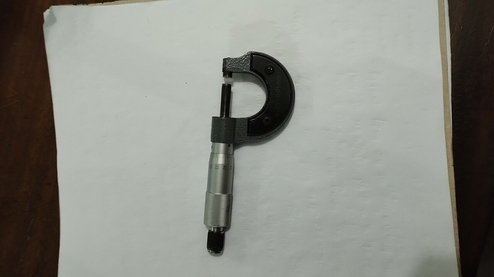
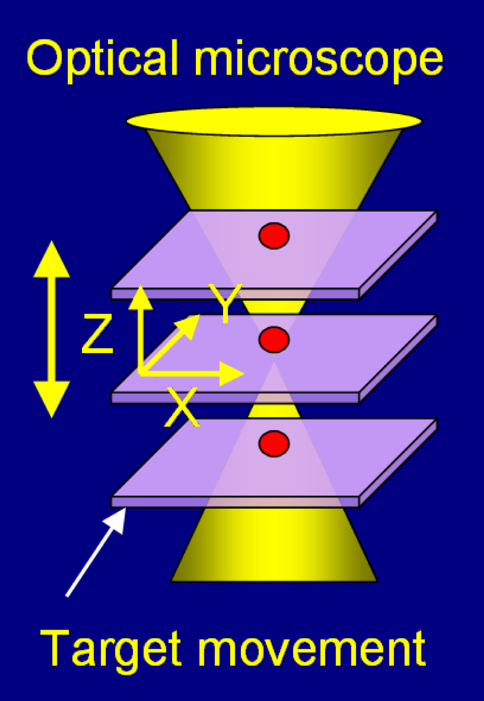
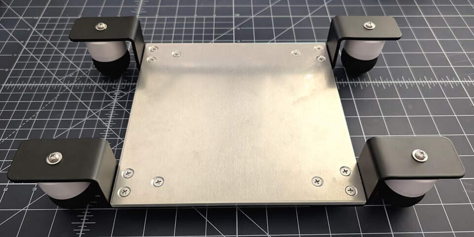
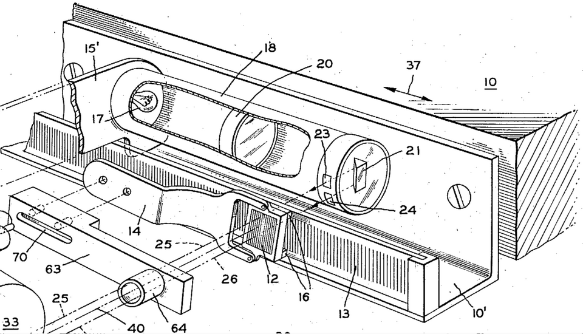

# Precision Motion Control

> *Screw Gauge*

> *Image: Riaz, CC BY-SA 4.0*

Capabilities in this domain:

> *Image: National Institute of Standards and Technology, Public domain*

- [Nanometer Positioning](nanometer-positioning.md) — Sub-micron positioning systems: piezoelectric stages (0.01 nm resolution), air bearing slides (0.01 μm straightness), and linear motor drives. Enables the actuation layer for semiconductor lithography, inspection, and metrology equipment.
<!-- TODO: source image for Wafer Stages & Scanner Systems -->
- [Wafer Stages & Scanner Systems](wafer-stages.md) — Stepper and scanner wafer positioning stages for photolithography: 6-DOF motion, reticle stages, step-and-scan mechanics, and synchronization with exposure systems. Positioning accuracy to ±5 nm, acceleration to 10g.

> *Image: Quirkipedia, CC0*

- [Vibration Isolation](vibration-isolation.md) — Passive and active vibration isolation systems for nanometer-precision equipment: pneumatic isolation tables, active feedback cancellation, foundation design, and environmental vibration specs for semiconductor fabs.

> *Image: en:David Theodore Nelson Williamson, Public domain*

- [Precision Encoders & Feedback](precision-encoders.md) — Laser interferometers (0.6 nm resolution), optical scale encoders (1 nm with interpolation), and encoder integration for closed-loop positioning. The measurement backbone that enables nanometer-level motion control.

[↑ Back to Tech Tree](../index.md)
