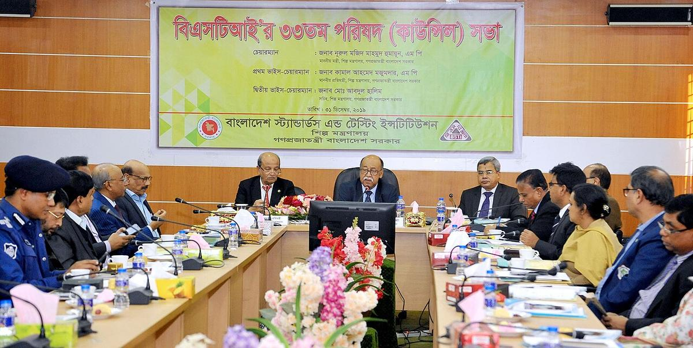
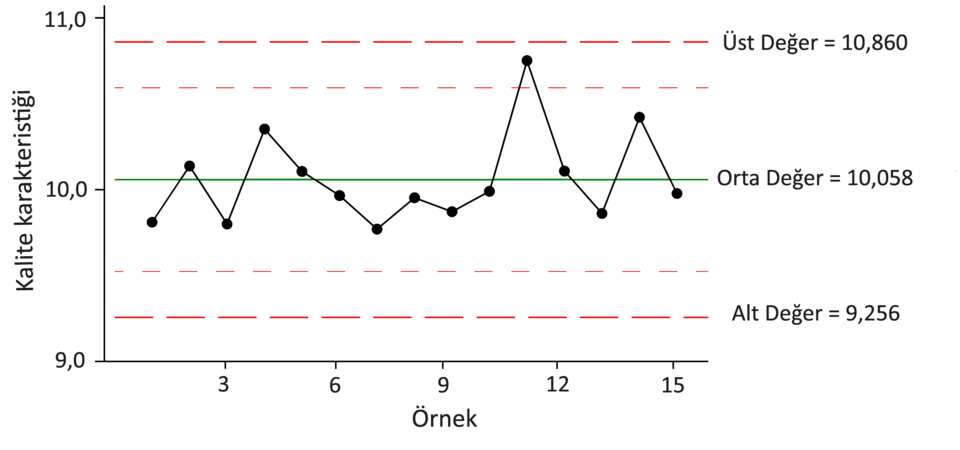
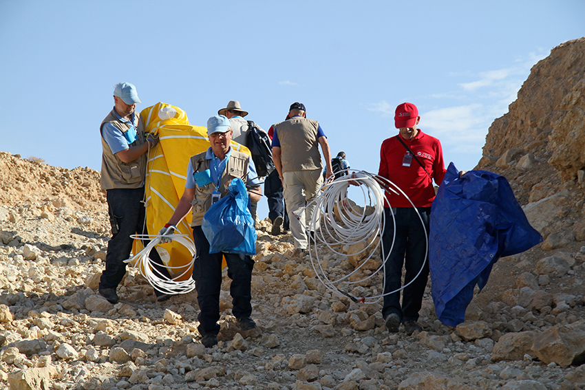
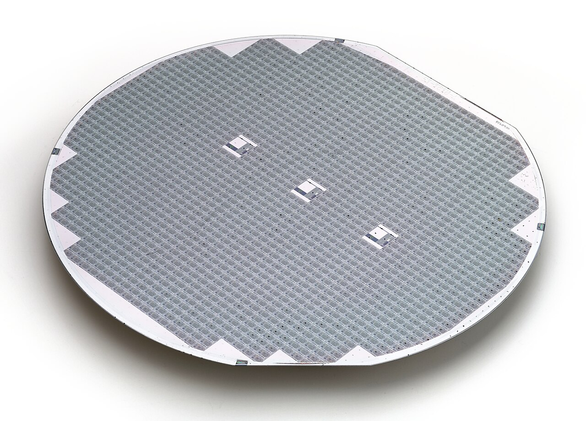

# Quality Control & Statistical Process Control

> *Industries Minister Nurul Majid Mahmud Humayun presided over the council meeting of BSTI at the BSTI auditorium in Tejgaon, Dhaka, on the national level control of quality of goods and services (Tuesday, December 31, 2019).*

> *Image: Press Information Department, Public domain*

Capabilities in this domain:

> *Image: ControlChart.svg: The original uploader was DanielPenfield at English Wikipedia.
derivative work : DeeMusil (talk) - ControlChart cz.svg
derivative work: Anerka (talk), CC BY-SA 3.0*

- [Statistical Process Control](statistical-process-control.md) — Control charts (X-bar/R, p, c, u charts), process capability indices (Cpk/Ppk ≥ 1.33), Six Sigma methodology, Western Electric rules, and process monitoring for manufacturing stability.

> *Image: The Official CTBTO Photostream, CC BY 2.0*

- [Inspection & Sampling Plans](inspection-sampling.md) — Incoming inspection, in-process inspection, final test, acceptance sampling (AQL, MIL-STD-105E), single/double/sequential sampling plans, and switch rules for inspection severity.

> *Image: Phiarc, CC BY-SA 4.0*

- [Defect Analysis & Yield Modeling](defect-analysis.md) — Pareto analysis, fishbone (Ishikawa) diagrams, FMEA (Failure Mode and Effects Analysis), root cause analysis, Murphy's and Seeds yield models, and defect density tracking for semiconductor fabrication.

[↑ Back to Tech Tree](../index.md)
