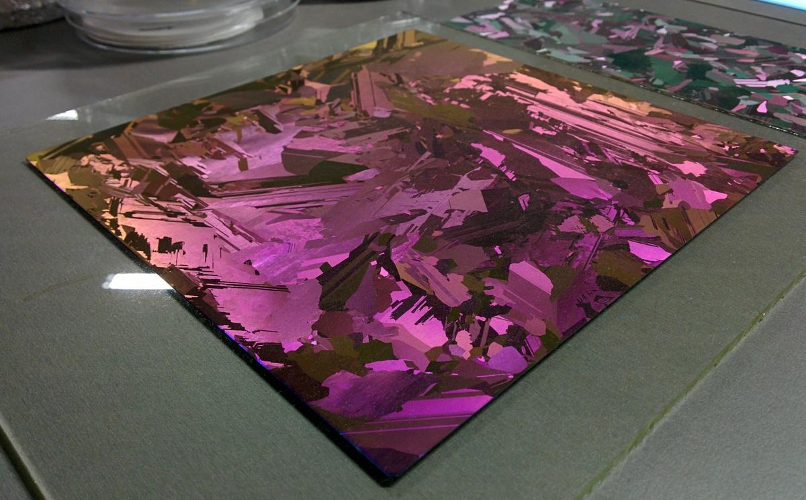
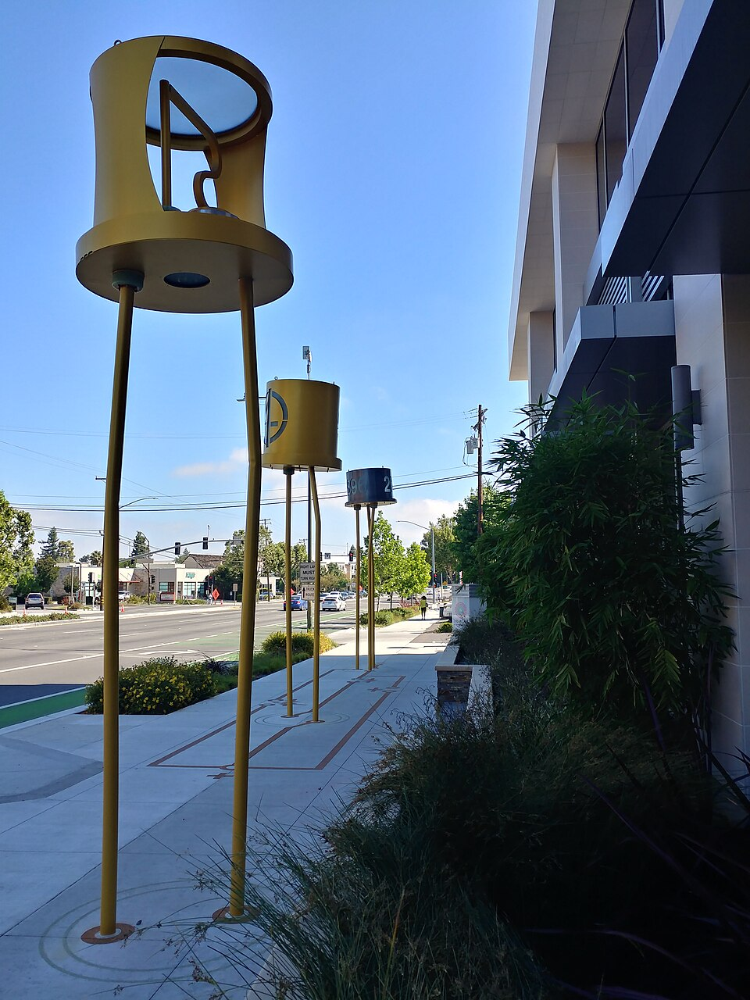
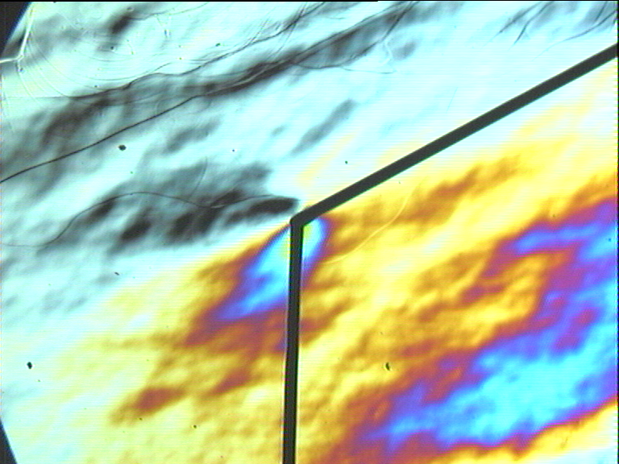
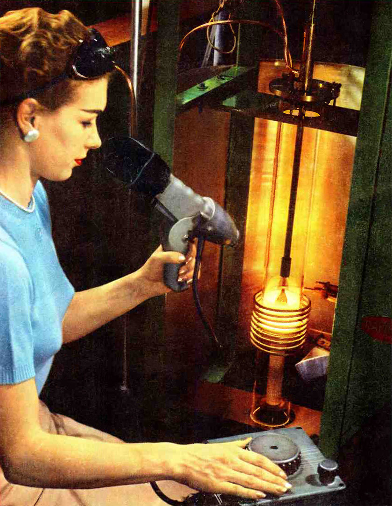
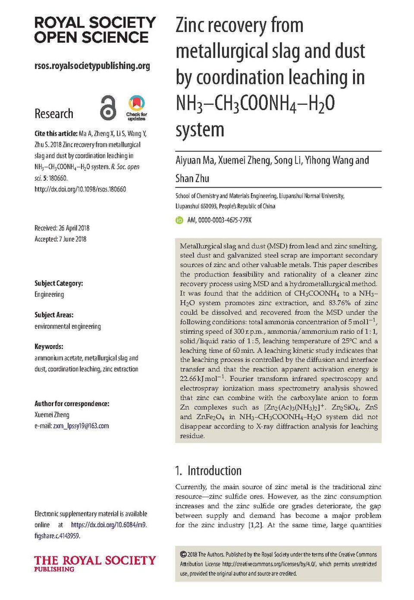
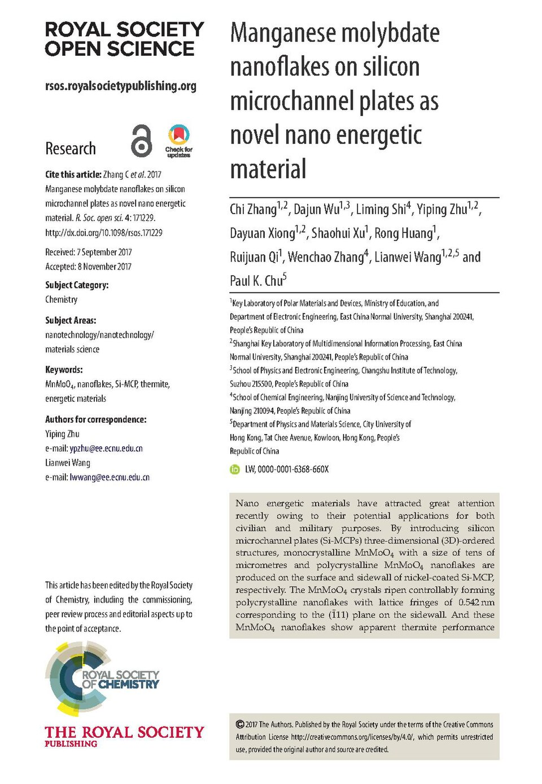
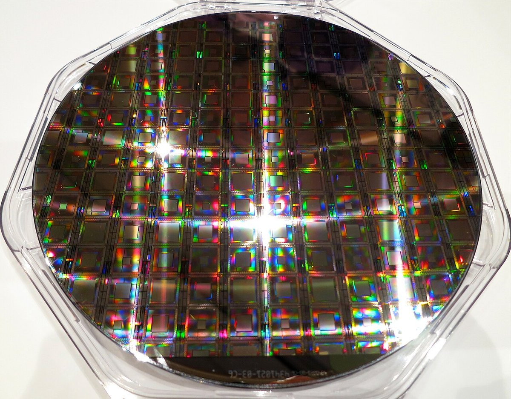

# Silicon

> *Image: Rama &amp; Musée Bolo, CC BY-SA 2.0 fr*

> *A multicrystalline silicon wafer with thin film iridescence from silicon nitride coating*

> *Image: Radiotrefoil, CC BY-SA 4.0*

Capabilities in this domain:

> *Image: Baltakatei, CC BY-SA 4.0*

- [Basic Semiconductor Devices](basic-devices.md) — Solar cell fabrication (p-type wafer → phosphorus diffusion → SiNₓ AR coating → screen-printed metallization, targeting 15-18% efficiency), point-contact diodes, alloy junction transistors, and diffused transistors.

> *Image: No machine-readable author provided. Twisp assumed (based on copyright claims)., Public domain*

- [Crystal Growth & Wafering](crystal-growth.md) — Czochralski (CZ) crystal pulling from quartz crucibles with precision motion control, wire saw wafering, lapping (2-5 μm TTV), and CMP polishing (<0.5 nm Ra).

> *Image: George E. Meyers, Public domain*

- [Czochralski Crystal Pulling](cz-pulling.md) — Pulling single-crystal silicon ingots from molten polysilicon using a seed crystal in a quartz crucible at ~1415°C.

> *Image: Rachid Ouertani, Abderrahmen Hamdi, Chohdi Amri, Marouan Khalifa, Hatem Ezzaouia, CC BY 4.0*

- [Metallurgical-Grade Silicon Production](mg-si-production.md) — Carbothermic reduction of quartz (SiO₂ + 2C → Si + 2CO) in submerged arc electric furnace at 1800-2100°C.

> *Image: MmRoma, CC0*

- [Silicon Purification](purification.md) — Chemical purification via Siemens-like process (hydrochlorination → fractional distillation of chlorosilanes → CVD deposition, 9N-11N purity) and physical purification via directional solidification and zone refining (5-9N).

> *Image: Steve Jurvetson, CC BY 2.0*

- [Wafering](wafering.md) — Ingot preparation, wire saw and ID blade slicing, lapping, CMP polishing, RCA cleaning, epitaxial and SOI wafer production, wafer thinning, gettering, wafer-level metrology, die preparation, and yield economics.

[↑ Back to Tech Tree](../index.md)
