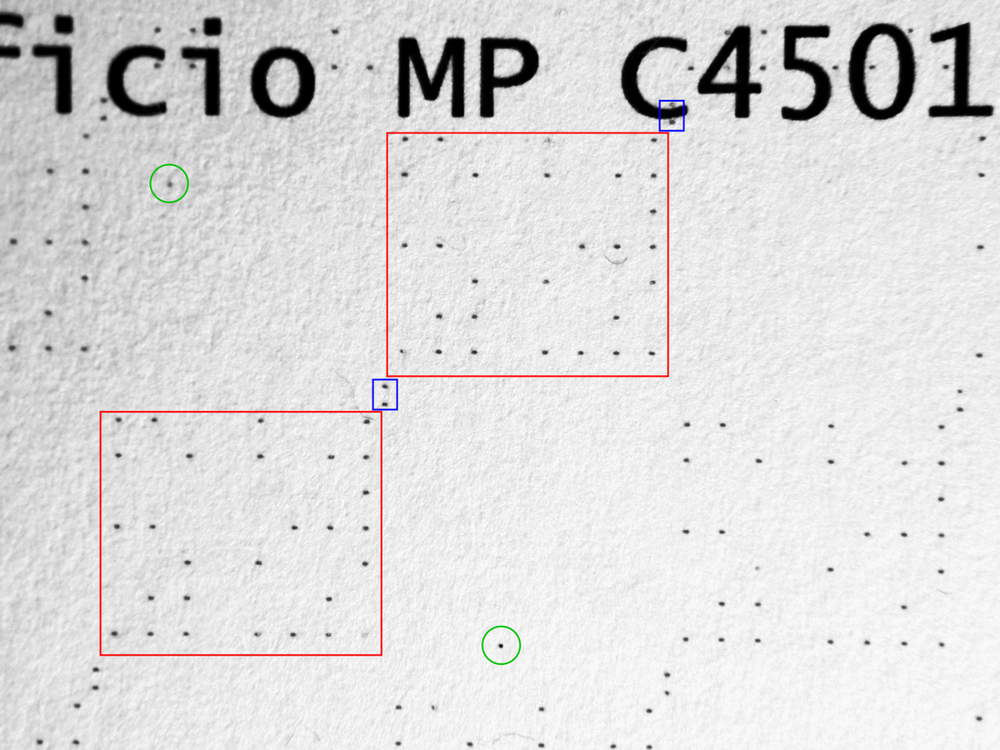
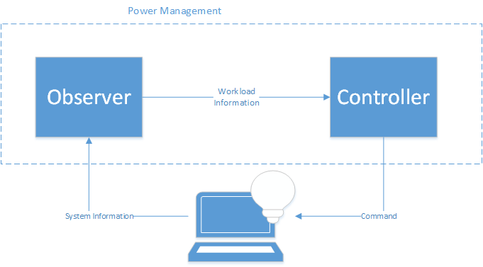

# Software Bootstrapping


> *The original finding aid described this photograph as: Base: Arnold Air Force Base State: Tennessee (TN) Country: United States Of America (USA) Scene Camera Operator: SMSGT. Robert Wickley Release Status: Released to Public*

> *Image: Department of Defense. American Forces Information Service. Defense Visual Information Center. 1994, Public domain*

Capabilities in this domain:


> *Image: Heino Sauerbrey, CC BY-SA 3.0 de*

- [Machine Code & Front-Panel Programming](machine-code.md) — Hand-entered binary instructions via front-panel switches, hex keyboards, and paper tape bootstrap loaders.
<!-- TODO: source image for Assemblers, Linkers & Loaders -->
- [Assemblers, Linkers & Loaders](assemblers.md) — Assembly language design, two-pass assembler construction, symbol table management, relocation, and program loading.
<!-- TODO: source image for Compiler Construction -->
- [Compiler Construction](compilers.md) — Lexical analysis, parsing, code generation, optimization, and the self-hosting bootstrap sequence.

> *Image: Opavlos, CC BY-SA 4.0*

- [Operating System Construction](operating-systems.md) — Boot loaders, interrupt handlers, process scheduling, memory management, file systems, and device drivers.
<!-- TODO: source image for Development Tools & Debugging -->
- [Development Tools & Debugging](dev-tools.md) — Text editors, debuggers, build systems, and version control.
<!-- TODO: source image for Self-Hosting Compiler Bootstrap -->
- [Self-Hosting Compiler Bootstrap](self-hosting.md) — The bootstrap sequence that makes a compiler compile itself, achieving a self-sustaining software toolchain.

## Boundary with Computing

This domain has a strict boundary with the [Computing](../computing/index.md) domain:

**computing/ builds the MACHINE.** Hardware design, construction, and manufacturing:
- Vacuum tube and transistor circuit design
- Digital logic gate implementation at transistor level
- Memory cell construction (SRAM, DRAM, flash)
- PCB design and manufacturing
- Computer architecture (von Neumann, accumulator, register-based) as hardware concepts
- I/O peripheral hardware (CRT, keyboard, disk controller)
- ISA specification (opcodes, registers, addressing modes) as a hardware contract

**software-bootstrapping/ builds the SOFTWARE.** Programming the machine that computing/ built:
- Hand-entering binary opcodes via front-panel switches
- Designing and implementing assemblers, compilers, linkers
- Building operating systems (schedulers, file systems, device drivers)
- Creating development tools (editors, debuggers, build systems)
- Writing programs that target the ISA (the programming act, not the ISA specification)

### Gray Zones Resolved

| Topic | Home Domain | Rationale |
|-------|-------------|-----------|
| ISA specification (opcodes, registers) | computing.electronic | Hardware contract |
| Writing programs in an ISA | software-bootstrapping.machine-code | Programming act |
| "Compilers exist" (conceptual) | computing.electronic | Contextual mention |
| How to BUILD a compiler | software-bootstrapping.compilers | Construction process |
| FPGA hardware platform | computing.digital-logic | Physical device |
| HDL programming for FPGA | software-bootstrapping.dev-tools | Software act |
| Storage media manufacturing | computing.data-storage | Physical media |
| File system data structures | software-bootstrapping.operating-systems | Software organization |

## Organizing Axis: Bootstrap Chain

The capabilities in this domain are ordered by the bootstrap sequence:

```
machine-code → assemblers → compilers → operating-systems → dev-tools
```

Each capability builds on the one before it. The chain is strictly sequential because each tool is used to build the next:

1. **Machine code** is hand-entered to create the first assembler
2. **Assembler** is used to write the first compiler
3. **Compiler** enables writing the OS in a higher-level language
4. **OS** provides the platform for development tools
5. **Self-hosting** completes the chain — the compiler compiles itself

This is analogous to the [Machine Tools](../machine-tools/index.md) domain's Precision Ladder — each stage enables the next with increasing capability.

[↑ Back to Tech Tree](../index.md)
