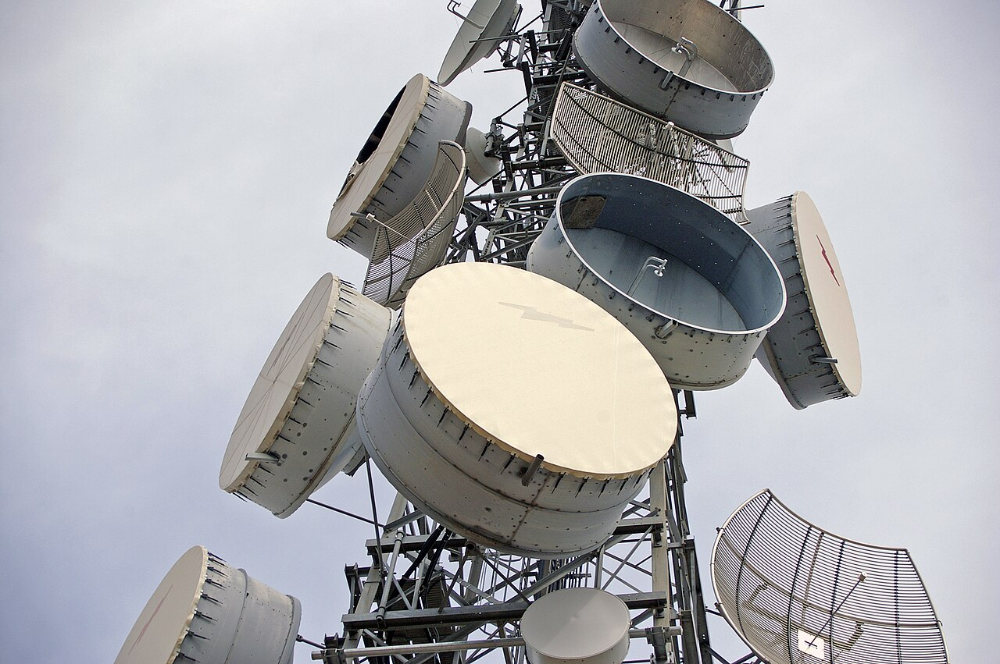
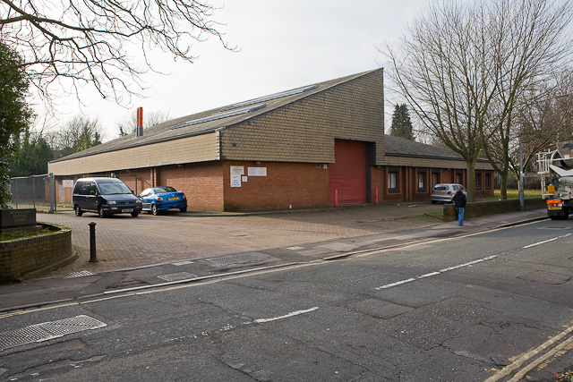

# Telecommunications

> *Parabolic antennas (also known as microwave dishes) on a telecommunications tower on Willans Hill, Wagga Wagga, New South Wales, Australia.  The cylinder shapes are metal shrouds surrounding the parabolic dishes.  The shoud shields the antenna from signals coming from angles outside its main axis...*

> *Image: Bidgee, CC BY-SA 2.5 au*

> **Domain ID**: telecom
> **Timeline**: Years 10-60+
> **Organizing Axis**: Chronological — capabilities ordered by technological era from visual signaling through electronic radio

Long-distance communication systems spanning pre-electric visual signaling through electrical telegraph networks, telephone exchanges, submarine cables, and radio. The telecommunications domain addresses information transfer across distances impractical for couriers — from semaphore lines relaying military intelligence at 150 km/h to radio waves crossing oceans at light speed.

**SIK Boundary with Transport**: The transport.telegraph node covers telegraph hardware (keys, sounders, batteries, pole-line construction). The telecom domain covers the network architecture, multiplexing, and broader communication systems that build on that hardware. Infrastructure overlap with transport is <25% — transport moves physical goods; telecom moves information. Railway block signaling is the notable intersection, documented via cross-references.

Capabilities in this domain:

<!-- TODO: source image for Pre-Electric Communication -->
- [Pre-Electric Communication](pre-electric.md) — Signal fires, beacon chains, semaphore lines (Chappe telegraph), heliograph mirror signaling, and flag signaling systems for pre-electrical long-distance communication.
<!-- TODO: source image for Electrical Telegraph Networks -->
- [Electrical Telegraph Networks](electric-telegraph.md) — Network architecture, message routing, duplex/quadruplex multiplexing, and railway block signaling integration. Hardware details in [transport/telegraph](../transport/telegraph.md).
<!-- TODO: source image for Telephone Systems -->
- [Telephone Systems](telephone.md) — Voice communication over wire: Bell telephone, carbon microphone, manual switchboard exchanges, and Strowger automatic step-by-step switching enabling private dialing.

> *Image: Collinpetty, CC BY-SA 4.0*

- [Submarine Cable Systems](submarine-cables.md) — Undersea telegraph and telephone cables: gutta-percha insulation, armored cable construction, cable-laying ships, and deep-sea repair operations.
<!-- TODO: source image for Radio Communication -->
- [Radio Communication](radio.md) — Wireless telegraphy and voice radio: spark-gap transmitters, crystal detectors, vacuum tube development, antenna systems, and propagation fundamentals.

[↑ Back to Tech Tree](../../index.md)
