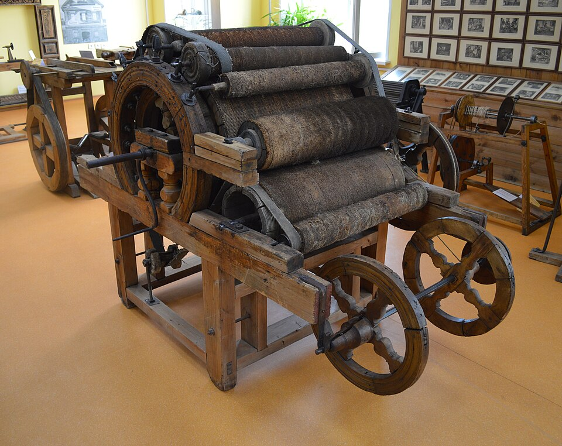

# Carding Machine

> **Node ID**: textiles.carding-machine
> **Domain**: [Textiles](./index.md)
> **Dependencies**: [`metals.iron-steel`](../metals/iron-steel.md), [`machine-tools.machining`](../machine-tools/machining.md), [`textiles.spinning`](spinning.md)
> **Enables**: [`textiles.spinning-frame`](spinning-frame.md) (uniform roving feed for mechanized spinning)
> **Timeline**: Years 10-20
> **Outputs**: carded batt (aligned fiber sheet), carded roving
> **Critical**: Yes — drum carding produces the uniform fiber batts required for mechanized spinning at 10-20× the rate of hand carding

## Principle

> *Wool-beating machine. Russia, Arzamas district, Nizhegorodsky province, XIX century.Technical Museum. Nizhny Novgorod.*

> *Image: Лапоть, CC0*

A carding machine aligns textile fibers from a tangled mass into a parallel sheet (batt) using rotating drums covered in card clothing — stiff wire teeth set in a flexible backing. The machine uses two drums: a large main cylinder (20-40 cm diameter) covered with fine wire teeth rotating at 100-200 rpm, and a smaller licker-in roller (10-15 cm diameter) rotating at 300-600 rpm that feeds fiber onto the main cylinder. A doffer roller (15-25 cm diameter) running opposite to the main cylinder strips the carded batt off.

The key mechanism is "carding action": two surfaces covered in wire teeth moving relative to each other. When the teeth point in the same direction and the surfaces move in opposite directions (or at different speeds in the same direction), the teeth comb through the fiber mass, separating and aligning individual fibers. The working angle of the wire teeth (20-35° from perpendicular) determines whether fiber is held (carding point) or released (stripping point).

Carding converts 0.5-1 kg/hour of hand-carded fiber output to 5-10 kg/hour throughput, making it the essential link between fiber preparation and mechanized spinning. Without drum carding, a spinning frame cannot be fed fast enough to justify its construction cost.

## Prerequisites

- [Iron & Steel](../metals/iron-steel.md) — wire for card clothing, shafts for drums
- [Machine Tools](../machine-tools/index.md) — turning drums, boring bearing housings
- [Leather or Rubber](../animals/leather.md) — flexible backing for card clothing
- [Power source](../energy/index.md) — hand crank for small units, water wheel or motor for production units (0.5-2 kW)

## Materials

| Material | Quantity | Specifications | Source | Alternatives |
|----------|----------|----------------|--------|-------------|
| Cast iron (drums) | 30-60 kg | Main cylinder 20-40 cm dia × 40-60 cm wide, licker-in 10-15 cm dia, doffer 15-25 cm dia | [Iron & Steel](../metals/iron-steel.md) | Hardwood drums (lighter, less stable, shorter life) |
| Steel shafts | 3 pcs, 10-15 kg | 20-30 mm diameter, ground to ±0.05 mm | [Iron & Steel](../metals/iron-steel.md) | None — precision required |
| Card wire | 5-15 kg | 28-32 gauge steel wire, hardened, bent to 20-35° angle, 5-10 mm projection | [Iron & Steel](../metals/iron-steel.md) | Hand-card wire teeth (slower production) |
| Leather or rubber backing | 1-2 m² | 3-5 mm thick flexible sheet, wrapped around drums | [Leather](../animals/leather.md) | Rubber sheet (better grip, less available) |
| Bearings | 6-12 pcs | Bronze plain bearings or ball bearings | [Bearings](../machine-tools/bearings-abrasives.md) | Wooden bearings with oil cups (shorter life) |
| Frame timber or angle iron | 20-40 kg | Sturdy frame supporting drum shafts at precise centers | [Iron & Steel](../metals/iron-steel.md) | Hardwood frame (heavier, absorbs vibration) |
| Drive gears or belts | 1 set | Step-down ratio 2:1 to 6:1 between licker-in and main cylinder | [Metals](../metals/index.md) | Rope drive (less positive) |
| Bolts and fasteners | 5-10 kg | M8-M12 | [Iron & Steel](../metals/iron-steel.md) — fabricated in-house | Through-bolts with nuts |

## Construction Steps

### Frame

1. **Build the frame**: Construct a rigid frame from angle iron (50 × 50 × 5 mm) or hardwood (100 × 100 mm posts). The frame must hold three parallel shafts at precise center distances: licker-in to main cylinder gap 0.3-0.8 mm, main cylinder to doffer gap 0.3-0.5 mm. Bore bearing housings in the frame with a jig to maintain alignment — shaft centers must be parallel within 0.1 mm over the full drum width. Any misalignment causes uneven carding and fiber buildup.

2. **Mount bearing blocks**: Install split-bearing housings (bronze bushings) at each shaft position. The bearing housings for the licker-in and doffer must be adjustable — slots in the frame allow these drums to be moved closer to or farther from the main cylinder, setting the critical carding gap.

### Drums

3. **Prepare the main cylinder**: Turn the main cylinder (cast iron, 20-40 cm diameter × 40-60 cm wide) on a lathe. The surface must be concentric within 0.05 mm and smooth (1.6 μm Ra). Balance the cylinder statically — an unbalanced drum at 200 rpm vibrates destructively. Drill and tap mounting holes for the card clothing attachment clips at each end.

4. **Wrap card clothing on the main cylinder**: Cut card cloth (leather or rubber backing with embedded wire teeth) to the cylinder circumference length plus 10 mm overlap. Apply adhesive (hide glue or rubber cement) to the cylinder surface. Wrap the card cloth tightly around the cylinder, teeth pointing in the direction of rotation. Secure the leading and trailing edges with flat iron clips screwed into the cylinder ends. The teeth must be uniform in height (±0.5 mm) — uneven teeth produce uneven carding.

5. **Prepare the licker-in roller**: Turn the licker-in (10-15 cm diameter × 40-60 cm wide) to the same surface finish as the main cylinder. Wrap with coarser card cloth (fewer, stouter teeth — the licker-in opens the fiber mass before it reaches the fine main cylinder). Licker-in wire: 20-25 gauge, 8-12 mm projection, 30-35° working angle.

6. **Prepare the doffer roller**: Turn the doffer (15-25 cm diameter × 40-60 cm wide) and wrap with fine card cloth. The doffer must strip fiber cleanly from the main cylinder — its teeth are slightly finer and set at a stripping angle (opposite to main cylinder teeth direction).

### Assembly and Drive

7. **Mount drums in frame**: Install the main cylinder first, then adjust the licker-in and doffer positions to set the carding gaps. Licker-in to main cylinder: 0.3-0.8 mm (wider for coarse fiber like wool, narrower for fine fiber like cotton). Main cylinder to doffer: 0.3-0.5 mm. Check gaps with a feeler gauge at both ends and the center of each drum.

8. **Install drive system**: Connect a hand crank, foot treadle, or motor to the main cylinder shaft. Gear or belt-drive the licker-in from the main cylinder at 2-4× the main cylinder speed (the licker-in must rotate faster to open the feed). Gear or belt-drive the doffer at 0.5-1.0× the main cylinder speed (the doffer runs slower to condense the fiber web). A typical speed ratio: main cylinder 150 rpm, licker-in 400-600 rpm, doffer 80-120 rpm.

9. **Install feed tray and doffer comb**: Mount a feed tray (flat wooden or metal surface) above the licker-in where the operator places loose fiber. Install a doffer comb (thin steel blade set 0.5-1.0 mm from the doffer surface) that peels the carded batt off the doffer as a continuous web.

10. **Install batt take-up**: Guide the carded batt from the doffer comb through a pair of calender rollers (smooth steel rollers, 30-50 mm diameter, spring-loaded to compress the batt) and onto a collection spool or tray. The calender rollers consolidate the loose batt into a coherent sheet.

## Calibration and Verification

1. **Gap check**: Measure the gap between licker-in and main cylinder, and between main cylinder and doffer, at three positions (both ends and center). Use a 0.3 mm feeler gauge for fine carding, 0.5-0.8 mm for coarse. Adjust drum positions until gaps are uniform within ±0.1 mm across the width.

2. **Rotation direction verification**: The main cylinder and doffer must counter-rotate at the carding point (surfaces move in opposite directions). The licker-in and main cylinder surfaces must also move in opposite directions at their nip point. Verify by hand-cranking before applying power.

3. **Balance test**: Run the main cylinder at full speed (150-200 rpm) without card cloth. Measure vibration amplitude at each bearing housing — maximum 0.05 mm. If vibration exceeds this, add balance weights to the cylinder rim.

4. **Carding quality test**: Feed 100 g of prepared fiber through the machine. Inspect the output batt: fibers should be uniformly aligned parallel to the machine direction, with no clumps, neps (tangled fiber balls), or uncarded patches. If neps appear, reduce the feed rate or tighten the carding gap.

## Expected Performance

| Parameter | Value |
|-----------|-------|
| Main cylinder diameter | 20-40 cm |
| Throughput (fiber) | 5-10 kg/hour |
| Output form | Continuous batt, 40-60 cm wide, 1-3 mm thick |
| Main cylinder speed | 100-200 rpm |
| Licker-in speed | 300-600 rpm |
| Doffer speed | 80-120 rpm |
| Carding gap (licker-in to cylinder) | 0.3-0.8 mm |
| Carding gap (cylinder to doffer) | 0.3-0.5 mm |
| Power requirement | 0.5-2 kW (hand-cranked or motorized) |
| Wire tooth life | 2,000-5,000 hours (replace card cloth) |
| Drum balance tolerance | ≤0.05 mm vibration amplitude |

## Strengths

- 5-10 kg/hour throughput vs. 0.5-1 kg/hour for hand cards — 10× productivity gain
- Produces uniform batts suitable for feeding spinning frames — essential link in mechanized textile production
- Continuous output (batt or roving) vs. discrete rolags from hand carding — integrates with downstream machinery
- Handles wool, cotton, and short-staple fibers with the same machine (adjust gap and wire gauge)

## Weaknesses

- Card clothing (wire teeth in leather/rubber backing) wears out in 2,000-5,000 hours and must be re-wrapped — time-consuming maintenance
- Drum balance is critical — an unbalanced 30 cm drum at 200 rpm vibrates destructively within hours
- Carding gap must be set precisely (0.3-0.8 mm) — too wide produces neps, too tight cuts fibers
- Wire teeth bend or break if foreign objects (twigs, metal fragments) enter with the fiber

## Safety

- **Rotating drums**: The main cylinder and licker-in present nip hazards where clothing, hair, or fingers can be drawn in. Guard all nip points. Never reach into the feed tray while the machine is running. Use a push stick to feed fiber.
- **Wire teeth**: Card wire is sharp. Handling card cloth or reaching near drums without guards causes puncture wounds and lacerations. Wear leather gloves when handling card clothing.
- **Dust and fly**: Carding generates fine fiber dust at 5-10× the rate of hand carding. Ventilate the carding area. Wear a dust mask — chronic inhalation causes byssinosis.
- **Entanglement in drive belts**: Guard all belts and gears. Loose clothing catches in rotating shafts.

## Maintenance

Regular maintenance extends carding machine life from months to decades. Neglect accelerates wire tooth wear, bearing failure, and drum damage from foreign objects.

**Daily checks** (before each shift):
- Inspect feed tray for foreign objects (twigs, metal fragments, buttons). These bend or break wire teeth on contact.
- Check carding gaps at both ends and center with a feeler gauge. Gaps drift with bearing wear and frame vibration — correct before running.
- Verify belt tension. Loose belts cause speed variation between drums, producing uneven carding.

**Weekly maintenance**:
- Remove accumulated fiber from under the drums and from the doffer comb. Packed fiber restricts airflow and increases dust generation.
- Lubricate bearing housings with machine oil (SAE 30 or equivalent). Bronze bushings need 2-3 drops per bearing per week. Ball bearings: check seals and re-grease every 6 months.
- Inspect card cloth for bent or broken wire teeth. Replace damaged sections by cutting out the affected strip and gluing in a new piece. Even a few bent teeth produce neps in the output batt.

**Monthly maintenance**:
- Check drum balance by running the main cylinder at full speed without card cloth. Vibration amplitude must not exceed 0.05 mm at the bearing housings. If vibration has increased, clean the drum surface (accumulated fiber oils cause imbalance) and re-check. Add balance weights if needed.
- Inspect drive belts for cracks, glazing, and stretch. Replace cracked belts before they break — a belt failure during operation causes the licker-in to stall while the main cylinder continues, wrapping fiber around the main cylinder and jamming the machine.
- Check the doffer comb blade for wear. The comb must be set 0.5-1.0 mm from the doffer surface and parallel across the full width. A worn comb leaves fiber on the doffer instead of peeling it off as a continuous web.

**Card cloth replacement** (every 2,000-5,000 operating hours):
1. Remove the old card cloth by prying the retaining clips at each end and peeling the cloth off the drum. Clean residual adhesive from the drum surface with a scraper.
2. Cut new card cloth to circumference length plus 10 mm overlap. Check that wire tooth density matches the original specification — finer teeth for cotton, coarser for wool.
3. Apply hide glue or rubber cement to the drum surface. Wrap the new card cloth tightly, teeth pointing in the direction of rotation. Secure with retaining clips.
4. Check tooth height uniformity with a straightedge laid across the drum — teeth must be within ±0.5 mm of uniform height. High spots can be pressed down gently with a wooden block; low spots indicate improperly seated cloth and require re-wrapping.

## Troubleshooting

| Problem | Probable Cause | Solution |
|---------|---------------|----------|
| Neps (tangled fiber balls) in output | Carding gap too wide or feed rate too high | Tighten gap to 0.3-0.5 mm using feeler gauge. Reduce feed quantity per pass. |
| Uneven batt thickness | Drum surface not concentric or card cloth worn unevenly | Check drum runout with dial indicator (max 0.05 mm). Replace worn card cloth sections. |
| Fiber wrapping around licker-in | Licker-in speed too low relative to feed or gap too tight | Increase licker-in speed ratio to 3-4× main cylinder. Widen licker-in gap by 0.2 mm. |
| Excessive fiber dust | Card cloth worn flat — teeth no longer gripping fiber | Replace card cloth. Worn teeth crush fiber instead of combing it. |
| Vibration at operating speed | Drum unbalanced or bearings worn | Remove card cloth, check balance. Replace worn bearings. Re-balance if needed. |
| Motor stalling / belt slipping | Foreign object in drum gap or feed overload | Stop machine immediately. Clear obstruction. Reduce feed rate. Check belt tension. |
| Fiber not transferring to doffer | Doffer gap too wide or doffer speed wrong | Tighten doffer gap to 0.3-0.5 mm. Check doffer speed ratio (0.5-1.0× main cylinder). |
| Wire teeth breaking | Foreign objects (metal, twigs) in feed or wire fatigue | Install a pre-cleaner or inspection step before carding. Replace fatigued card cloth. |

## Card Clothing Wire Specifications

Card wire must match the fiber being processed. Using the wrong wire gauge or tooth density degrades carding quality and increases waste:

| Fiber Type | Wire Gauge (SWG) | Tooth Density (teeth/cm²) | Tooth Height (mm) | Working Angle |
|------------|-----------------|--------------------------|-------------------|---------------|
| Fine cotton | 30-32 | 60-80 | 5-7 | 20-25° |
| Medium cotton | 28-30 | 40-60 | 7-9 | 25-30° |
| Wool (fine) | 28-30 | 30-50 | 8-10 | 25-30° |
| Wool (coarse) | 24-26 | 15-25 | 10-12 | 30-35° |
| Synthetic staple | 28-30 | 40-60 | 7-9 | 25-30° |

Wire material: hardened and tempered steel (Rockwell C 50-55). Softer wire deforms within hours of operation. The wire is set in a flexible backing (rubber or leather, 3-5 mm thick) that allows slight tooth deflection under load — rigid mounting causes wire breakage.

## Feed Preparation for Optimal Carding

The quality of the carded batt depends heavily on feed preparation. Poorly prepared fiber wastes carding time and produces inferior output:

- **Open the fiber mass**: Before feeding, tease apart compressed bales or bundles by hand or with a willowing machine (rotating spiked cylinder that fluffs the fiber). Compressed fiber clumps cannot be opened by the licker-in alone and produce neps.
- **Remove trash**: Vegetable matter, seeds, and dirt should be removed as far as possible before carding. The carding machine will remove some trash, but heavy contamination dulls wire teeth and increases waste. Pre-clean by hand-picking or with a coarse screen.
- **Control moisture**: Cotton and wool card best at 10-14% moisture content. Over-dry fiber generates static electricity and flies apart instead of forming a coherent web. Over-wet fiber clumps and clogs the carding gap. Condition fiber by storing in a humidity-controlled room (55-65% RH) for 24 hours before carding.
- **Even feeding**: Feed fiber in thin, uniform layers across the full width of the licker-in. Heaping fiber in the center produces uneven carding and overloads the center section of the main cylinder. Use a feed tray with width markers to train consistent feeding.

## Carding Output Quality Standards

The carded batt must meet measurable quality criteria before it is suitable for spinning. Poor carding quality propagates defects through every downstream process:

- **Nep count**: Maximum 20 neps (tangled fiber balls) per 100 g of carded batt for medium-count yarn (Ne 20-40). For fine yarn (Ne 60+), maximum 5 neps per 100 g. Count neps by spreading 100 g of batt on a dark surface and inspecting under 5× magnification. Neps appear as small, tight knots that resist being pulled apart.
- **Fiber alignment**: In a well-carded batt, 80-90% of fibers should lie within ±15° of the machine direction. Check by pulling a small tuft from the batt and holding it against a protractor card. Cross-aligned fibers (more than 30° from machine direction) produce weak spots in the yarn.
- **Trash content**: Remaining vegetable matter should be less than 0.5% of batt weight for cotton, less than 0.2% for wool. Weigh a 100 g sample, pick out all visible trash, and re-weigh. Higher trash content indicates insufficient pre-cleaning or worn card cloth.
- **Batt uniformity**: Measure batt thickness at 5 positions across the width and at 3 positions along the length (15 measurements total). Standard deviation must be within ±15% of mean thickness. Thick or thin spots in the batt produce uneven yarn.

## Integration with Downstream Equipment

Carded batts feed directly into drawing frames and roving frames before reaching the spinning frame. The batt must be coherent enough to handle without disintegrating:

- **Drawing frame**: 4-8 carded slivers (condensed batts) are doubled and drafted together on a drawing frame. Doubling averages out variations in individual slivers — 6 slivers fed together reduce mass variation by √6 ≈ 2.45×. The drawing frame further aligns fibers and improves uniformity. Each sliver should weigh 3-6 g/m.
- **Roving frame (speed frame)**: The drawn sliver is attenuated to a thin roving (1-2 g/m) with slight twist (1-2 tpi) to give it enough cohesion to be wound onto a bobbin and unwound at the spinning frame without breaking. The roving must be uniform — thick spots cause slubs in the final yarn; thin spots cause breaks.
- **Carding-to-spinning yield**: From 100 kg of raw fiber input to the carding machine, expect 85-95 kg of usable carded output, depending on fiber type and trash content. The 5-15% loss is mostly removed trash (seeds, vegetable matter, short fibers) that would degrade yarn quality if left in.

## See Also

- [Spinning](spinning.md) — hand spinning methods, fiber properties, hand cards
- [Spinning Frame](spinning-frame.md) — industrial spinning machines fed by carded batts
- [Fibers](fibers.md) — fiber types, preparation, and properties
- [Machine Tools](../machine-tools/index.md) — precision turning for drums and shafts
- [Bearings](../machine-tools/bearings-abrasives.md) — bearing selection for rotating drums

---
*Part of the [Bootciv Tech Tree](../index.md) • [Textiles](./index.md) • [All Domains](../index.md)*
