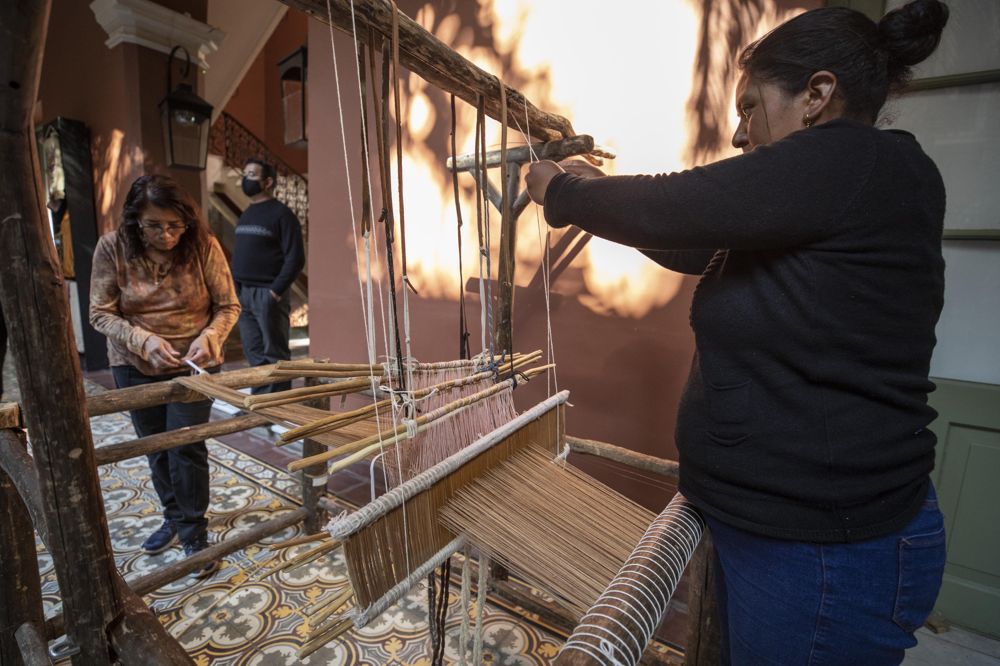
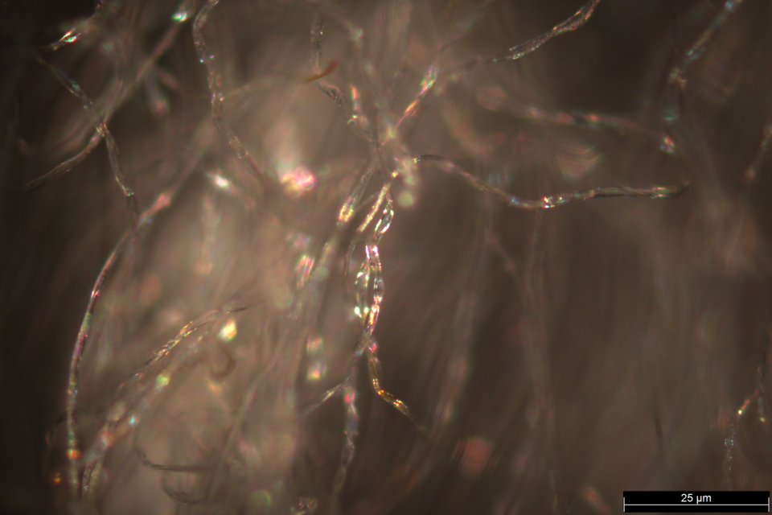

# Textiles, Fiber & Cordage

> *Traditional loom weaving — Conversatorio Las Manos que Piensan (Textiles)*

> *Image: Ministerio de Cultura de la Nación, CC BY-SA 2.0*

Capabilities in this domain:

- [Dyeing](dyeing.md) — Natural and synthetic dye preparation and application to textiles.
- [Fiber Preparation](fibers.md) — Cultivation and preparation of natural fibers including flax, hemp, cotton, and wool.
- [Rope & Cordage](rope-making.md) — Rope manufacture from natural fibers via 3-strand twist construction for construction, sailing, and mechanical handling.
- [Spinning](spinning.md) — Drop spindle and treadle wheel spinning of fibers into yarn and thread.
- [Weaving](weaving.md) — Frame loom and treadle loom weaving of yarn into cloth, canvas, and sailcloth.
- [Finishing](finishing.md) — Fulling, napping, calendering, mercerization, and waterproofing of woven fabrics.
- [Sewing & Tailoring](sewing-tailoring.md) — Needle making, thread selection, seam construction, garment production, and industrial sewing.

- [Spinning Frame](spinning-frame.md) — Water-powered and powered spinning frames (water frame, spinning mule, ring frame) for mechanized yarn production.
- [Carding Machine](carding-machine.md) — Mechanical carding engines for disentangling and aligning fibers for spinning preparation.
- [Power Loom](power-loom.md) — Water and steam-powered looms for mechanized cloth weaving at industrial scale.
[↑ Back to Tech Tree](../index.md)

