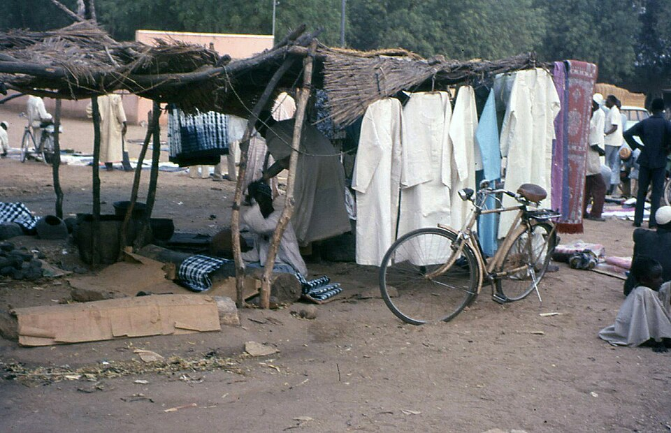
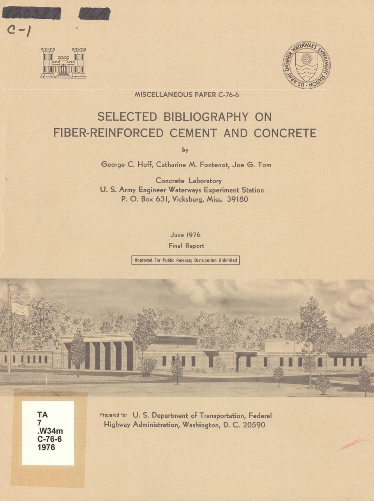
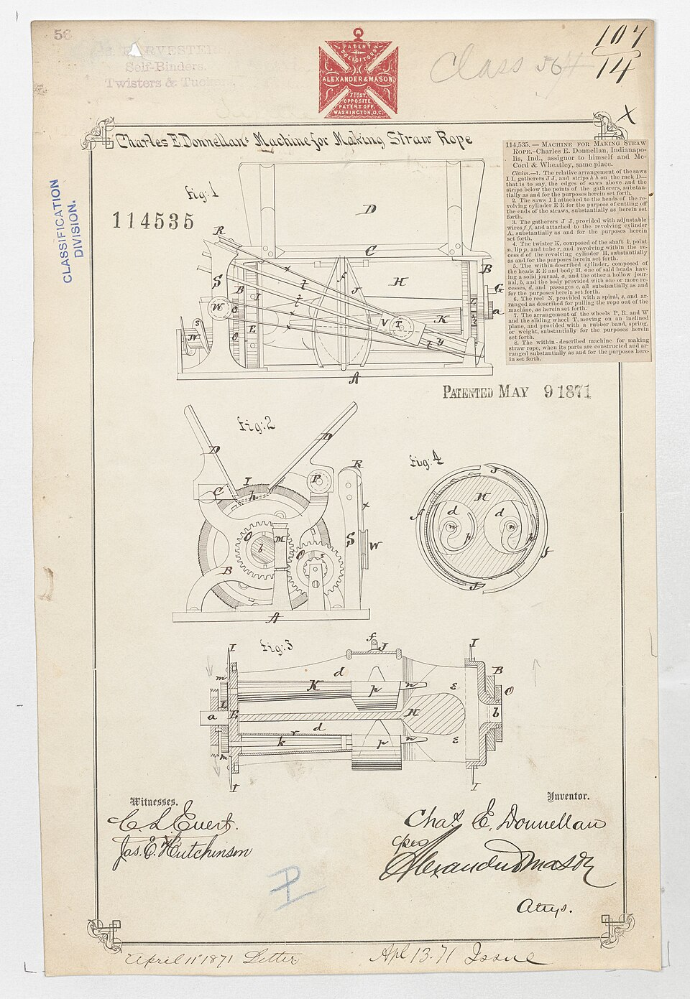
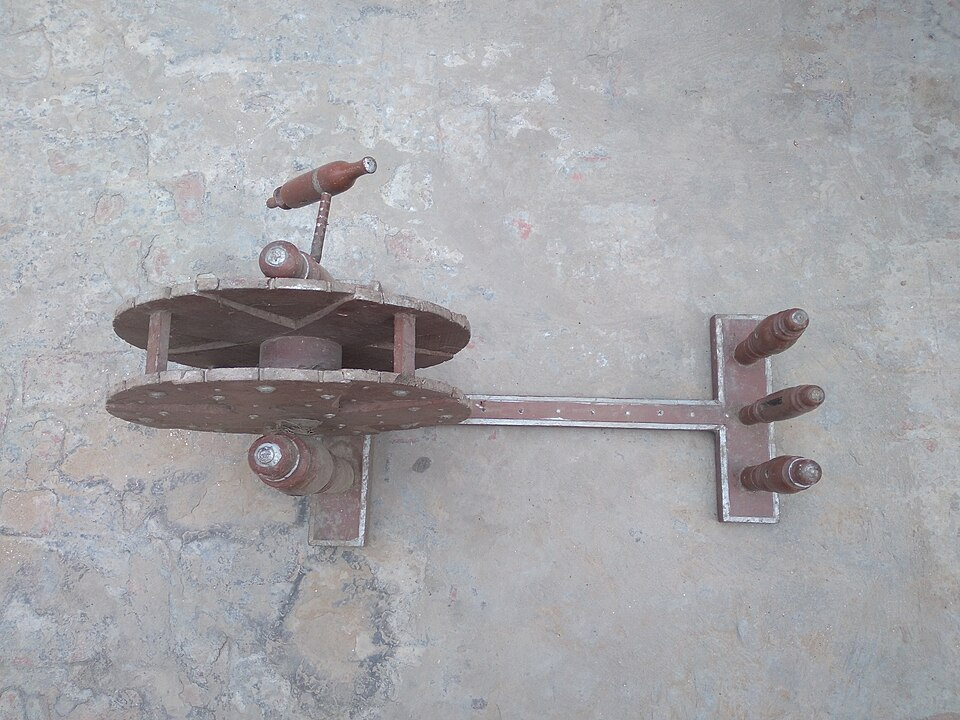
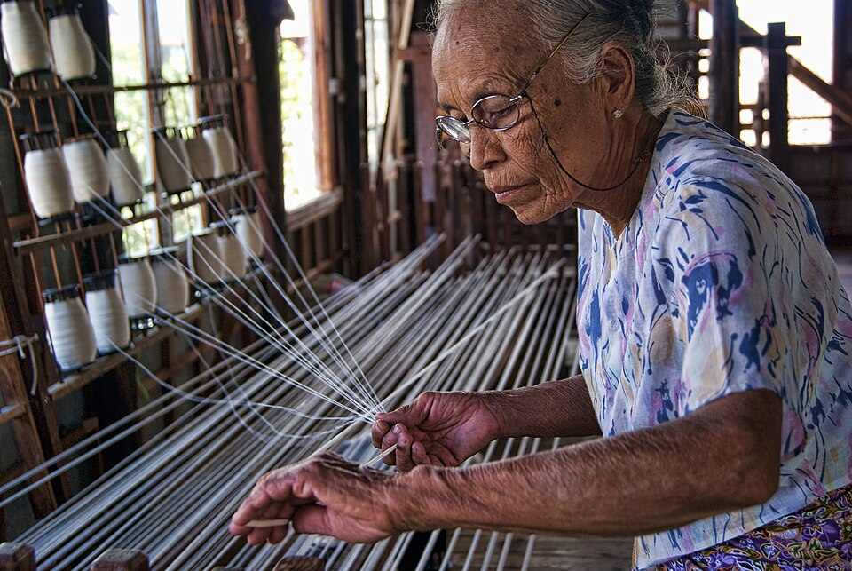
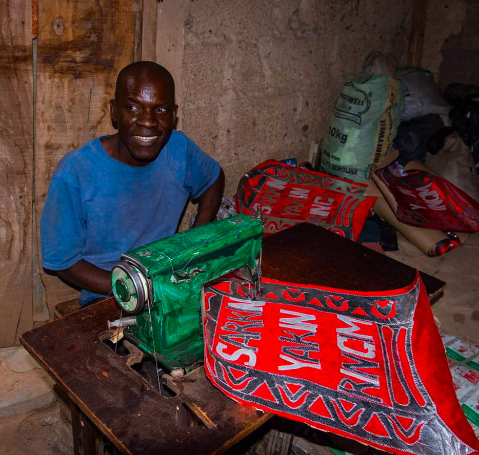
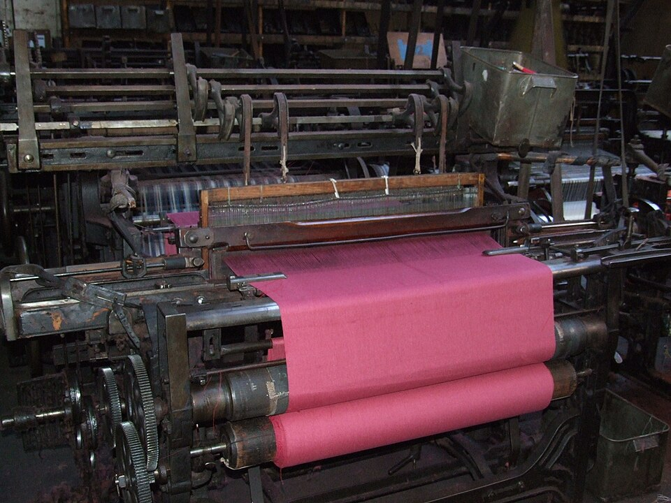

# Textiles, Fiber & Cordage

> *Image: Vyacheslav Argenberg, CC BY 4.0*

> *Traditional loom weaving — Conversatorio Las Manos que Piensan (Textiles)*

> *Image: Ministerio de Cultura de la Nación, CC BY-SA 2.0*

Capabilities in this domain:

> *Image: Roued, CC BY-SA 2.0*

- [Dyeing](dyeing.md) — Natural and synthetic dye preparation and application to textiles.

> *Image: Aiym Maksatkyzy, CC BY-SA 4.0*

- [Fiber Preparation](fibers.md) — Cultivation and preparation of natural fibers including flax, hemp, cotton, and wool.

> *Image: Department of the Interior. Patent Office. (1849 - 1925), Public domain*

- [Rope & Cordage](rope-making.md) — Rope manufacture from natural fibers via 3-strand twist construction for construction, sailing, and mechanical handling.

> *Image: Barker, A. F. (Aldred Farrer), b. 1868; Gardner, Walter Myers 1862- [from old catalog]; Snow, R. [from old catalog]; Cook, William H. [from old catalog]; Bradbury, Fred. [from old catalog], Public domain*

- [Spinning](spinning.md) — Drop spindle and treadle wheel spinning of fibers into yarn and thread.

> *Image: Philip Nalangan, CC BY-SA 4.0*

- [Weaving](weaving.md) — Frame loom and treadle loom weaving of yarn into cloth, canvas, and sailcloth.
<!-- TODO: source image for Finishing -->
- [Finishing](finishing.md) — Fulling, napping, calendering, mercerization, and waterproofing of woven fabrics.

> *Image: Zee Gee el, CC BY 4.0*

- [Sewing & Tailoring](sewing-tailoring.md) — Needle making, thread selection, seam construction, garment production, and industrial sewing.

> *Image: Wikimedia Commons contributor, CC BY 4.0*

- [Spinning Frame](spinning-frame.md) — Water-powered and powered spinning frames (water frame, spinning mule, ring frame) for mechanized yarn production.

> *Image: Лапоть, CC0*

- [Carding Machine](carding-machine.md) — Mechanical carding engines for disentangling and aligning fibers for spinning preparation.

> *Image: Clem Rutter, Rochester, Kent., CC BY-SA 3.0*

- [Power Loom](power-loom.md) — Water and steam-powered looms for mechanized cloth weaving at industrial scale.
[↑ Back to Tech Tree](../index.md)
