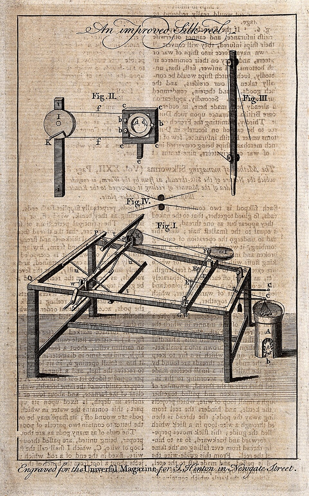

# Spinning Frame

> **Node ID**: textiles.spinning-frame
> **Domain**: [Textiles](./index.md)
> **Dependencies**: [`metals.iron-steel`](../metals/iron-steel.md), [`machine-tools.machining`](../machine-tools/machining.md), [`textiles.spinning`](spinning.md)
> **Enables**: [`textiles.weaving`](weaving.md) (mass-scale yarn supply)
> **Timeline**: Years 15-25
> **Outputs**: yarn at industrial scale (10-100× hand spinning)
> **Critical**: Yes — mechanized spinning breaks the hand-spinning bottleneck that limits cloth production to the pace of individual spinners

## Principle

> *Textiles: a silk-spinning frame. Engraving. Iconographic Collections Keywords: Benjamin Cole*

> *Image: Wikimedia Commons contributor, CC BY 4.0*

Mechanized spinning replaces hand drafting and twisting with powered rollers and high-speed spindles. Three systems dominate industrial spinning, each suited to different yarn types:

**Water frame (Arkwright, 1769)**: Pairs of rollers draw fiber out (drafting), each successive pair rotating faster than the last. A typical 4-pair roller system increases surface speed 4-8× from first to last pair, attenuating the roving to the target thickness. The final pair feeds the attenuated fiber to a flyer that inserts twist. The water frame produces firm, even yarn suitable for warp — the critical bottleneck that limited hand spinning to weft-only production. Roller diameters: 25 mm typical, ground smooth to ±0.02 mm.

**Spinning mule (Crompton, 1779)**: Combines water frame roller drafting with carriage travel. The carriage moves outward 1.5-2 m while rollers feed roving and spindles rotate, simultaneously drafting and twisting. On the return stroke, the wound yarn is deposited onto the spindle. The mule produces the finest, most uniform yarn of any system — fine enough to match hand-spun muslin. By the 1830s, mules carried 300-1,300+ spindles. The self-acting mule (1830s) automated the carriage return, eliminating manual pushing.

**Ring spinning (Thorpe, 1828)**: A C-shaped traveler (small wire loop) rotates around a ring at 3,000-15,000 rpm, simultaneously inserting twist and winding yarn onto the bobbin. No carriage stroke needed — continuous motion. Simpler mechanism, faster production than mule spinning. The ring rail traverses vertically to build yarn packages evenly on the bobbin. By 1900, ring spinning produced ~80% of the world's cotton yarn and remains dominant today (~70% of short-staple spinning).

## Prerequisites

- [Precision machining](../machine-tools/machining.md) — rollers bored and ground to ±0.02 mm, spindles turned true
- [Iron & Steel](../metals/iron-steel.md) — cast iron frames, forged steel rollers, hardened steel rings and travelers
- [Bearings](../machine-tools/bearings-abrasives.md) — reliable plain or roller bearings for high-speed spindles (3,000-15,000 rpm)
- [Power source](../energy/index.md) — water wheel (original), steam engine (19th century), or electric motor (20th century). Minimum 2-5 kW for a 100-spindle frame.
- [Spinning](spinning.md) — fiber preparation (carding, combing, roving) as input to the frame

## Materials

| Material | Quantity (100-spindle frame) | Specifications | Source | Alternatives |
|----------|:---------------------------:|----------------|--------|-------------|
| Cast iron (frame) | 500-1000 kg | Grade 25 or higher, bed and uprights | [Iron & Steel](../metals/iron-steel.md) | Welded steel plate (lighter, requires welding) |
| Steel bar (rollers) | 50-100 kg | 1045 or equivalent, 25 mm diameter, ground to ±0.02 mm | [Iron & Steel](../metals/iron-steel.md) | Chilled cast iron rollers (shorter life) |
| Steel wire (spindles) | 20-50 kg | 12-16 mm diameter, turned and polished | [Iron & Steel](../metals/iron-steel.md) | None — precision spindles required |
| Hardened steel (rings) | 100-200 pcs | Flanged ring, 40-55 mm inner diameter, 50-60 HRC | [Iron & Steel](../metals/iron-steel.md) | None — hardened rings essential for traveler life |
| Steel wire (travelers) | 200-400 pcs | C-shaped, 0.3-0.5 mm wire, hardened and tempered | [Iron & Steel](../metals/iron-steel.md) | None — wears out; consumable |
| Leather or rubber (roller cots) | 100-200 pcs | 25 mm ID, 2-3 mm wall, shore A 65-80 | [Polymers](../polymers/index.md) | Leather (shorter life, less consistent grip) |
| Bearings | 200-400 pcs | Plain bronze or ball bearings for spindles | [Bearings](../machine-tools/bearings-abrasives.md) | Wooden bearings with oil cups (short life at high rpm) |
| Drive belts | 5-15 m | Leather or canvas, 50-100 mm wide | [Leather](../animals/leather.md) | Rope drive (less efficient) |
| Bolts and fasteners | 20-50 kg | Grade 8.8, M8-M16 | [Iron & Steel](../metals/iron-steel.md) — fabricated in-house | Riveted joints (non-adjustable) |

## Construction Steps

### Water Frame Construction

1. **Cast the frame**: Pour cast iron into sand molds for the bed plate (2000 × 400 × 50 mm) and two upright columns (1500 × 200 × 150 mm). The bed must be flat within 0.1 mm over its length — machine the top surface on a planer. Bolt uprights to the bed with 4 × M16 bolts per column, aligned perpendicular within 0.05 mm per 100 mm.

2. **Machine the rollers**: Turn 25 mm diameter steel bar to ±0.02 mm cylindricity in sets of matched pairs. Each pair must have identical diameters (matched within 0.01 mm) for even drafting. Grind the surface to 0.4 μm Ra finish. Mount in bearing blocks bored to 25.00 +0.02/-0.00 mm. For a 4-pair drafting system: pairs 1-2 handle coarse feed, pairs 3-4 handle fine draft.

3. **Set drafting ratios**: Gear the roller drives so each successive pair rotates faster. Surface speed ratio between consecutive pairs: 1.5-2.0×. Total draft ratio (last pair to first): 4-8× for medium yarn, 10-20× for fine yarn. Change gears allow ratio adjustment for different yarn counts. Mount change gears on a lay shaft with sliding key engagement.

4. **Mount the spindles**: Install 4-8 spindles per frame (early water frames) on the spindle rail, spaced 80-100 mm apart. Each spindle is a 12-16 mm steel shaft running in two bearings, with a whorl (pulley) at the base driven by a continuous cord from the tin roller (cylinder drum). Spindle speed: 4,000-6,000 rpm. Mount flyers (U-shaped brackets with hooks) on each spindle to guide yarn onto the bobbin.

5. **Install the bobbin rail**: A horizontal rail that traverses up and down (via a cam mechanism on the main shaft) to build yarn evenly on the bobbin. Traverse speed: 20-40 cycles per minute. Guide eyes above each spindle align yarn to the bobbin center.

6. **Connect drive system**: Mount a main drive shaft running the length of the frame, driven by belts from the power source (water wheel, steam engine, or motor). The main shaft drives the roller gear train via change gears, and the tin roller (spindle drive) via a separate belt.

### Ring Frame Construction

7. **Cast and machine the frame**: Same as water frame step 1, but add an inverter (U-shaped bracket) at the top of each spindle position to support the ring rail. The ring rail must traverse smoothly up and down.

8. **Install spindle-rail and spindles**: Mount spindles at 80-100 mm spacing on the spindle rail. Spindle speed: 8,000-15,000 rpm for modern machines; 3,000-5,000 rpm for early bootstrap versions. Higher speed requires better bearings and balance.

9. **Mount rings and travelers**: Press a hardened steel ring into the ring rail at each spindle position. Thread a C-shaped steel traveler onto each ring. The traveler rotates around the ring at high speed, inserting twist and winding yarn simultaneously. Ring inner diameter: 40-55 mm. Traveler weight: 20-80 mg depending on yarn count.

10. **Install ring rail lifting mechanism**: Connect the ring rail to a cam-driven lifting mechanism that traverses the rail up and down to build the bobbin package. The lift pattern (chase) determines package density. Typical chase: 30-50 mm. A reversing cam produces the tapered package shape (cop build).

11. **Install creel and guide eyes**: Mount a creel (rack) above the rollers to hold roving bobbins. Thread roving from the creel through guide eyes into the roller drafting system, then down through the traveler and ring to the bobbin.

### Spinning Mule Construction

12. **Construct the carriage**: Build a carriage frame (wooden or iron, 1.5-2 m wide) on wheels running on rails. The carriage carries the spindles (mounted at an angle, typically 45° from horizontal) and moves outward from the rollers during drafting, then returns to wind yarn.

13. **Install the headstock**: The fixed frame at one end holds the roller drafting system, the drive mechanism, and the cam that controls carriage movement. The headstock connects to the carriage via a counterfaller and faller wire mechanism that controls yarn tension during the inward (winding) stroke.

14. **Connect carriage drive**: The carriage is driven by a scroll cam on the main shaft that converts rotary motion to the linear carriage travel. Carriage speed: outward stroke at 0.5-1.0 m/s, return stroke at 0.3-0.5 m/s. The total carriage travel is 1.5-2 m.

## Calibration and Verification

1. **Roller alignment**: Check that all roller pairs are parallel within 0.05 mm per 100 mm of width using a precision straightedge. Misaligned rollers produce uneven drafting and slubs.

2. **Spindle speed balance**: Run all spindles at full speed without yarn. Measure vibration at each spindle with a dial indicator — maximum runout 0.03 mm. Re-balance or replace spindles exceeding this limit. Imbalance at 5,000+ rpm causes destructive vibration.

3. **Drafting ratio verification**: Feed a measured length of colored roving through the rollers. Measure the length of the drafted output. Actual draft ratio = output length / input length. Compare to calculated gear ratio — must match within ±2%.

4. **Ring-traveler clearance**: Check that each traveler rotates freely on its ring without sticking. Apply a thin film of spindle oil to the ring. Spin the traveler by hand — it should complete 3+ revolutions from a single flick. Sticking travelers cause yarn breaks.

## Expected Performance

### Water Frame

| Parameter | Value |
|-----------|-------|
| Spindles per frame | 4-8 (early), 40-80 (later) |
| Spindle speed | 4,000-6,000 rpm |
| Yarn production per spindle | 0.1-0.3 kg/hour |
| Draft ratio | 4-8× (adjustable via change gears) |
| Yarn count range | Ne 10-40 (medium count) |
| Power consumption | 2-5 kW per 100 spindles |
| Roller surface speed | 5-40 m/min (graduated) |
| Service life | 20-40 years with bearing and cot replacement |

### Ring Frame

| Parameter | Value |
|-----------|-------|
| Spindles per frame | 100-1,000+ (modern), 20-100 (bootstrap) |
| Spindle speed | 3,000-5,000 rpm (early), 8,000-15,000 rpm (modern) |
| Yarn production per spindle | 0.15-0.5 kg/hour |
| Traveler speed | 3,000-15,000 rpm (matches spindle) |
| Yarn count range | Ne 6-100+ |
| Ring inner diameter | 40-55 mm |
| Power consumption | 3-8 kW per 100 spindles |
| Traveler life | 100-500 hours (consumable — hardened steel wears) |
| Ring life | 5,000-15,000 hours |

### Spinning Mule

| Parameter | Value |
|-----------|-------|
| Spindles per mule | 300-1,300+ |
| Spindle speed | 5,000-8,000 rpm |
| Carriage travel | 1.5-2 m stroke |
| Yarn production per spindle | 0.08-0.2 kg/hour |
| Yarn count range | Ne 20-200+ (finest yarn of any system) |
| Cycles per minute | 3-5 stretch/wind cycles |
| Power consumption | 5-15 kW per 500 spindles |

## Strengths

- Water frame produces firm, even warp yarn — breaks the hand-spinning bottleneck that limited textile production
- Ring spinning is continuous motion (no carriage stroke) — simpler mechanism and faster than mule spinning
- Mule produces the finest, most uniform yarn of any system — fine enough to match hand-spun muslin
- 100-spindle frame replaces 50-100 hand spinners — dramatic labor reduction

## Weaknesses

- All systems require precision-turned rollers (±0.02 mm) and reliable high-speed bearings
- Ring spinning travelers wear out in 100-500 hours — hardened steel consumable
- Spinning mule carriage mechanism is mechanically complex — self-acting mule has 100+ moving parts
- Water frame rollers crush fibers if pressure is uneven — roller cots need frequent replacement

## Safety

- **High-speed spindles**: Spindles at 5,000-15,000 rpm contain significant rotational energy. Guard all spindle rails. A broken spindle becomes a projectile. Inspect spindles for cracks and fatigue before each shift.
- **Entanglement**: Loose clothing, hair, or jewelry caught in rotating rollers or drive belts causes severe injury. Wear fitted clothing. Tie back long hair. Guard all drive belts and gears.
- **Dust and fly**: Carding and spinning generate fiber dust (fly). Prolonged inhalation causes byssinosis ("brown lung"). Ventilate spinning rooms. Wear dust masks in enclosed areas.
- **Noise**: Ring frames at 10,000+ rpm generate 85-95 dB. Hearing protection required for extended exposure.
- **Drive belts**: Leather and canvas belts at high speed can break and whip. Guard belt runs. Maintain belt tension — loose belts slip and fray.

## Maintenance

**Daily checks** (before each shift):
- Inspect travelers on ring frames for wear. A worn traveler (rounded edges, thin wire) causes uneven twist and frequent yarn breaks. Replace worn travelers — they are consumable items with 100-500 hour life.
- Check roller cots (rubber or leather covers on drafting rollers) for grooves, cracks, or glazing. Worn cots grip fiber unevenly, producing slubs and drafting faults. Rotate or replace cots showing wear grooves deeper than 0.5 mm.
- Oil spindle bearings: 2-3 drops of spindle oil (light mineral oil, ISO VG 10-22) per bearing. Under-lubricated bearings generate heat and wear rapidly at 5,000+ rpm.

**Weekly maintenance**:
- Check drafting roller alignment with a precision straightedge. Misalignment greater than 0.05 mm per 100 mm produces uneven drafting and slubs. Adjust bearing block positions.
- Inspect drive belts for tension, cracks, and alignment. A belt that tracks off the pulley edge will fray and break within hours.
- Clean accumulated fly (fiber dust) from around the spindle rail, ring rail, and roller assemblies. Fly buildup interferes with traveler rotation and contaminates yarn.

**Monthly maintenance**:
- Measure ring wear with a bore gauge. Ring inner diameter increases with use; the traveler-to-ring clearance must stay within specification. Rings worn more than 0.1 mm over nominal diameter must be replaced.
- Check spindle runout with a dial indicator. Maximum acceptable runout: 0.03 mm at the spindle tip. Higher runout causes vibration, yarn breaks, and uneven package building. Re-balance or replace spindles exceeding this limit.
- Inspect the ring rail lifting cam for wear. The cam profile determines package shape — a worn cam produces uneven bobbins that cause tension variation in downstream processes (winding, warping, weaving).

**Ring and traveler replacement schedule**:
- Travelers: replace every 100-500 operating hours depending on yarn count and spindle speed. Coarse yarn at high speed wears travelers faster.
- Rings: replace every 5,000-15,000 operating hours. Ring surface finish degrades progressively — rough rings cause traveler vibration and yarn hairiness.
- When replacing rings, clean the ring rail seat thoroughly before pressing in the new ring. Any debris under the ring causes misalignment.

## Fiber-Specific Spinning Frame Parameters

Different fibers demand different machine settings on the spinning frame. Running cotton settings on wool produces overtwisted, uneven yarn. Running wool settings on cotton produces weak, fuzzy yarn that breaks at the loom.

**Drafting and twist settings by fiber**:

| Fiber | Draft Ratio | Roller Surface Speed Range | Spindle Speed (ring) | Traveler Weight (mg) | Yarn Count Range (Ne) | Key Adjustment |
|-------|-------------|---------------------------|---------------------|----------------------|----------------------|----------------|
| Cotton (carded) | 15-25× | 8-25 m/min | 8,000-15,000 rpm | 30-60 | 10-40 | Short staple needs tight roller clearance |
| Cotton (combed) | 20-35× | 8-30 m/min | 10,000-15,000 rpm | 25-50 | 30-80 | Longer staple allows higher draft |
| Wool (woolen) | 8-15× | 5-15 m/min | 4,000-7,000 rpm | 60-120 | 4-16 | Low draft, low speed; bulky yarn |
| Wool (worsted) | 12-25× | 6-20 m/min | 5,000-8,000 rpm | 50-90 | 16-50 | Higher draft for parallel fibers |
| Flax (wet-spun) | 10-20× | 5-15 m/min | 4,000-6,000 rpm | 80-150 | 10-40 (lea) | Humidity 60-70% RH essential |
| Synthetic staple | 20-40× | 10-35 m/min | 10,000-15,000 rpm | 20-50 | 20-80 | Anti-static treatment required |

**Fiber preparation requirements for frame spinning**:

Each fiber requires specific preparation before it can be fed into the spinning frame. The preparation determines the yarn quality more than the frame settings.

- **Cotton**: Gin (remove seeds) → willow (open bales) → card (align fibers, remove trash) → draw (parallel and even the sliver through 2-3 passages of drawing frame) → roving (light twist on a roving frame for handling). The sliver from carding weighs 3-5 ktex (grams per kilometer). After 2-3 drawing passages, the sliver uniformity (U%) should be below 4%. The roving frame adds just enough twist (0.8-1.5 tpi) to hold the roving together during handling without preventing the spinning frame from drafting it further.
- **Wool (worsted)**: Scour (wash) → card → gill (pin drafting to align and blend) → comb (remove short fibers, noils) → gill again (3-4 passages) → roving. Combed wool top has average fiber length (hauteur) 60-100 mm for Merino, with short fiber content below 5%. The gill boxes use faller pins that controlled-intermesh to produce perfectly parallel sliver.
- **Wool (woolen)**: Scour → card → blend (oil and moisture added) → condenser card (splits the card web into narrow strips and adds false twist to form rovings). Woolen roving is less parallel and contains shorter fibers — the yarn relies on fiber entanglement rather than parallel alignment for strength. The carding quality determines yarn quality: woolen carding must produce uniform, even web across the full width.
- **Flax**: Ret → break → scutch → hackle → spread (draw hackled fibers into thin sliver on a spread board) → roving (light twist on a wet roving frame). Wet spinning of flax requires a water trough between the front rollers and the spindle on the ring frame. The water swells the pectin binding the ultimate fibers (individual plant cells, 12-25 μm diameter) together, allowing them to pack more tightly and produce a smoother, stronger yarn with 20-30% higher tensile strength than dry-spun flax.

**Yarn quality targets by end use**:

| Application | Yarn Count (Ne) | tpi | Min. Single Strength (cN) | Max. CV% (count) | Max. CV% (strength) | Hairiness Rating |
|-------------|-----------------|-----|--------------------------|------------------|---------------------|-----------------|
| Denim warp | 6-10 | 12-18 | 600-900 | 5% | 8% | 4-5 (hairy OK) |
| Shirting warp | 30-50 | 22-30 | 150-250 | 3% | 7% | 2-3 |
| Sheeting warp | 20-30 | 18-25 | 250-400 | 4% | 7% | 2-3 |
| Knitting yarn | 20-40 | 14-20 | 180-300 | 3% | 6% | 1-2 (low hairiness critical) |
| Sewing thread (3-ply) | 40/3-60/3 | 25-35 | 200-350 | 2% | 5% | 1 (smooth for needle eye) |
| Canvas warp | 8-16 | 10-16 | 400-700 | 5% | 8% | 3-4 |
| Toweling warp | 16-24 | 16-22 | 300-450 | 4% | 7% | 2-3 |

Warp yarn requires higher twist, higher strength, and lower hairiness than weft yarn because it must withstand the repeated tension cycles of shedding and beating at the loom. Weft yarn can be softer (lower twist) because it does not bear sustained tension — it merely lies in place between warp threads. The strength CV% (coefficient of variation) matters more than average strength: a yarn with 10% CV in strength will break at the loom three to five times more often than a yarn with 5% CV, even if both have the same average strength. Wide strength distribution means frequent weak spots.

## Yarn Quality Troubleshooting

| Problem | Probable Cause | Solution |
|---------|---------------|----------|
| Uneven yarn (slubs) | Roller pressure uneven, worn cots, or drafting ratio too high for fiber length | Replace worn roller cots. Reduce draft ratio. Check roller alignment with straightedge. |
| Frequent yarn breaks | Spindle vibration, worn traveler, or yarn too thin for spindle speed | Balance spindles. Replace worn travelers. Reduce spindle speed for finer yarn. Check roving uniformity. |
| Traveler flying off ring | Traveler too light for spindle speed, or ring worn | Use heavier traveler weight. Replace worn rings. Reduce spindle speed. |
| Mule yarn too hairy | Insufficient twist or drafting too aggressive | Increase twist (higher spindle speed or slower carriage). Reduce draft ratio. |
| Ring frame package density uneven | Ring rail lift timing off or chase too long/short | Adjust cam profile for lift pattern. Shorten chase for denser package. |
| Rollers crushing fiber | Top roller pressure too high or bottom roller surface worn | Reduce top roller weighting. Re-grind bottom roller surface. Replace cots. |
| Yarn hairiness (excessive fiber protrusion) | Traveler too light, ring worn, or spindle speed too high | Increase traveler weight. Replace worn rings. Reduce spindle speed by 10-15%. |
| Yarn count variation | Drafting ratio fluctuating or roving feed inconsistent | Check change gears for worn teeth. Verify roving bobbin tension in the creel. Clean guide eyes. |

## Power and Drive Requirements

Spinning frames have specific power demands that scale with spindle count and speed. A 100-spindle ring frame operating at 5,000 rpm requires 3-8 kW, distributed across the roller drafting system, spindle drive, and ring rail lift mechanism. The spindle drive consumes 60-70% of total power (air drag on the traveler and bobbin, bearing friction). Roller drafting consumes 15-20%. The remainder drives the lift mechanism and overcoming friction in the gear train.

Drive configuration: a single motor drives the main shaft via flat belt. The main shaft drives the roller gear train through change gears (ratio adjustable for yarn count) and the tin roller (spindle drive) through a separate belt. Individual spindle speeds must be uniform within ±2% — a faster spindle overtwists yarn, a slower spindle undertwists, both producing defects visible in the finished cloth.

Line shaft drives (multiple frames from one power source via overhead shafting and belts) were standard in 19th-century mills. Each frame has a tight-and-loose pulley arrangement for starting and stopping independently. Counter-shafts step down the line shaft speed to the frame's operating speed. Total power for a 500-spindle spinning room: 15-40 kW, depending on yarn count and spindle speed.

## See Also

- [Spinning](spinning.md) — hand spinning methods, fiber preparation, twist and yarn properties
- [Weaving](weaving.md) — loom-based cloth production from spun yarn
- [Carding Machine](carding-machine.md) — fiber preparation for spinning frame feed
- [Machine Tools](../machine-tools/index.md) — precision machining for rollers and spindles
- [Bearings](../machine-tools/bearings-abrasives.md) — bearing selection for high-speed spindles
- [Energy](../energy/index.md) — power sources for driving spinning frames

---
*Part of the [Bootciv Tech Tree](../index.md) • [Textiles](./index.md) • [All Domains](../index.md)*
