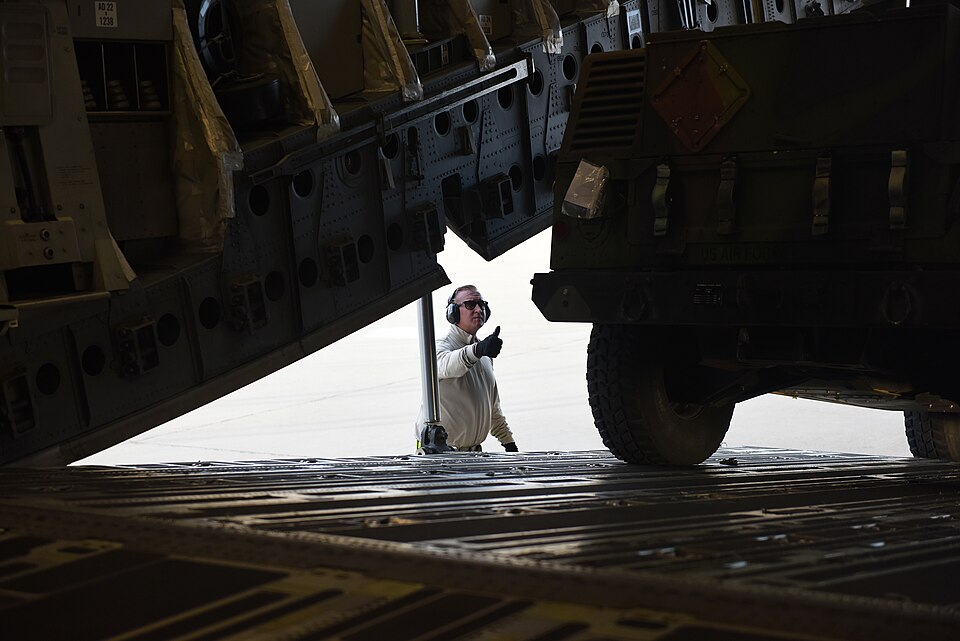
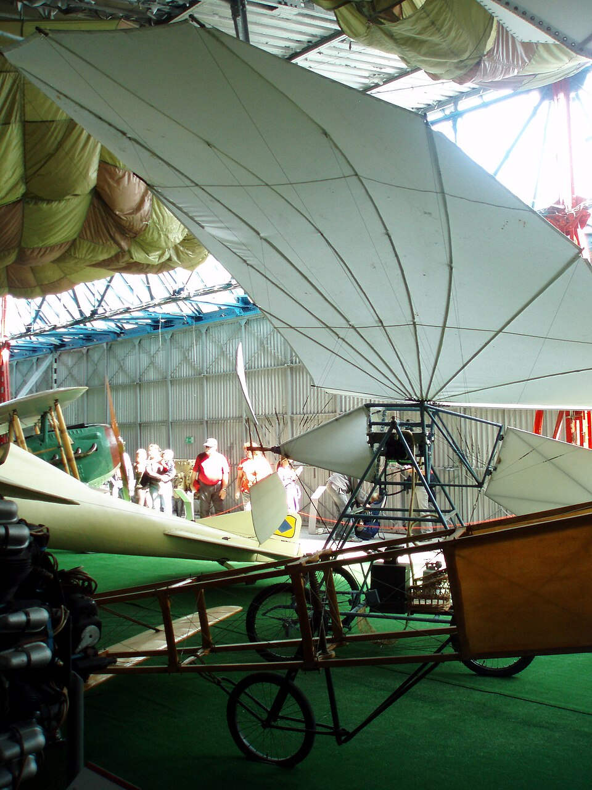
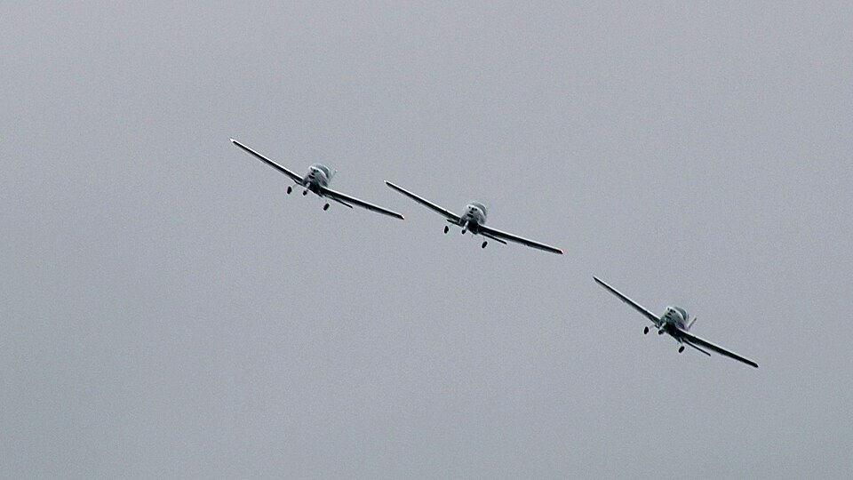
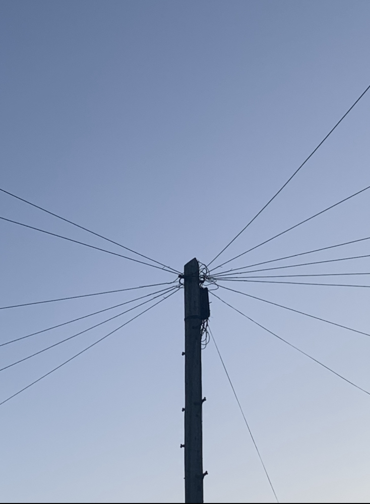
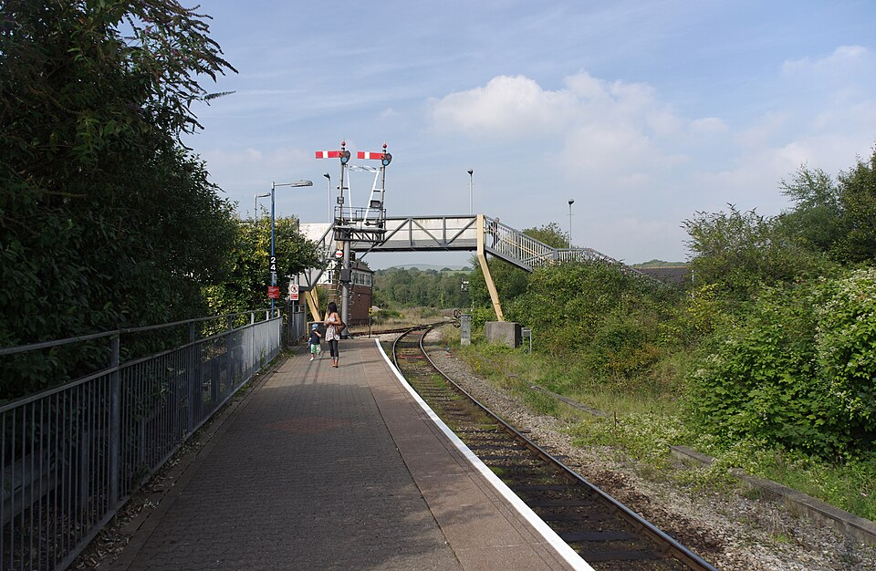
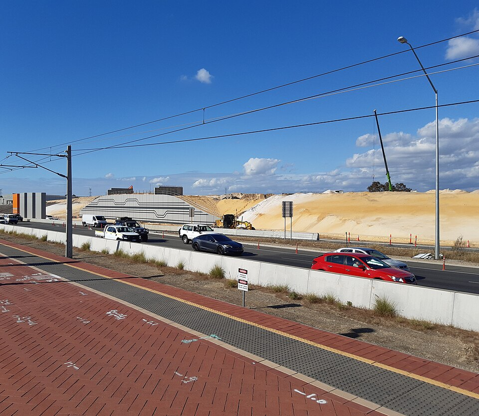
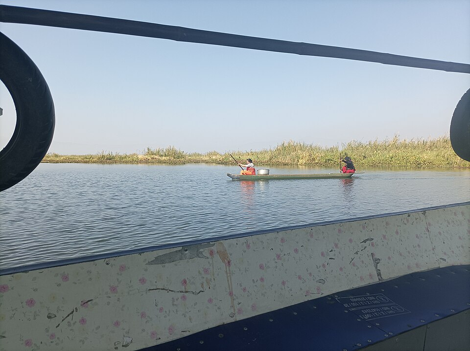

# Transportation & Logistics

> *Image: U.S. Space Force image by Staff Sgt. Shane Phipps, Public domain*

> *30th Logistics Readiness Squadron Air Transportation technicians help load Explosive Ordnance Disposal vehicles and equipment onto a C-17 Globemaster III, from Hickam Air Force Base, Feb. 18, 2018, Vandenberg Air Force Base, Calif. The EOD vehicles and equipment were transported as part of a depl...*

> *Image: U.S. Space Force image by Staff Sgt. Shane Phipps, Public domain*

Capabilities in this domain:

> *Image: Gaurav Dhwaj Khadka, CC BY-SA 4.0*

- [Aviation](aviation.md) — Aircraft development, tube-and-fabric airframes, propellers, and flight testing.

> *Image: Kenneth  Allen, CC BY-SA 2.0*

- [Light Aircraft](light-aircraft.md) — Single-engine propeller planes enabling rapid long-distance transport, aerial survey, and emergency medical evacuation with 100–300 hp engines and aluminum or composite airframes.

> *Image: Col. Sir F. J. Goldsmid, Public domain*

- [Telegraph Communication](telegraph.md) — Electrical telegraph systems using Morse code over wire for long-distance communication and railway block signaling.

> *Image: David P Howard, CC BY-SA 2.0*

- [Railways](railways.md) — Steam locomotive railways, track construction, signaling, and freight/passenger operations.

> *Image: Krzysztof Golik, CC BY-SA 4.0*

- [Road & Bridge Construction](roads.md) — Road construction from dirt tracks to paved highways, bridge building, and route planning.

> *Image: Haoreima, CC BY 4.0*

- [Water Transport](shipping.md) — Water transport: boats, barges, canals, and maritime shipping infrastructure.

> *Image: Evelyn Simak, CC BY-SA 2.0*

- [Road Construction Equipment](road-construction-equipment.md) — Graders, rollers, pavers, and excavating equipment for road and highway construction.
[↑ Back to Tech Tree](../index.md)
