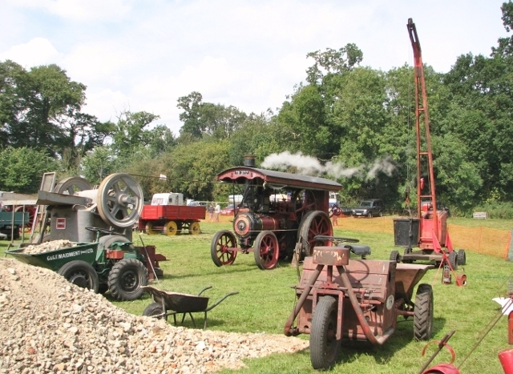

# Road Construction Equipment

> **Node ID**: transport.road-construction-equipment
> **Domain**: [Transport](./index.md)
> **Dependencies**: [`metals.iron-steel`](../metals/iron-steel.md), [`animals.draft-power`](../animals/draft-power.md), [`mining`](../mining/index.md)
> **Enables**: [`transport.roads`](roads.md)
> **Timeline**: Years 8-25
> **Outputs**: compacted_surfaces, graded_earth, shaped_road_profile
> **Critical**: No — road construction can be done manually with hand tools, but rollers and graders increase quality and speed by 5-10×

## Principle

> *Image: Evelyn Simak, CC BY-SA 2.0*

Road construction equipment shapes and compacts earth, aggregate, and paving materials into a stable road surface. The two fundamental operations are **grading** (cutting, moving, and spreading earth to create the road profile) and **compaction** (compressing soil, aggregate, or asphalt to increase density and bearing capacity). Proper compaction increases soil bearing capacity by 2-5× and reduces settlement under traffic loads from years to negligible levels.

Compaction effectiveness depends on three factors: **compactive effort** (force per unit area), **moisture content** (optimum moisture allows soil particles to rearrange; too dry and particles resist movement, too wet and water prevents densification), and **number of passes** (6-8 passes with a smooth drum roller typically achieves 95% of maximum dry density on granular soils). The Proctor compaction test determines the optimum moisture content and maximum dry density for each soil type — compact to ≥95% of this maximum for road construction.

## Prerequisites

- [Iron and steel](../metals/iron-steel.md) — for drums, blades, and frames
- [Draft power](../animals/draft-power.md) — animal traction for hand-drawn equipment (2-6 horses or oxen)
- [Mining](../mining/index.md) — crushed stone and aggregate supply
- [Basic tools](../foundations/tools-basic.md) — hand tools for construction and maintenance of the equipment itself

## Materials

### Smooth Drum Roller (3-5 tonne, animal-drawn)

| Material | Quantity | Specifications | Source | Alternatives |
|----------|----------|----------------|--------|-------------|
| Steel drum | 1 | 1.0-1.5 m diameter × 1.2-1.8 m wide, 10-15 mm wall, welded from rolled plate | [Iron & Steel](../metals/iron-steel.md) | Hardwood log with iron bands (lower weight, ≈1 tonne) |
| Drum end plates | 2 | 15-20 mm steel plate, welded to drum ends, with shaft journals | [Iron & Steel](../metals/iron-steel.md) | Cast iron end plates (requires foundry) |
| Shaft (axle) | 1 | 40-50 mm steel bar, 1.5-2.0 m long, turned journals at each end | [Iron & Steel](../metals/iron-steel.md) | Forged shaft (rougher finish) |
| Frame (tongue and hitch) | 1 | 50 × 50 mm angle iron or timber (150 × 150 mm hardwood), 2.5-3.5 m long | [Iron & Steel](../metals/iron-steel.md) | Timber frame (adequate for animal-drawn) |
| Scraper blade | 1 | 5-10 mm steel plate, curved to match drum diameter, bolted to frame behind drum | [Iron & Steel](../metals/iron-steel.md) | None — prevents mud buildup on drum |
| Bearings | 2 | Plain journal bearings or pillow blocks, 40-50 mm bore | [Bearings](../machine-tools/bearings-abrasives.md) | Hardwood bearings with grease lubrication |
| Ballast (fill) | — | Water, sand, or scrap iron to reach target weight (3-5 tonnes total) | — | Stone rubble (difficult to load/unload) |

### Sheepsfoot Roller (attachment for drum roller)

| Material | Quantity | Specifications | Source | Alternatives |
|----------|----------|----------------|--------|-------------|
| Steel feet | 40-80 | 50-75 mm diameter × 100-200 mm long, welded to drum surface | [Iron & Steel](../metals/iron-steel.md) | Timber pegs bolted through drum wall (wear quickly) |

### Animal-Drawn Grader Blade (Fresno-type, 2-4 m blade)

| Material | Quantity | Specifications | Source | Alternatives |
|----------|----------|----------------|--------|-------------|
| Moldboard blade | 1 | 5-8 mm steel plate, 2-4 m wide × 300-400 mm tall, curved cross-section | [Iron & Steel](../metals/iron-steel.md) | Timber blade with iron cutting edge (wears fast) |
| Cutting edge | 1 | 10-15 mm steel plate, 2-4 m wide × 80-100 mm tall, bolted to blade bottom | [Iron & Steel](../metals/iron-steel.md) | Hardened steel edge (longer life, harder to source) |
| Frame | 1 | 50 × 50 mm angle iron or 150 × 150 mm timber, 3-4 m long | [Iron & Steel](../metals/iron-steel.md) | Timber frame (adequate for animal-drawn) |
| Wheels | 2-4 | 400-600 mm diameter, iron-rimmed timber or solid cast iron | [Iron & Steel](../metals/iron-steel.md) | Timber discs with iron tires |
| Adjustment mechanism | 1 set | Lead screws or levers for blade angle, height, and lateral offset | [Machine Tools](../machine-tools/index.md) | Fixed blade (limits versatility) |
| Hitch | 1 | Forge-welded steel, with swivel for animal team attachment | [Forging](../metals/forming.md) | Rope traces (less control) |

## Construction Steps

### Smooth Drum Roller

1. **Roll the drum shell**: Cut a rectangular plate of 10-15 mm steel to the developed length of the drum circumference (π × diameter) plus a 30-50 mm overlap for welding. For a 1.2 m diameter × 1.5 m wide drum: plate size ≈ 3770 mm × 1500 mm. Roll the plate into a cylinder on a plate roller. Tack weld the longitudinal seam, then complete with a full-penetration weld (V-groove, back-gouge and weld from both sides).

2. **Weld end plates**: Cut two circular end plates from 15-20 mm steel plate, diameter matching the drum outside diameter. Weld a shaft journal (50 mm OD tube, 100 mm long, turned to 40 mm bore) concentric to each end plate. Position tolerance: ≤1.0 mm runout from the journal center to the plate edge. Weld each end plate to the drum shell with a continuous fillet weld, 6 mm leg size, inside and outside.

3. **Install drain/fill ports**: Cut and weld two 50 mm diameter pipe nipples into one end plate — one at the bottom (drain) and one near the top (fill). Install pipe plugs. These ports allow filling the drum with water or sand for ballast and draining for transport.

4. **Fabricate the frame and tongue**: Build a rectangular frame from 50 × 50 mm angle iron (or 150 × 150 mm hardwood timber). The frame straddles the drum, with bearing mounts at each side. Attach a tongue (drawbar) extending 2.5-3.5 m forward for animal hitch. The tongue must be long enough that the draft animals are clear of the drum — minimum 2.5 m from hitch point to drum center.

5. **Mount the drum on bearings**: Install pillow block bearings or journal bearings on the frame. Insert the drum shaft through the bearings. Verify the drum rotates freely: ≤50 N·m torque required to spin the empty drum. If binding, realign bearings or shim mounts.

6. **Attach scraper blade**: Bolt a curved steel plate (5 mm thick, matching the drum curvature, spanning the full drum width) to the frame immediately behind the drum. Gap between scraper and drum surface: 3-5 mm. The scraper removes stuck material from the drum during operation, preventing buildup that causes uneven compaction.

7. **Add ballast**: Fill the drum with water (preferred — easily drained for transport) or sand through the fill port. A 1.2 m diameter × 1.5 m wide drum holds approximately 1,700 L of water (1,700 kg). Combined with drum steel weight (≈500-800 kg), total weight reaches 2,200-2,500 kg with water fill. For heavier compaction (3-5 tonnes): add sand or scrap iron inside the drum, or add a ballast box on the frame.

### Sheepsfoot Roller (Modification of Smooth Drum)

8. **Weld feet to drum**: Cut 40-80 steel feet (50-75 mm square base, 100-200 mm long) from bar stock or forged blanks. Weld each foot to the drum shell in a staggered pattern (no two adjacent feet in the same circumferential or axial line). Foot spacing: 50-80 mm apart in each direction, measured at the base. The staggered pattern ensures full coverage of the soil surface as the drum rotates — every point on the ground should be struck by at least one foot per pass.

### Animal-Drawn Grader Blade

9. **Form the moldboard**: Heat and bend the 5-8 mm steel plate to a curved cross-section (convex face forward). The curve pushes earth to the side and simultaneously compacts it. A typical moldboard curve: radius 400-600 mm over the 300-400 mm blade height. Alternatively, cut the curve cold with a press brake.

10. **Attach the cutting edge**: Bolt the hardened cutting edge (10-15 mm steel, 80-100 mm tall) to the bottom of the moldboard with 4-6 countersunk bolts (M16, flush on the earth-contact face). The cutting edge is a wear item — design for easy replacement. Sharpen the bottom edge to a 30° bevel for cutting into hard ground.

11. **Build the frame and wheel assembly**: Construct a rectangular frame from angle iron or timber, mounted on 2-4 wheels (400-600 mm diameter). The moldboard hangs from the frame at the midpoint between axles. The frame must be rigid enough to transmit the cutting force from the blade to the ground through the wheels without excessive flexure — deflection at the blade <10 mm under full cutting load.

12. **Install adjustment mechanisms**: Mount the blade on a pivot at the frame center that allows three adjustments:
    - **Blade angle** (rotation about a vertical axis): 30-60° from the direction of travel. Steeper angle moves more earth laterally; shallower angle allows faster travel with less cutting depth. Adjust with a lever and pin-in-hole system (6-8 positions).
    - **Blade height** (vertical position): Raise to clear obstacles, lower to cut. Adjust with a lead screw or ratchet lever. Cutting depth range: 0-150 mm below wheel contact level.
    - **Lateral offset** (blade position relative to frame center): Slide the blade left or right to grade outside the wheel track. Range: ±300 mm from center. Adjust with a horizontal slide and locking bolt.

13. **Attach hitch**: Forge or weld a hitch assembly at the front of the frame. The hitch must allow vertical pivoting (for the team to walk on uneven ground while the blade stays level) and horizontal pivoting (for turning). A single-tree (spreader bar) distributes the pull across 2-4 animals. Hitch height: set so the draft animals pull horizontally — adjust for the height of the team (horses ≈1.0 m, oxen ≈0.8 m at shoulder).

## Calibration and Verification

### Roller Calibration

1. **Drum runout**: Mount a straightedge against the drum surface. Rotate the drum and measure runout at 4 positions around the circumference. Maximum runout: ≤3 mm. Excessive runout causes uneven compaction (visible as a corrugated surface).

2. **Weight verification**: Weigh the roller (empty and filled) on a platform scale. Verify total weight is within 5% of the target. For a 3-5 tonne roller, the drum should be filled to the calculated water/sand volume for the target weight. Mark the fill level on the drum interior for field reference.

3. **Compaction test strip**: Compact a 10 m test strip of the road material (6-8 passes at the target speed). Measure density with a sand cone test or nuclear density gauge. Target: ≥95% of maximum dry density (Proctor test). If density is low, increase the number of passes or add moisture.

### Grader Calibration

4. **Blade alignment**: Set the blade to 45° from the direction of travel. Measure the angle with a protractor. Tolerance: ±3°. Verify blade height is level across the full width (check with a spirit level on the cutting edge). Maximum deviation: ≤5 mm.

5. **Cutting depth test**: On a prepared surface, lower the blade to the minimum cutting depth (25 mm). Pull the grader forward 5 m. Measure the depth of cut at 3 points along the blade. Deviation: ≤5 mm from target.

## Expected Performance

### Smooth Drum Roller

| Parameter | Animal-Drawn (3-5 t) | Self-Propelled (8-12 t) |
|-----------|:--------------------:|:-----------------------:|
| Drum width | 1.2-1.8 m | 1.5-2.1 m |
| Operating speed | 2-4 km/h (animal walking pace) | 3-8 km/h |
| Passes for 95% compaction | 6-8 (granular), 10-15 (cohesive) | 4-6 (granular), 8-10 (cohesive) |
| Compaction depth per lift | 150-200 mm (granular), 100-150 mm (cohesive) | 200-300 mm (granular), 150-200 mm (cohesive) |
| Production rate | 200-400 m²/hour | 500-1000 m²/hour |
| Total weight | 3-5 tonnes | 8-12 tonnes |
| Daily output | 1,500-3,000 m² (8-hour day) | 4,000-8,000 m² (8-hour day) |

### Sheepsfoot Roller

| Parameter | Value |
|-----------|-------|
| Foot dimensions | 50-75 mm diameter × 100-200 mm long |
| Foot contact pressure | 1.5-3.5 MPa (per foot) |
| Effective compaction depth | 200-300 mm (cohesive soils) |
| Passes for 95% compaction | 8-12 on clay subgrade |
| Best soil type | Clay, silt, and cohesive soils |

### Grader Blade

| Parameter | Animal-Drawn (2-4 m) | Motor Grader (3-4 m) |
|-----------|:--------------------:|:--------------------:|
| Blade width | 2-4 m | 3-4 m |
| Cutting depth | 0-150 mm | 0-300 mm |
| Operating speed | 2-4 km/h | 3-12 km/h |
| Cross-section accuracy | ±20 mm of design profile | ±10 mm of design profile |
| Production rate (grading) | 500-1,500 m²/hour | 2,000-5,000 m²/hour |
| Draft requirement | 2-4 horses or oxen | 50-150 kW engine |

## Strengths

- Rollers are mechanically simple — a drum on a frame with bearings. Buildable in a basic workshop with welding capability
- Animal-drawn versions require no fuel or power supply — sustainable at any industrial level
- Sheepsfoot modification to a smooth drum is straightforward — weld feet to the existing drum
- Grader blade shapes the crowned road profile in a single pass, which would take hours of manual shovel work
- Compaction improves soil bearing capacity 2-5× — the difference between a road that lasts years and one that lasts decades

## Weaknesses

- Animal-drawn equipment is limited to 2-4 km/h operating speed — slow for long road sections
- Rollers cannot compact frozen ground or saturated soil — seasonal limitation in cold/wet climates
- Smooth drum rollers are ineffective on cohesive (clay) soils — sheepsfoot or pneumatic-tired rollers are needed
- Grader blade requires a skilled operator to achieve the target road profile — an unskilled operator can make the road worse
- All equipment requires maintenance (bearing lubrication, blade sharpening, drum weld repair) — neglected equipment degrades rapidly

## Safety

- **Roller rollover**: Rollers on side slopes >15% (8.5°) are at risk of rollover. The high-mounted drum creates a high center of gravity. Always work up and down slopes, never across. If cross-slope grading is necessary, start at the bottom and work up.
- **Runaway roller**: On steep downgrades, an animal-drawn roller can overrun the team. Install a brake (lever-actuated friction brake on the drum shaft) for grades >5%. Never allow the roller to freewheel downhill.
- **Dust**: Grading dry earth produces respirable dust. Operators and nearby workers should wear dust masks when grading in dry conditions.
- **Animal handling**: Draft animals require experienced handlers. A spooked team can bolt, dragging the equipment unpredictably. Never stand directly in front of or behind a hitched team.
- **Crush hazard between equipment and structures**: The grader blade extends beyond the wheel track. Ensure minimum 1 m clearance between the blade tip and any obstacle (walls, boulders, other equipment).

## Troubleshooting

| Problem | Probable Cause | Solution |
|---------|---------------|----------|
| Roller leaving corrugated surface | Drum out-of-round, bearing worn, uneven ballast | Measure drum runout; replace worn bearings; drain and refill ballast evenly |
| Inadequate compaction (low density) | Too few passes, wrong moisture, lift too thick | Increase passes to 8-10; check moisture with hand squeeze test (should form ball without dripping); reduce lift thickness to 150 mm |
| Drum picking up soil (sticky clay) | Clay too wet, no scraper blade, wrong roller type | Wait for drier conditions; install/adjust scraper blade; switch to sheepsfoot roller for clay |
| Grader blade gouging road surface | Blade tilted, cutting depth too deep, blade worn unevenly | Re-level blade; reduce cutting depth; inspect and sharpen or replace cutting edge |
| Grader not cutting hard ground | Blade dull, insufficient draft power, angle too steep | Sharpen or replace cutting edge; add another animal to the team; reduce blade angle to 30° |
| Sheepsfoot feet clogging with clay | Clay too wet, feet too close together | Wait for drier conditions; if feet are welded at <50 mm spacing, remove every other foot to increase clearance |
| Roller sinking into soft subgrade | Subgrade bearing capacity too low for roller weight | Reduce roller weight (drain partial ballast); add geotextile fabric and 150-200 mm granular layer before compaction |
| Excessive vibration loosening frame bolts | Frame joints not re-torqued after initial 10 hours of operation | Inspect all frame bolts weekly; apply thread-locking compound to critical joints; re-torque to specification |
| Uneven road crown (water ponds in wheel tracks) | Grader blade not set to correct crown angle, or single-pass grading | Set blade to produce 2-4% cross-slope (20-40 mm per meter of road width); make at least 2 passes per section — one each direction |

## Scaling Notes

A single animal-drawn roller (3-5 tonnes) compacts 1,500-3,000 m² per 8-hour day. At this rate, a 1 km section of 6 m wide road requires 2-4 days of roller work per lift. A typical 2-layer gravel road (150 mm subbase + 100 mm base) needs 4-8 roller days per kilometer.

Scaling from animal-drawn to engine-powered equipment increases throughput 3-5× and allows heavier drums (8-12 tonnes) for deeper compaction (200-300 mm lifts vs. 150-200 mm). However, the minimum viable road-building capability is the animal-drawn setup described here — sufficient for low-traffic roads carrying <500 vehicles per day at speeds below 40 km/h.

## Variations and Alternatives

- **Smooth drum vs. sheepsfoot vs. pneumatic-tired**: Smooth drums for granular soils and surface finishing. Sheepsfoot for cohesive (clay) subgrades — the feet penetrate and knead the soil. Pneumatic-tired rollers for asphalt compaction — rubber tires conform to surface irregularities for uniform density. A construction site needs at least a smooth drum; adding sheepsfoot feet extends capability to clay subgrades.
- **Animal-drawn vs. self-propelled**: Animal-drawn equipment is limited to walking speed (2-4 km/h) and the sustained pull of 2-4 draft animals (2-5 kN per animal). Self-propelled rollers and motor graders use diesel or electric power for 3-5× the speed and force — but require engine manufacturing capability.
- **Fresno scraper**: A horse-drawn earthmoving scoop with a curved bowl. Simpler than a grader — the operator opens and closes the bowl with a lever to scoop earth, haul it, and dump it. Effective for moving small volumes (0.5-0.8 m³ per trip) over short distances (50-200 m). Not a substitute for a grader, but complementary for earthmoving.
- **Hand tools**: Shovels, rakes, and hand tampers can grade and compact small areas. A 2-person team with hand tampers compacts 20-50 m²/hour — feasible for short road sections but impractical for road construction longer than 100 m.

## See Also

- [Road & Bridge Construction](roads.md) — road design, surface types, and construction methods
- [Cement & Concrete](../chemistry/cement.md) — concrete for road paving and bridge construction
- [Draft Power](../animals/draft-power.md) — animal traction for construction equipment
- [Mining](../mining/index.md) — crushed stone and aggregate production for road materials
- [Iron & Steel](../metals/iron-steel.md) — steel for drums, blades, and frames

---

*Part of the [Bootciv Tech Tree](../index.md) • [Transport](./index.md) • [All Domains](../index.md)*
