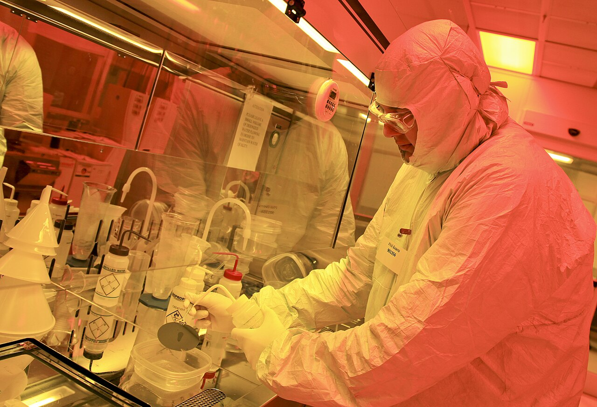
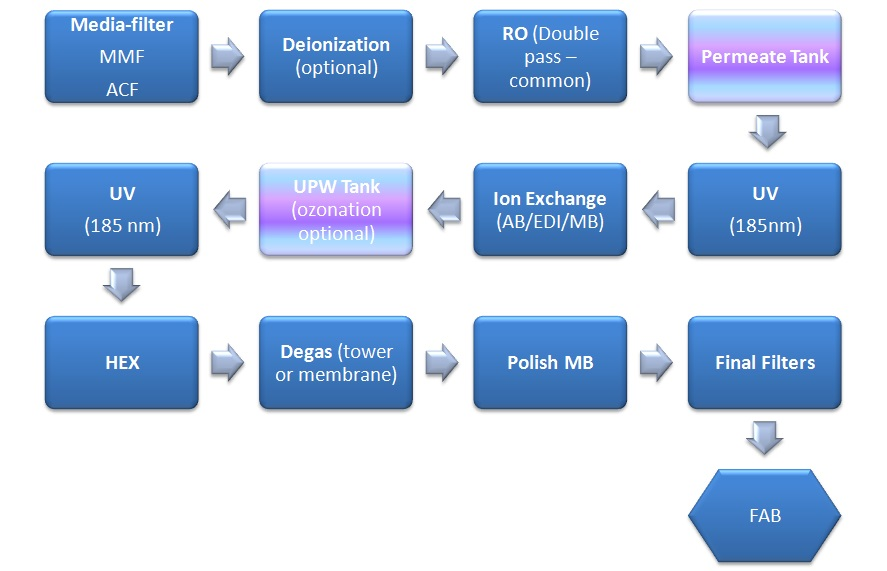
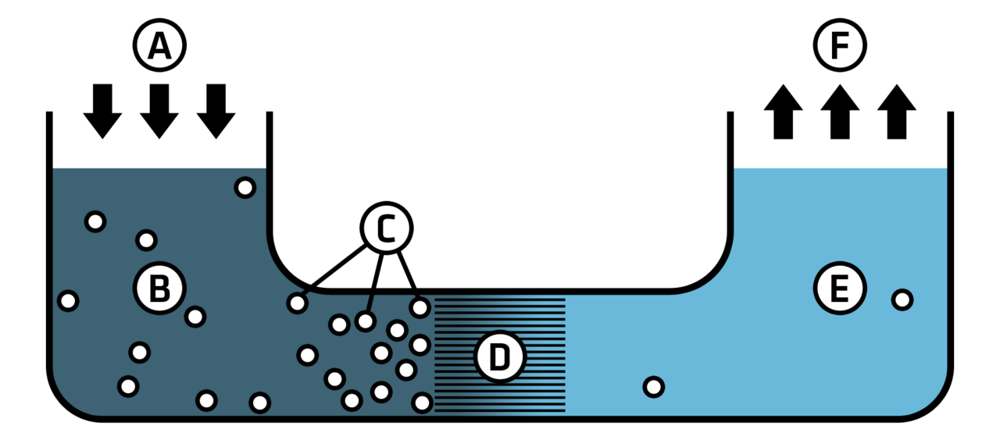

# Ultra-Pure Materials

> *Phil Evans, a research scientist in the Quantum Information Science group, rinses a silicon-on-insulator wafer with isopropyl alcohol following electron beam lithography at the Center for Nanophase Materials Sciences. Dr. Evans is fabricating quantum photonic circuits – consisting of waveguides a...*

> *Image: Oak Ridge National Laboratory, CC BY 2.0*

Capabilities in this domain:

> *Image: Igorsky, CC BY-SA 4.0*

- [Ultra-Pure Water (UPW)](upw.md) — Multi-stage purification to 18.2 MΩ·cm resistivity: RO, electrodeionization, mixed-bed ion exchange, UV oxidation, sub-micron filtration, cleanroom distribution

> *Image: Colby Fisher, CC BY-SA 3.0*

- [High-Purity Chemicals](high-purity-chemicals.md) — 9N+ (99.9999999%) chemical purification: sub-boiling distillation, isothermal distillation, zone refining, ion exchange, electronic-grade acids and solvents
<!-- TODO: source image for Analytical Verification -->
- [Analytical Verification](analytical-verification.md) — PPT-level contamination detection: ICP-MS (0.1-10 ppt metals), TOC analysis, ion chromatography, laser particle counting, dissolved oxygen monitoring

[↑ Back to Tech Tree](../../index.md)
