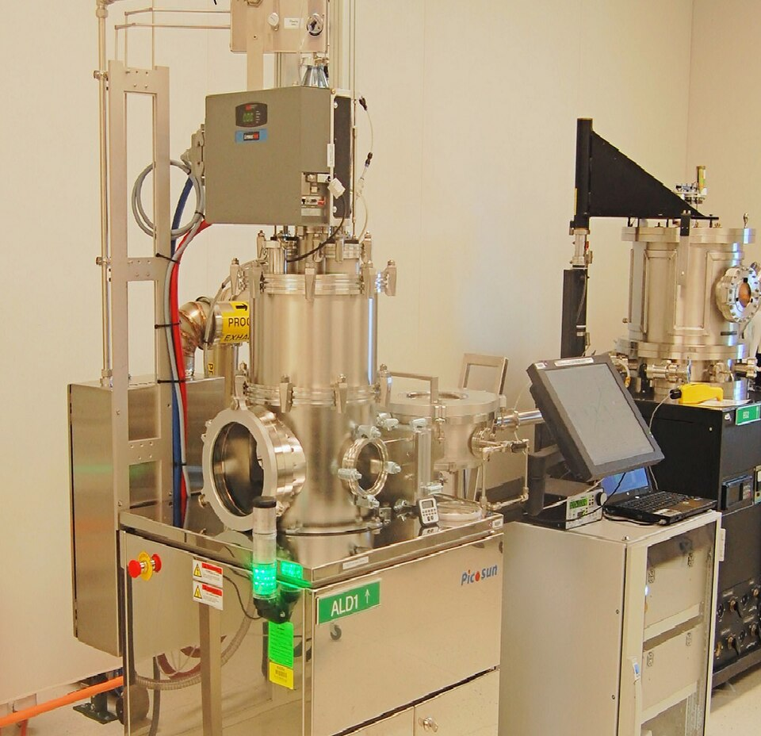
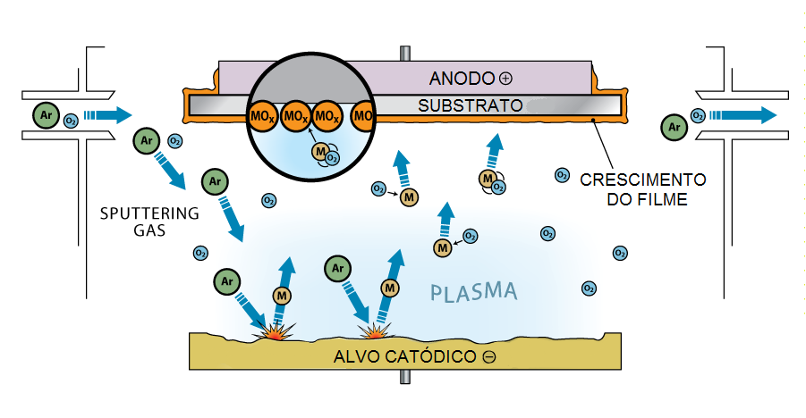

# Deposition Systems

> **Node ID**: vacuum.deposition-systems
> **Domain**: [Vacuum Technology](./index.md)
> **Dependencies**: [`vacuum.pumps`](./pumps.md), [`vacuum.chambers`](./chambers.md), `gas-handling`, `precision-motion`
> **Enables**: [`photolithography.fab-processes`](../photolithography/fab-processes.md), [`silicon.basic-devices`](../silicon/basic-devices.md), [`optics.inspection.optical-coatings`](../optics/optical-coatings.md)
> **Critical**: Yes — vacuum deposition systems (sputtering, evaporation, CVD) are required for all semiconductor thin-film fabrication; no alternative to vacuum-based deposition exists
> **Timeline**: Years 25-40
> **Outputs**: sputter_deposition, cvd_films, evaporated_films, load_lock_systems, pump_down_procedures

Deposition systems are the reason vacuum technology exists in semiconductor manufacturing. Every thin film — gate oxides, polysilicon gates, metal interconnects, passivation layers, barrier films — is deposited in a vacuum environment. This document covers the integrated systems that combine vacuum [pumps](./pumps.md), [chambers](./chambers.md), gas delivery, substrate handling, and process control into deposition tools.

## Sputter Deposition Systems

> *An Atomic Layer Deposition (ALD) system at Los Alamos National Laboratory.*

> *Image: Center for Integrated Nanotechnologies - Los Alamos National Laboratory, Public domain*

> *Crescimento de filme por sputtering reativo.*

> *Image: RegiSantana, CC BY-SA 4.0*

### DC Magnetron Sputtering

**Principle**: A DC voltage (300-700 V) applied between a conductive target (cathode) and the chamber (anode) creates an Ar plasma. A magnetic field behind the target traps electrons in a racetrack pattern, increasing ionization efficiency near the target surface. Ar⁺ ions bombard the target, ejecting atoms that travel to the substrate and condense as a thin film.

**System components**:
- **Target assembly**: Water-cooled copper backing plate with the target material bonded (soldered, brazed, or mechanically clamped) to the front face. Target thickness: 3-12 mm (consumed over life). Bonding quality is critical — voids between target and backing cause local overheating and arcing. Ultrasonic C-scan inspection verifies bond integrity.
- **Magnetron assembly**: Permanent magnets (NdFeB or SmCo) arranged behind the target to create a closed magnetic field loop. The magnetic field strength at the target surface: 0.03-0.05 T. The magnets define the erosion racetrack — target utilization is typically 25-40% (the racetrack grooves deeply while the center and edges remain uneroded).
- **Substrate holder**: Heated or cooled stage with wafer clamping. For deposition uniformity, the substrate may rotate (planetary rotation: 10-30 RPM) or undergo linear translation. Substrate-to-target distance: 50-150 mm. Closer = higher deposition rate but worse uniformity.
- **Power supply**: DC for conductive targets (Al, Cu, Ti, W). Current-regulated, typically 1-20 kW. Arc suppression circuit detects voltage drops indicating micro-arcs and rapidly reverses voltage to extinguish the arc before it ejects droplets (macroparticles) onto the substrate.
- **Gas delivery**: Mass flow controllers (MFCs) for Ar (sputter gas, 10-100 sccm) and reactive gases (N₂ for TiN, O₂ for ITO). Gas injection ring near the target for uniform distribution. Total pressure: 1-10 mTorr, controlled by throttling the turbo pump gate valve.

**Operating parameters**:
| Parameter | Typical Range | Notes |
|---|---|---|
| Target voltage | 300-700 V DC | Depends on target material and Ar pressure |
| Discharge current | 1-20 A | Controls deposition rate |
| Ar pressure | 2-10 mTorr | Lower = more energetic adatoms, denser films |
| Substrate temperature | 20-400°C | Higher = better film crystallinity |
| Deposition rate | 5-30 nm/min | Material-dependent (Al ~30, Ti ~10, W ~5 nm/min) |
| Film uniformity | ±3-10% | Across 150-200 mm wafer |

**Process notes**:
- **Target conditioning (pre-sputter)**: Before depositing on substrates, sputter the target for 5-30 minutes with the shutter closed. This removes surface oxides and contaminants from the target, stabilizing the discharge and preventing impurity incorporation in the first layers of film. Monitor discharge voltage — when it stabilizes, the target is clean.
- **Pressure effects**: Low Ar pressure (1-3 mTorr) gives longer mean free path → sputtered atoms arrive at the substrate with higher kinetic energy → denser, more adherent films. High Ar pressure (>10 mTorr) thermalizes sputtered atoms through gas-phase collisions → less dense films but better step coverage due to scattering.
- **Substrate bias**: Applying a small RF bias (-50 to -200 V) to the substrate holder during deposition causes Ar⁺ ion bombardment of the growing film (ion-assisted deposition). This densifies the film, improves adhesion, and can change crystal texture. Trade-off: too much bias causes resputtering (reduces net deposition rate) and Ar incorporation.

### RF Magnetron Sputtering

**Principle**: For insulating targets (SiO₂, Al₂O₃, Si₃N₄), a DC plasma cannot be sustained — positive charge accumulates on the target surface and extinguishes the discharge. An RF power supply (13.56 MHz) alternates the voltage polarity each half-cycle, allowing electrons to neutralize the accumulated positive charge. The impedance mismatch between the RF supply and the plasma is matched by an automatic matching network (tunable capacitors).

**System differences from DC sputtering**:
- **RF power supply**: 13.56 MHz oscillator with automatic impedance matching network. Power: 100-2000 W. The matching network minimizes reflected power (<5% of forward power) to protect the RF generator.
- **Target material**: Insulating ceramics (SiO₂, Al₂O₃, Si₃N₄, ITO) or semiconductors. Target bonded to a metal backing plate (for cooling) with conductive adhesive.
- **Deposition rates**: Generally lower than DC sputtering for equivalent power input, because the RF field distributes energy between target sputtering and substrate bombardment. SiO₂: 2-10 nm/min. Al₂O₃: 1-5 nm/min.

## CVD Reactor Systems

### LPCVD Hot-Wall Tube Reactor

**Configuration**: Horizontal or vertical quartz tube (150-300 mm diameter), resistance-heated by a 3- or 5-zone furnace. Wafers stand vertically in a slotted quartz boat (50-200 wafers per run). Process gases flow through the tube at low pressure (0.1-1 Torr).

**System components**:
- **Furnace**: 3-5 zone resistive heating with ±1°C uniformity over the hot zone (600-1200 mm length). Maximum temperature: 900-1200°C. Thermocouples (Type K or S) in each zone provide feedback to PID controllers.
- **Quartz tube**: Fused silica, 150-300 mm ID, 1200-2400 mm length. Must be replaced when contaminated with deposited material (after 50-200 runs depending on process). End caps with O-ring seals and gas inlet/outlet ports.
- **Gas delivery**: Mass flow controllers for process gases (SiH₄, NH₃, SiH₂Cl₂, N₂O, TEOS bubbler). Gas manifold with pneumatic valves for automated sequencing. All wetted parts: stainless steel 316L or electropolished 304L.
- **Vacuum system**: Rotary vane or scroll roughing pump (for reaching 0.1-1 Torr operating pressure). Pressure controlled by throttle valve + capacitance manometer feedback loop (±1% pressure stability). No high-vacuum pump needed — LPCVD operates at rough/medium vacuum.
- **Wafer boat**: Quartz slotted boat holds wafers vertically at 3-10 mm spacing. Boat loaded on a quartz paddle, inserted into the furnace by a cantilever loader (push rate <5 cm/min to avoid thermal shock).

**Typical processes**:
| Film | Gases | Temperature | Rate | Uniformity |
|---|---|---|---|---|
| Poly-Si | SiH₄ | 620°C | ~10 nm/min | ±2-5% |
| Si₃N₄ | SiH₂Cl₂ + NH₃ | 750-850°C | ~3-5 nm/min | ±2-5% |
| SiO₂ (TEOS) | TEOS + O₂ | 650-750°C | ~5-15 nm/min | ±3-5% |
| SiO₂ (SiH₄) | SiH₄ + O₂ | 450°C | ~10 nm/min | ±3-5% |

**Process notes**:
- **Hot-wall vs. cold-wall**: In a hot-wall reactor, the tube walls are at the same temperature as the wafers — film deposits on the walls as well. This wastes precursor gas and eventually requires tube cleaning (or replacement). The advantage is excellent temperature uniformity across the wafer batch. Cold-wall reactors (only the substrate is heated) avoid wall deposition but have worse uniformity.
- **Particle generation**: Flaking of deposited film from the tube walls is the primary particle source in LPCVD. As film builds up (tens of μm), thermal cycling creates stress that causes spalling. Flakes fall onto wafers below. Mitigation: replace/clean tubes on schedule, use dedicated tubes for each film type, orient wafers vertically so flakes fall between slots rather than onto surfaces.

### PECVD Parallel-Plate Reactor

**Configuration**: A vacuum chamber containing two parallel electrodes. The upper electrode (showerhead) distributes process gases uniformly. The lower electrode (heated platen) holds the wafer. RF power (13.56 MHz) applied to one electrode generates plasma between the plates.

**System components**:
- **Chamber**: Stainless steel or aluminum, 300-500 mm diameter. Viewport for plasma observation. Pumped by a turbomolecular pump (throttled to maintain process pressure 0.5-5 Torr).
- **Showerhead electrode**: Perforated plate (hundreds of 1-2 mm holes) for uniform gas distribution across the wafer. Material: aluminum (coated with Al₂O₃ or Y₂O₃ for corrosion resistance) or anodized aluminum.
- **Heated platen**: Resistive or lamp-heated substrate electrode. Temperature: 200-400°C (limited by RF power coupling and wafer handling). Uniformity: ±5°C across 200 mm wafer. Heated by embedded cartridge heaters or external lamp array with reflector.
- **RF system**: 13.56 MHz RF generator (300-3000 W), automatic matching network, and power sensor. The matching network adjusts two capacitors to minimize reflected power. RF power density: 0.1-1 W/cm².
- **Vacuum system**: Turbomolecular pump (300-2000 L/s) backed by a dry (scroll) or wet (rotary vane) pump. Throttle valve controls process pressure. Typical pump-down: 5-15 minutes from atmosphere to base pressure (10⁻⁶ Torr), then backfill to process pressure.
- **Load lock**: Separate chamber for wafer introduction without venting the process chamber. Pumped by a dedicated roughing pump + small turbo (or just a roughing pump). Cycle time: 2-5 minutes per wafer.

**Typical processes**:
| Film | Gases | Temperature | Rate | Notes |
|---|---|---|---|---|
| SiNₓ | SiH₄ + NH₃ + N₂ | 300-400°C | 5-50 nm/min | Final passivation, anti-reflection coating |
| SiO₂ | SiH₄ + N₂O | 300-400°C | 10-30 nm/min | Interlayer dielectric |
| a-Si:H | SiH₄ | 200-300°C | 5-20 nm/min | TFT channel, solar cells |
| SiC | SiH₄ + CH₄ | 300-400°C | 5-15 nm/min | MEMS, harsh environment |

### APCVD Conveyor Furnace

**Configuration**: Wafers travel on a belt or moving boat through a heated zone at atmospheric pressure (760 Torr). No vacuum system required — gases flow through an open-tube furnace at 10-50 L/min.

**Characteristics**:
- **Deposition rate**: 10-100 nm/min (fast — gas transport is not diffusion-limited at atmospheric pressure)
- **Uniformity**: ±5-10% (worse than LPCVD due to gas flow patterns)
- **Step coverage**: Poor — conformality limited at high pressure
- **Applications**: SiO₂ doped glasses (BSG, PSG), thick oxide deposition where quality is less critical
- **Advantage**: Simplicity — no vacuum system, high throughput, continuous processing
- **Limitation**: Poor film quality and uniformity compared to LPCVD; not suitable for critical films (gate oxide, thin dielectrics)

## Evaporation Systems

### Thermal Evaporation

**Principle**: A resistively heated boat or filament (W, Mo, Ta) holds the source material. At the source temperature, the material vapor pressure becomes significant (>10⁻² Torr), and atoms leave the surface in all directions. At chamber pressure <10⁻⁵ Torr, mean free path exceeds the source-to-substrate distance, and atoms travel in straight lines (line-of-sight deposition).

**System components**:
- **Vacuum chamber**: Bell jar (glass or stainless steel, 300-500 mm diameter) or box coater. Base pressure: <10⁻⁶ Torr. Pumped by diffusion pump + LN₂ trap + rotary vane (classic configuration) or turbomolecular pump + scroll pump.
- **Source holder**: Tungsten, molybdenum, or tantalum boat (resistively heated, 1000-2000°C) or filament (for wire-fed sources like Al). Multiple source positions for sequential deposition of different materials without breaking vacuum.
- **Substrate holder**: Heated or unheated dome or planar fixture. Planetary rotation for uniform thickness on 3D geometries. Substrate-to-source distance: 200-500 mm.
- **Thickness monitor**: Quartz crystal microbalance (QCM). A 6 MHz AT-cut quartz crystal oscillates at a frequency proportional to its mass. As film deposits on the crystal, its mass increases and frequency decreases. Rate: ~2.27 Hz/nm for aluminum. Crystal lifetime: 5,000-50,000 nm total thickness before replacement (the crystal drifts as stress builds up in the deposited film).
- **Shutter**: Mechanical shutter between source and substrate. Opens when the source is at temperature and rate is stable. Closes at target thickness.

**Operating parameters**:
| Material | Source Temperature | Vapor Pressure | Deposition Rate | Notes |
|---|---|---|---|---|
| Al | 1200-1400°C | ~10⁻² Torr | 5-50 nm/min | Wets tungsten boats — use BN or Al₂O₃-coated boats |
| Au | 1400-1600°C | ~10⁻² Torr | 10-100 nm/min | High rate, excellent conductivity |
| Ti | 1700-1900°C | ~10⁻² Torr | 1-5 nm/min | Reactive — getters residual gas |
| Cr | 1400-1600°C | ~10⁻² Torr | 2-10 nm/min | Adhesion layer for Au, Cu on oxide |
| Cu | 1300-1500°C | ~10⁻² Torr | 10-50 nm/min | Must use Ta or Mo boats (not W — alloys with Cu) |

### Electron-Beam Evaporation

**Principle**: A focused electron beam (5-40 keV, 0.1-10 A) heats a small spot on the source material in a water-cooled copper hearth. The localized heating reaches much higher temperatures than thermal boats, enabling evaporation of refractory metals (W, Ta, Mo) and ceramics.

**System components**:
- **E-beam gun**: Thermionic emitter (tungsten filament) with electrostatic focusing and magnetic deflection (270° bend to prevent filament contamination reaching the substrate). Power: 1-10 kW.
- **Hearth**: Water-cooled copper crucible with multiple pockets (4-6 positions) for sequential evaporation of different materials. The copper cold-crucible design creates a solid skull of the source material at the hearth walls, preventing copper contamination.
- **Source scanning**: Magnetic deflection coils sweep the beam across the source surface for uniform evaporation (prevents deep crater formation that would cause non-uniform thickness).

**Advantages over thermal evaporation**:
- Higher purity: the water-cooled hearth prevents crucible contamination (only the source material is hot)
- Higher temperature: can evaporate refractory metals and ceramics
- Higher deposition rate: up to 100 nm/min for some materials
- Multiple sources: hearth rotates between pockets for multi-layer deposition

**Limitations**:
- X-ray generation: the high-energy electron beam produces Bremsstrahlung X-rays that can damage sensitive devices (MOS gate oxides). Not suitable for front-end-of-line (FEOL) deposition on wafers with thin gate oxides.
- More complex and expensive than thermal evaporation
- Requires higher vacuum (<10⁻⁶ Torr) for stable beam operation

## Load-Lock Design

### Purpose

A load lock transfers wafers between atmospheric pressure and high vacuum without venting the main process chamber. Every vent cycle deposits multiple monolayers of water vapor on internal surfaces, requiring hours of pumping to recover base pressure. Load locks limit contamination to a small, easily pumped volume.

### Design Parameters

**Volume**: Minimize load lock volume to minimize pump-down time. Typical: 5-20 L (holds 1-25 wafers). Pump-down from atmosphere to 10⁻⁶ Torr: 5-15 minutes (vs. 2-8 hours for main chamber).

**Pumping**: Dedicated roughing pump (rotary vane or scroll, 10-50 L/s) plus optional small turbomolecular pump (50-200 L/s) for faster pump-down to high vacuum. A gate valve connects the load lock to the main chamber for high-vacuum wafer transfer.

**Gate valves**: Two gate valves — one to atmosphere (the load/unload door) and one to the main process chamber. Pneumatic actuation: 1-3 second open/close time.

**Transfer mechanism**:
- **Magnetic feedthrough**: External magnet moves a trolley or paddle inside the load lock through the chamber wall. Simple, reliable, no bellows or shaft seal required. Limited to small, flat substrates.
- **Wobble stick**: Bellows-sealed push rod with a fork or paddle tip. Manually or pneumatically actuated. Low cost but requires operator skill.
- **Motorized transfer arm**: Stepper-motor-driven linear arm with wafer paddle. Position feedback via encoder. Programmable transfer sequence. Most common in production equipment. Wafer picked up by vacuum chuck or edge-grip on the paddle tip.

**Vent gas**: Always vent with dry nitrogen (N₂) — not atmospheric air. Dry N₂ leaves only a thin physisorbed N₂ layer that pumps away in seconds. Atmospheric air deposits multiple monolayers of water vapor, requiring extended pumping. N₂ supply: pressure-regulated (1.0-1.2 bar absolute) with 0.2 μm particle filter.

### Multi-Chamber Cluster Tools

Modern deposition systems use a cluster architecture: a central vacuum transfer chamber (always under high vacuum) connects to multiple process chambers and one or more load locks. A robotic arm in the transfer chamber moves wafers between chambers without breaking vacuum.

**Advantages**:
- Sequential multi-layer deposition without vacuum break (prevents interfacial contamination/oxidation between layers)
- High throughput: one wafer unloads while another processes
- Each chamber optimized for a specific process (different pressure, temperature, gas chemistry)

**Configuration example** (Ti/Al metallization stack):
1. Load lock: wafer introduction, pump-down to 10⁻⁶ Torr
2. Transfer to Ti sputter chamber: deposit 20-50 nm Ti adhesion layer
3. Transfer to Al sputter chamber (without vacuum break): deposit 500-1000 nm Al
4. Transfer back to load lock, vent with dry N₂

## Pump-Down Procedures

### Standard Pump-Down Sequence

1. **Verify chamber closure**: All doors, viewports, and access ports sealed. All CF/KF bolts tightened. Gate valve to high-vacuum pump verified closed.
2. **Roughing phase** (atmosphere → ~10⁻³ Torr):
   - Open roughing pump valve (or start scroll pump if directly connected)
   - Chamber pressure drops through rough vacuum range
   - Duration: 5-30 minutes depending on chamber volume and pump speed
   - Monitor with Pirani or thermocouple gauge
   - Do NOT open the high-vacuum pump valve during this phase (turbomolecular pumps cannot start at atmospheric pressure; diffusion pumps require foreline below 0.5 Torr)
3. **High-vacuum pump start**:
   - For turbomolecular pump: Verify foreline below 10⁻² Torr. Start turbo. Wait for full speed (1-5 minutes for small pumps, 5-15 minutes for large). Open gate valve between turbo and chamber.
   - For diffusion pump: Verify foreline below 0.5 Torr. Verify cooling water is flowing (flow switch interlock active). Turn on heater. Wait for boiler to reach operating temperature (20-30 minutes). Fill LN₂ cold trap. Open gate valve.
   - For cryopump: Verify cryopump is cold (second stage <20 K, first stage <80 K). Open gate valve.
4. **Base pressure approach** (10⁻³ → 10⁻⁶ Torr):
   - Outgassing dominates pressure decay in this regime
   - Pressure follows approximately q(t) = q₀ × t⁻¹ decay
   - Duration: 2-8 hours for unbaked chamber, 30-60 minutes for well-baked chamber
   - Monitor with ionization gauge (Bayard-Alpert or cold cathode)
5. **Bake-out** (optional, for achieving <10⁻⁷ Torr):
   - Wrap heating tape/band heaters on chamber exterior
   - Heat to 150-250°C (stainless steel; do not exceed 300°C to avoid sensitization)
   - Maintain temperature while pumping for 12-48 hours
   - Monitor with thermocouples at 4-8 locations (±20°C uniformity target)
   - Allow slow cooling under vacuum before venting (do not force-cool)
6. **Process readiness**:
   - Verify base pressure meets process specification (10⁻⁵ Torr for evaporation, 10⁻⁶ Torr for sputtering, process-dependent for CVD)
   - RGA scan for residual gas composition: H₂O (mass 18) should be dominant; N₂ (mass 28) and O₂ (mass 32) indicate air leak; hydrocarbons (mass 39, 41, 43) indicate oil backstreaming
   - If RGA shows air signature (>10% N₂), helium leak check before processing

### Vent Procedure

1. Close high-vacuum gate valve (protect pump from pressure burst)
2. Admit dry N₂ through a regulated vent valve (not a quick burst — control the rate to prevent particle disturbance)
3. Equalize to atmospheric pressure
4. Open chamber door
5. Minimize exposure time — every minute at atmosphere adsorbs water vapor

### Pump-Down Time Estimation

**Roughing phase** (atmospheric to ~1 Pa):

t = (V / S_eff) × ln(P₁ / P₂)

where V = chamber volume (L), S_eff = effective pumping speed (L/s), P₁ = starting pressure, P₂ = target pressure.

**Example**: 100 L chamber with 5 L/s effective pumping speed, from 10⁵ Pa to 1 Pa:

t = (100 / 5) × ln(10⁵ / 1) = 20 × 11.51 = 230 seconds ≈ 4 minutes

**High-vacuum phase** (below 1 Pa, outgassing-dominated):

The base pressure is reached when outgassing rate equals effective pumping:

P_base = Q_outgas / S_eff

For electropolished stainless steel after 10 hours pumping: Q_outgas ≈ 2×10⁻⁷ Pa·m³/s·m². For a chamber with 0.5 m² internal surface area and 300 L/s turbo: P_base = (2×10⁻⁷ × 0.5) / 300 = 3×10⁻¹⁰ Pa ≈ 2×10⁻¹² Torr — excellent. In practice, O-ring seals, viewports, and feedthroughs limit achievable base pressure.

## Deposition System Selection Guide

| Application | Deposition Method | Base Pressure | Process Pressure | Key Requirement |
|---|---|---|---|---|
| Gate electrode (poly-Si) | LPCVD | 10⁻³ Torr | 0.1-1 Torr | Excellent uniformity, high throughput |
| Gate oxide (thin) | Thermal oxidation | — | 760 Torr (dry O₂) | Highest oxide quality |
| Interlayer dielectric (SiO₂) | LPCVD (TEOS) or PECVD | 10⁻³ / 10⁻⁶ Torr | 0.5 / 1-5 Torr | Gap fill, planarization |
| Passivation (SiNₓ) | PECVD | 10⁻⁶ Torr | 0.5-5 Torr | Low temperature, low stress |
| Metal interconnect (Al, Al-Cu) | DC magnetron sputter | 10⁻⁷ Torr | 3-5 mTorr | Uniformity, step coverage |
| Adhesion/barrier (Ti, TiN) | DC sputter / reactive sputter | 10⁻⁷ Torr | 3-5 mTorr | TiN stoichiometry control |
| Contact metallization | Evaporation (thermal or e-beam) | 10⁻⁶ Torr | <10⁻⁵ Torr | Purity, no X-ray damage |
| Transparent conductor (ITO) | RF sputter | 10⁻⁷ Torr | 3-5 mTorr | Resistivity, transparency |
| Solar cell ARC (SiNₓ) | PECVD | 10⁻⁶ Torr | 0.5-2 Torr | Hydrogen passivation, optical tuning |
| Optical coating (multilayer) | Evaporation or sputter | 10⁻⁶ Torr | <10⁻⁵ / 3 mTorr | Precise thickness control (±1%) |

## Troubleshooting

| Problem | Probable Cause | Solution |
|---|---|---|
| Sputter film stress causing wafer bow | Ar pressure too low (high energy bombardment creates compressive stress) or too high (tensile stress from porous film) | Adjust Ar pressure: compressive stress decreases with increasing pressure; find the transition point where stress crosses zero. For Al: typically 4-7 mTorr. For Ti: 3-5 mTorr. |
| Poor step coverage in sputtered films | Line-of-sight deposition at low pressure; no substrate rotation | Increase Ar pressure (5-15 mTorr) to thermalize atoms via gas-phase scattering; add substrate rotation (planetary); for best step coverage, use CVD instead of PVD |
| LPCVD film thickness variation across batch >±5% | Gas flow depletion along tube; temperature gradient between zones | Optimize gas injection (inject from both ends for long tubes); verify furnace zone temperatures ±1°C; rotate wafer positions between runs to average out position-dependent variation |
| PECVD film has high hydrogen content >25 at% | Deposition temperature too low; insufficient RF power for precursor dissociation | Increase substrate temperature toward 400°C; increase RF power; adjust SiH₄:NH₃ ratio; for <15 at% H, switch to LPCVD at 750-850°C |
| Evaporation rate unstable on QCM monitor | Source material spitting (boiling rather than subliming); QCM crystal aging | Reduce source temperature ramp rate; use e-beam scanning for uniform evaporation; replace QCM crystal (lifetime: 5,000-50,000 nm total deposition) |
| Target arcing in DC sputter — droplets on film | Oxide layer on target surface causing localized charge buildup and micro-arcs | Increase pre-sputter conditioning time (10-30 min with shutter closed); verify arc suppression circuit is active; increase Ar pressure slightly |
| Load lock pump-down exceeds 15 minutes | Load lock volume too large; roughing pump speed inadequate; water vapor load from atmospheric vent | Minimize load lock volume; verify roughing pump speed meets spec; vent with dry N₂ instead of air (reduces water vapor load by >90%) |
| Particles on wafers after deposition | Flaking from chamber walls (built-up film); virtual leaks introducing debris; improper wafer handling | Clean chamber walls on schedule (LPCVD tube replacement, PECVD chamber cleaning); eliminate virtual leaks; use only vacuum wands or edge-grip robots for wafer handling |
| Base pressure not reaching specification | Outgassing from unbaked surfaces; real leak at flange or feedthrough; oil backstreaming from diffusion pump | Bake chamber at 150-250°C for 12-24h; helium leak check all flanges and feedthroughs; fill LN₂ cold trap on diffusion pump; verify RGA shows H₂O dominant (not N₂/O₂ or hydrocarbons) |

## See Also

- **[Vacuum Pumps](pumps.md)**: Pump types, selection matrix, backing pump sizing
- **[Vacuum Chambers & Sealing](chambers.md)**: Chamber design, flanges, load locks, bake-out hardware
- **[Vacuum Measurement & Leak Detection](measurement.md)**: Pressure gauges, RGA, helium leak detection
- **[Gas Handling](../gas-handling/index.md)**: Gas delivery, MFCs, gas cabinet safety
- **[Precision Motion](../precision-motion/index.md)**: Wafer stages, robotic transfer
- **[Core Fab Processes](../photolithography/fab-processes.md)**: How deposition fits into the full IC process flow

## System Integration and Automation

Modern vacuum deposition systems integrate multiple subsystems into a coordinated manufacturing tool. The vacuum chamber, pumping system, gas delivery, substrate handling, deposition source, process monitoring, and control electronics must all work together reliably and repeatably. System integration is where the individual component technologies converge into a production-capable manufacturing system.

### Subsystem Integration

The vacuum pumping system must be sized to handle the gas load from the deposition process itself (sputter gas, reactive gas, or evaporant vapor) in addition to the baseline chamber outgassing and any leaks. The pump-down time from atmosphere to base pressure, and the recovery time after each process cycle, determine the throughput of the system. Load-lock chambers — small ante-chambers that can be separately pumped down and vented — allow substrate loading and unloading without breaking vacuum in the main process chamber, dramatically reducing cycle times.

### Process Control

Automated deposition systems use programmable logic controllers (PLCs) or dedicated process controllers to sequence the pump-down, substrate heating, gas flow stabilization, deposition, and venting steps. Process parameters (pressure, gas flow rates, substrate temperature, deposition rate, film thickness) are monitored by instruments and fed back to control valves, heaters, and power supplies. Recipe-driven operation ensures that each substrate receives identical processing, which is essential for manufacturing consistency. Data logging of all process parameters provides traceability for quality assurance and defect analysis.

### Maintenance and Troubleshooting

Deposition systems require regular maintenance to sustain performance. Vacuum pump oil changes, chamber cleaning (removing accumulated film deposits from chamber walls and fixtures), leak testing of seals and gaskets, calibration of pressure gauges and deposition rate monitors, and replacement of worn consumable parts (sputter targets, evaporation boats, filaments) are all part of the maintenance cycle. Contamination — from pump oil backstreaming, air leaks, or outgassing of dirty fixtures — is the most common cause of film quality problems. A systematic approach to contamination control, including regular chamber cleaning, proper venting procedures (dry nitrogen rather than humid air), and clean handling of substrates and fixtures, prevents most deposition defects.

---

*Part of the [Bootciv Tech Tree](../../index.md) • [Vacuum Technology](./index.md) • [All Domains](../../index.md)*
