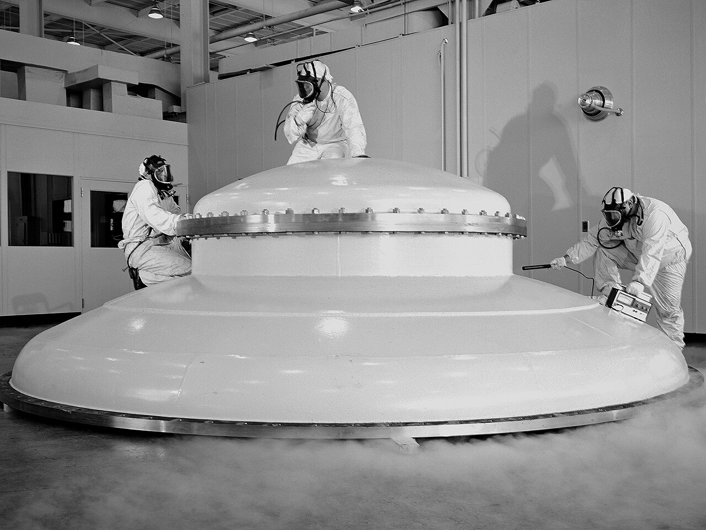

# Vacuum Technology

> *Engineer Paul Reader and his colleagues take environmental measurements during testing of a 20-inch diameter ion engine in a vacuum tank at the Electric Propulsion Laboratory (EPL). Researchers at the Lewis Research Center were investigating the use of a permanent-magnet circuit to create the mag...*

> *Image: NASA Glenn Research Center, Public domain*

> **Node ID**: vacuum
> **Timeline**: Years 25-40
> **Organizing Axis**: Functional — capabilities grouped by vacuum system function (pumping, chamber design, measurement/diagnosis)

Capabilities in this domain:

- [Vacuum Pumps](pumps.md) — Roughing pumps (rotary vane, scroll, diaphragm), high-vacuum pumps (turbomolecular, diffusion), and ultra-high vacuum pumps (cryopumps, ion pumps, NEG pumps). Pressure ranges from atmosphere to 10⁻¹¹ Torr. Pump speeds, backing requirements, and selection criteria.
- [Vacuum Chambers & Sealing](chambers.md) — Chamber design, materials (stainless steel 304L/316L, aluminum 6061), sealing systems (CF/ConFlat, ISO-KF, Viton O-rings), viewports, load locks, gate valves, and outgassing management.
- [Vacuum Measurement & Leak Detection](measurement.md) — Pressure gauges (Pirani, thermocouple, ionization, cold cathode), residual gas analyzers (RGA), helium leak detection, and vacuum system diagnostics. Covers the full pressure range from 10³ to 10⁻¹² Torr.
- [Deposition Systems](deposition-systems.md) — Integrated vacuum deposition tools for semiconductor thin-film formation: sputter systems (DC and RF magnetron), CVD reactors (LPCVD, PECVD, APCVD), evaporation systems (thermal and electron-beam), load-lock transfer mechanisms, and pump-down procedures.

For basic vacuum technology foundations (piston pumps, Bourdon gauges, simple vacuum systems), see [Gas Handling: Vacuum](../gas-handling/vacuum.md).

- [Vacuum Pump (Construction)](vacuum-pump.md) — Construction of roughing and high-vacuum pumps: rotary vane, scroll, diaphragm, and diffusion pump designs.
- [Vacuum Chamber (Construction)](vacuum-chamber.md) — Fabrication of vacuum chambers from steel and aluminum with sealing systems for process and research applications.
[↑ Back to Tech Tree](../index.md)
