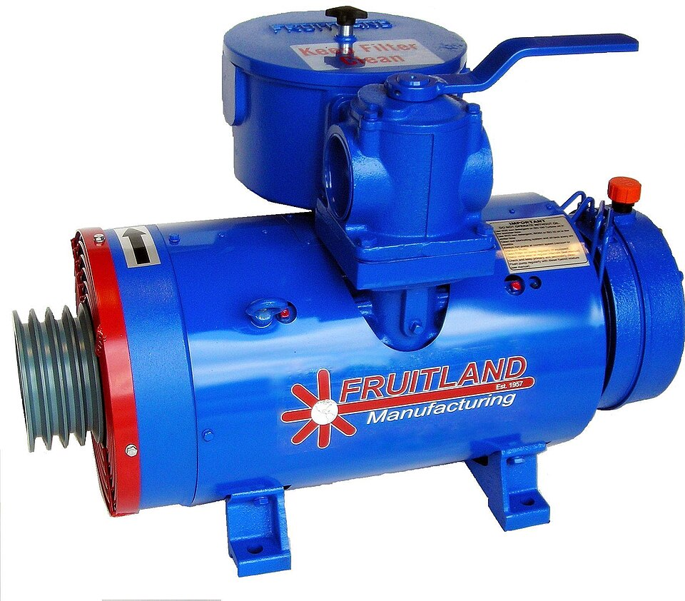

# Vacuum Pump

> **Node ID**: vacuum.vacuum-pump
> **Domain**: [Vacuum Technology](./index.md)
> **Dependencies**: [`machine-tools.machining`](../machine-tools/machining.md), [`metals.iron-steel`](../metals/iron-steel.md), [`chemistry.lubricants`](../chemistry/lubricants.md)
> **Enables**: [`vacuum.deposition-systems`](./deposition-systems.md), [`vacuum.chambers`](./chambers.md), [`photolithography.fab-processes`](../photolithography/fab-processes.md)
> **Timeline**: Years 25-35
> **Outputs**: vacuum_pumps, roughing_pumps, high_vacuum_pumps
> **Critical**: Yes — vacuum pumps are required for all semiconductor thin-film processes; no alternative to mechanical vacuum pumping exists

This article covers the construction of three vacuum pump families that together span from rough vacuum (760–10⁻³ Torr) to high vacuum (10⁻⁵–10⁻⁸ Torr). For pump selection, performance specifications, and advanced pump types (turbomolecular, cryopump, ion pump), see [Vacuum Pumps](pumps.md). For foundational pump operating principles, see [Gas Handling: Vacuum](../gas-handling/vacuum.md).

## Principle

> *Image: Gwhite4444, CC BY-SA 4.0*

A vacuum pump removes gas molecules from a sealed volume, progressively lowering the pressure. Three construction families cover the range needed for semiconductor processing:

**Rotary vane pump**: An eccentric rotor with spring-loaded vanes rotates inside a cylindrical stator. Each vane sweeps a crescent-shaped volume of gas from the inlet port to the exhaust valve, compressing it to above atmospheric pressure for expulsion. Oil fills the microscopic clearances between vanes and stator wall, creating a gas-tight seal. The pump achieves 10⁻²–10⁻³ Torr and serves as the roughing pump for all high-vacuum systems.

**Diffusion pump**: A boiler heats silicone oil to 150–200°C. Oil vapor rises through a chimney and exits through angled jet nozzles at supersonic velocity (200–300 m/s). The vapor jets collide with gas molecules diffusing down from the vacuum chamber, imparting downward momentum. Gas is compressed toward the exhaust, where a backing pump removes it. Oil vapor condenses on water-cooled walls and returns to the boiler by gravity. No moving parts — extremely reliable.

**Turbomolecular pump**: Rotor blades angled like axial compressor blades spin at 24,000–90,000 RPM. Blade tip speed approaches the thermal velocity of gas molecules (~500 m/s for N₂). Each blade stage deflects molecules toward the exhaust with a compression ratio of 2–10×; 20–40 stages achieve compression ratios of 10⁸–10¹² for N₂. Requires a backing pump at all times.

## Prerequisites

- [Precision machining](../machine-tools/machining.md) — boring stator cylinders to ±0.01 mm, turning rotors to ±0.005 mm
- [Iron and steel production](../metals/iron-steel.md) — cast iron stators, steel rotors and vanes
- [Lubricants](../chemistry/lubricants.md) — low vapor pressure vacuum oil (vapor pressure <5×10⁻⁵ Torr at 25°C)
- [Electric motors](../energy/electricity.md) — 0.1–15 kW depending on pump size
- [TIG welding](../machine-tools/joining.md) — for stator housing assembly

## Materials

### Rotary Vane Pump

| Material | Quantity | Specifications | Source | Alternatives |
|----------|----------|----------------|--------|-------------|
| Cast iron (stator body) | 10-50 kg | Gray iron Grade 25+, bored to ±0.01 mm ID | [Iron & Steel](../metals/iron-steel.md) | Steel billet (bored from solid — more machining) |
| Steel (rotor) | 2-10 kg | 1045 or equivalent, hardened to 45-50 HRC | [Iron & Steel](../metals/iron-steel.md) | Cast iron (lower strength) |
| Carbon fiber or steel (vanes) | 4-6 pieces | 3-8 mm thick, spring-loaded | [Iron & Steel](../metals/iron-steel.md) | Phenolic composite (shorter life) |
| Spring steel (vane springs) | 4-6 pieces | Compression springs, 5-20 N force | [Iron & Steel](../metals/iron-steel.md) | — |
| Vacuum oil | 0.5-8 L | Mineral oil, vapor pressure <5×10⁻⁵ Torr at 25°C | [Lubricants](../chemistry/lubricants.md) | Synthetic vacuum oil (lower VP, higher cost) |
| Steel shaft | 1 | 15-30 mm diameter, ground to ±0.01 mm | [Iron & Steel](../metals/iron-steel.md) | — |
| Seals (shaft seal, O-rings) | 2-4 | Viton FKM, rated to 200°C | [Elastomers](../polymers/rubber.md) | Buna-N (lower temp rating) |
| Electric motor | 1 | 0.25-4 kW, 1450 or 1750 RPM | [Electricity](../energy/electricity.md) | Hand-cranked (impractical for production) |

### Diffusion Pump

| Material | Quantity | Specifications | Source | Alternatives |
|----------|----------|----------------|--------|-------------|
| Steel (pump body) | 20-100 kg | Welded cylindrical shell, 150-400 mm diameter | [Iron & Steel](../metals/iron-steel.md) | Stainless steel (better corrosion resistance) |
| Copper (jet assembly) | 2-10 kg | Chimney and nozzle stages, brazed assembly | [Metals](../metals/index.md) | — |
| Diffusion pump oil | 0.2-2 L | DC-704 silicone oil, VP ~10⁻⁸ Torr at 25°C | [Chemistry](../chemistry/index.md) | Santovac 5 (lower VP, higher cost) |
| Heating element | 1 | 300-5000 W electric heater | [Energy](../energy/electricity.md) | Gas burner (less controllable) |
| Copper cooling coils | 5-20 m | 6-10 mm OD tubing, soft soldered to body | [Metals](../metals/index.md) | External water jacket (welded) |
| Thermal insulation | As needed | Mineral wool or ceramic fiber, 25-50 mm | [Ceramics](../ceramics/index.md) | — |

## Construction Steps

### Rotary Vane Pump

1. **Cast and bore the stator**: Cast the stator body in gray iron. Bore the internal cylinder to the nominal diameter ±0.01 mm roundness and ±0.02 mm cylindricity over the full bore length. The bore surface finish must be 0.8 μm Ra or better (honed). The rotor pocket (eccentric offset) is bored off-center by the eccentricity distance (typically 5-15% of bore diameter).

2. **Machine the rotor**: Turn the rotor from 1045 steel on a lathe. Diameter is 2× the eccentricity smaller than the stator bore. Surface finish: 0.8 μm Ra. Hardened to 45-50 HRC by quenching and tempering. Drill and mill vane slots (2-3 slots at equal angles) to width +0.02/+0.05 mm clearance for the vanes. Slot depth: vane width + 2-5 mm for spring pocket.

3. **Fabricate vanes**: Cut vanes from carbon fiber sheet or steel plate to 3-8 mm thickness. Width matches the rotor axial length. Length: rotor radius + eccentricity + 2-3 mm (vane extends past rotor OD to contact stator wall). Surface finish on contact edges: 0.4 μm Ra. Install compression springs in the vane slot bottoms (spring force pushes vanes outward against stator wall).

4. **Machine inlet and exhaust ports**: Drill and tap the inlet port (KF or NPT fitting) into the stator wall at the maximum-volume position. Drill and tap the exhaust port at the minimum-volume position. Install a reed valve or ball check valve at the exhaust (prevents backflow of gas from the oil sump into the pumping chamber).

5. **Assemble shaft and bearings**: Press ball bearings into the bearing housings at each end of the stator. Insert the rotor onto the shaft (keyed or press fit). Install shaft seals (Viton lip seals) on the exterior side of each bearing to prevent oil leakage.

6. **Add oil sump and gas ballast**: Weld or bolt an oil reservoir to the stator base. Fill level: enough oil to submerge the exhaust valve and lubricate vane tips through splash lubrication. Drill and tap a gas ballast port with a needle valve — admits a small amount of atmospheric air during the compression stroke to prevent condensation of vapors in the oil.

7. **Couple motor and test**: Mount the electric motor on a base plate aligned with the pump shaft. Couple with a flexible coupling. Fill with vacuum oil. Run for 30 minutes at atmospheric inlet — verify smooth operation, no unusual vibration or heating (stator body should stabilize below 80°C). Measure ultimate vacuum with a Pirani or thermocouple gauge: target 10⁻² Torr (single-stage) or 5×10⁻⁴ Torr (two-stage).

### Diffusion Pump

1. **Fabricate the pump body**: Roll and weld a steel cylinder (150-400 mm diameter, 300-600 mm tall). Weld a flat bottom plate with ports for the heater, oil drain, and foreline connection. Weld a top flange (CF or ISO-K) for connection to the vacuum chamber. All welds must be full-penetration, ground smooth on the interior, and leak-tested (see [Leak Detection](leak-detection.md)).

2. **Construct the jet assembly**: The jet chimney is a copper or steel tube (30-60% of body diameter) with 3-6 stages of annular nozzles. Each nozzle is a copper ring with angled slots pointing downward and outward. The nozzle angles are critical: top stage at 30-45° from horizontal, lower stages progressively steeper. Braze the nozzle rings to the chimney tube. The assembly sits on three support legs inside the pump body, with the chimney base immersed in the oil sump.

3. **Install the heater**: Mount an electric resistance heater (300-5000 W depending on pump size) on the exterior of the bottom plate. Use a temperature controller with a thermocouple embedded in the oil sump to maintain 150-200°C. Insulate the heater and lower body with mineral wool.

4. **Install cooling system**: Soft-solder copper cooling coils (6-10 mm OD) in a spiral around the upper pump body exterior. Connect to a water supply at 2-5 L/min flow. Alternatively, weld an external water jacket. Install a water flow switch interlocked to the heater — if water flow stops, heater power must cut off immediately (oil overheating → decomposition → fire hazard).

5. **Install cold trap mounting**: Weld a flange at the top of the pump body (between the jet assembly and the chamber connection) for a liquid nitrogen cold trap or chevron baffle. This is essential to prevent oil backstreaming — without it, oil vapor contaminates the vacuum chamber.

6. **Add oil and test**: Charge the pump with diffusion pump oil (DC-704 or equivalent). Connect a backing pump (rotary vane, sized to maintain foreline <0.5 Torr) to the foreline port. Evacuate the foreline to <0.5 Torr before turning on the heater. Heat the oil to operating temperature (150-200°C, 20-30 minutes). Fill the cold trap with LN₂. Measure ultimate vacuum: target 10⁻⁶ to 10⁻⁷ Torr on an ionization gauge.

## Calibration and Verification

### Rotary Vane Pump

1. **Ultimate vacuum test**: Connect a Pirani or thermocouple gauge directly to the inlet (minimize dead volume). Run pump for 30 minutes with gas ballast closed. Record ultimate vacuum: single-stage should reach ~10⁻² Torr, two-stage ~5×10⁻⁴ Torr.
2. **Pumping speed test**: Admit a known gas flow (via a calibrated leak or mass flow controller) and measure the equilibrium pressure. Pumping speed S = Q/P, where Q is the gas load (Torr·L/s) and P is the measured pressure.
3. **Oil contamination check**: After pumping wet loads, check oil color. Clear golden = good. Dark or milky = contaminated — change oil immediately.

### Diffusion Pump

1. **Foreline pressure verification**: Verify the backing pump maintains foreline below 0.5 Torr at maximum expected gas load. If foreline exceeds this, the diffusion pump stalls and oil backstreams.
2. **Backstreaming test**: Place a clean glass witness slide in the chamber above the cold trap. Pump for 24 hours. Remove slide and inspect under bright light — any oil film indicates cold trap failure or insufficient cooling.
3. **Cooling water interlock test**: Shut off cooling water while heater is on. Verify the interlock cuts heater power within 30 seconds. If not, adjust or replace the flow switch.

## Expected Performance

### Rotary Vane Pump

| Parameter | Value |
|-----------|-------|
| Pumping speed | 1-500 L/min (size-dependent) |
| Ultimate vacuum (single-stage) | ~10⁻² Torr |
| Ultimate vacuum (two-stage) | ~5×10⁻⁴ Torr |
| Oil charge | 0.2-8 L |
| Motor power | 0.1-4 kW |
| Noise level | 50-75 dB |
| Oil change interval | 3-6 months |
| Vane replacement interval | 2-3 years |
| Service life | 20+ years with maintenance |

### Diffusion Pump

| Parameter | Value |
|-----------|-------|
| Pumping speed (N₂) | 50-10,000 L/s (size-dependent) |
| Ultimate vacuum | 10⁻⁶ to 10⁻⁷ Torr (with LN₂ trap) |
| Foreline tolerance | <0.5 Torr |
| Heater power | 0.3-10 kW |
| Oil temperature | 150-200°C |
| Cooling water | 1-15 L/min |
| Oil charge | 0.05-2 L |
| Startup time | 20-30 minutes (heater warmup) |
| Service life | 20+ years (no moving parts) |

## Strengths

- Rotary vane pump: proven technology, 20+ year service life, high pumping speed per dollar
- Diffusion pump: no moving parts, extremely reliable, very high pumping speeds available at low cost

## Weaknesses

- Rotary vane pump: oil backstreaming contaminates vacuum system; regular oil changes required
- Diffusion pump: oil backstreaming requires LN₂ cold trap; cannot start at atmospheric pressure; fire hazard if cooling water fails

## Safety

- **Rotating machinery**: Rotary vane pumps have a rotor at 1450-1750 RPM. Keep hands clear of the coupling. Install a guard over the shaft coupling. Lock-out/tag-out before maintenance.
- **Hot oil**: Diffusion pump oil at 150-200°C causes burns on contact. Allow 30+ minutes cooling before opening the pump. Use heat-resistant gloves.
- **Oil fire hazard**: Diffusion pump oil decomposition products are flammable. The cooling water interlock is safety-critical — test monthly. Have a Class B fire extinguisher within 10 m.
- **Oil mist**: Rotary vane pump exhaust contains fine oil mist. Install an oil mist eliminator on the exhaust. Route exhaust to building exterior. Oil mist is a respiratory hazard and slip hazard.

## Troubleshooting

| Problem | Probable Cause | Solution |
|---------|---------------|----------|
| Rotary vane pump cannot reach 10⁻² Torr | Oil contaminated with water or solvents; gas ballast left open; worn vanes | Change vacuum oil; close gas ballast for final pump-down; inspect vanes for wear (>1 mm reduction from original width → replace) |
| Diffusion pump oil backstreaming | Cold trap empty; foreline pressure >0.5 Torr; cooling water not flowing | Refill LN₂ cold trap; verify backing pump maintains foreline <0.5 Torr; check cooling water flow switch interlock |
| Excessive vibration from rotary vane pump | Worn bearings; damaged vane; rotor imbalance | Replace bearings (standard ball bearings, press-fit); inspect vanes for cracking; check shaft runout (<0.02 mm TIR) |
| Diffusion pump will not reach 10⁻⁶ Torr | Oil degraded (discolored, viscous); leak at flange; cold trap insufficient | Change pump oil; helium leak check all flanges; verify LN₂ level in cold trap is adequate |

## Pump Specifications by Application

| Pump Type | Pumping Speed | Ultimate Pressure | Throughput (at 1×10⁻³ mbar) | Motor Power | Typical Application |
|---|---|---|---|---|---|
| Rotary vane (single-stage) | 1-300 L/min (0.06-18 m³/h) | ~10⁻² Torr (~1.3×10⁻² mbar) | 0.06-18 m³·mbar/h | 0.25-4 kW | Roughing, backing for diffusion/turbo pumps |
| Rotary vane (two-stage) | 1-300 L/min (0.06-18 m³/h) | ~5×10⁻⁴ Torr (~7×10⁻⁴ mbar) | 0.06-18 m³·mbar/h | 0.25-4 kW | Medium vacuum processes, freeze drying |
| Diffusion pump (4-inch) | 400-800 L/s (1,440-2,880 m³/h) | 10⁻⁶-10⁻⁷ Torr (~1.3×10⁻⁶ mbar) | 0.5-1 Torr·L/s at foreline | 1-3 kW heater | Sputtering, evaporation, general HV |
| Diffusion pump (10-inch) | 2,500-5,000 L/s (9,000-18,000 m³/h) | 10⁻⁷ Torr (~1.3×10⁻⁷ mbar) | 1-3 Torr·L/s at foreline | 5-10 kW heater | Large chamber HV processes |
| Turbomolecular pump (small) | 30-60 L/s (108-216 m³/h) | <10⁻⁸ Torr (<1.3×10⁻⁸ mbar) | 0.3-0.6 m³·mbar/h | 0.2-0.5 kW | Analytical instruments, RGA, leak detectors |
| Turbomolecular pump (medium) | 200-500 L/s (720-1,800 m³/h) | <10⁻⁹ Torr (<1.3×10⁻⁹ mbar) | 2-5 m³·mbar/h | 0.5-2 kW | Semiconductor sputtering, e-beam evaporation |
| Turbomolecular pump (large) | 1,000-4,000 L/s (3,600-14,400 m³/h) | <10⁻¹⁰ Torr (<1.3×10⁻¹⁰ mbar) | 10-40 m³·mbar/h | 2-10 kW | Large UHV chambers, surface science |

**Unit conversions for pump specs**:
- 1 L/min = 0.06 m³/h
- 1 L/s = 3.6 m³/h
- 1 Torr = 1.333 mbar = 133.3 Pa
- Throughput (Q) = Pumping speed (S) × Pressure (P)

**Pump selection by target pressure**:

| Target Pressure | Pump Configuration | Notes |
|---|---|---|
| 760-10⁻³ Torr (rough vacuum) | Single rotary vane pump | Direct pumping, no backing needed |
| 10⁻³-10⁻⁶ Torr (high vacuum) | Rotary vane (backing) + diffusion or turbo pump | Two-stage: roughing pump evacuates to 10⁻³, then HV pump engages |
| 10⁻⁶-10⁻⁹ Torr (very high vacuum) | Two-stage rotary vane + turbo pump + LN₂ trap | Requires baked chamber, metal seals (CF flanges) |
| <10⁻⁹ Torr (UHV) | Ion pump or titanium sublimation + turbo, all-metal seals | Requires extensive baking (250-450°C), minimal elastomer seals |

Oil-free (dry) pumps are increasingly important for semiconductor manufacturing. Scroll pumps, screw pumps, and diaphragm pumps provide rough vacuum without oil, eliminating backstreaming contamination. Their tradeoffs are higher cost and, for some types, a higher ultimate pressure. At advanced semiconductor nodes where even trace oil contamination causes defects, dry pumping is mandatory for critical process steps.

## See Also

- [Vacuum Pumps](pumps.md) — pump selection, advanced types, performance specifications
- [Vacuum Chambers & Sealing](chambers.md) — chamber construction and sealing systems
- [Gas Handling: Vacuum](../gas-handling/vacuum.md) — foundational vacuum pump operating principles
- [Deposition Systems](deposition-systems.md) — integrated systems that use vacuum pumps
- [Lubricants](../chemistry/lubricants.md) — vacuum oil specifications

---

*Part of the [Bootciv Tech Tree](../index.md) • [Vacuum Technology](./index.md) • [Vacuum Pumps](vacuum-pump.md) • [All Domains](../index.md)*

