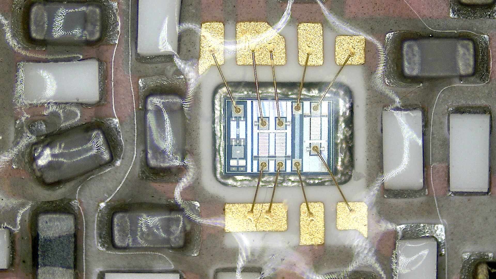
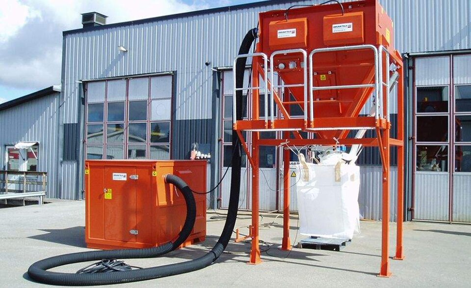
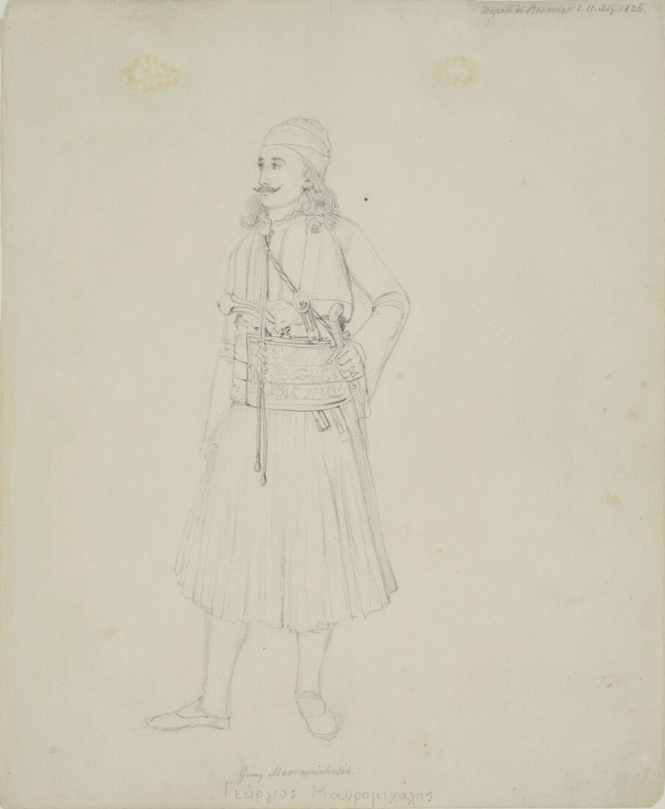
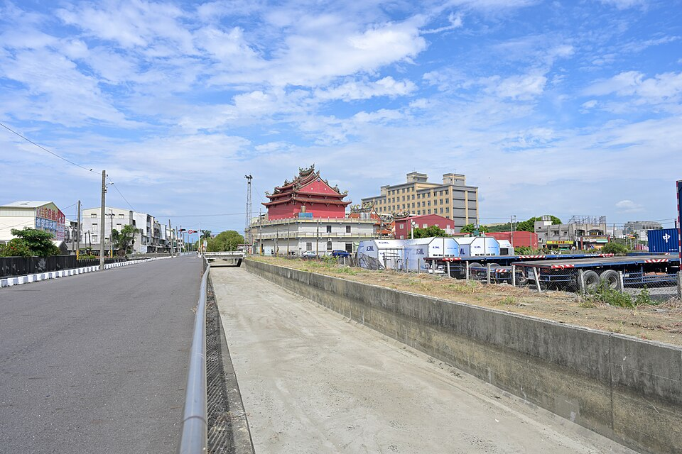
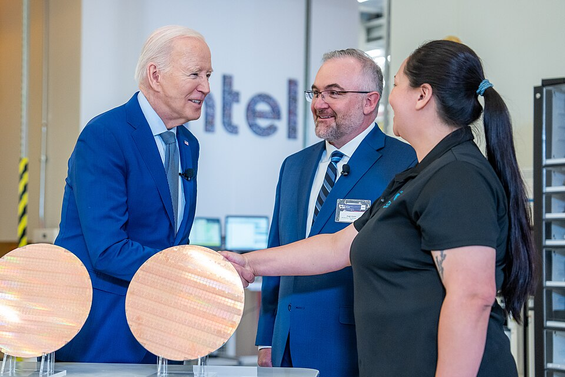
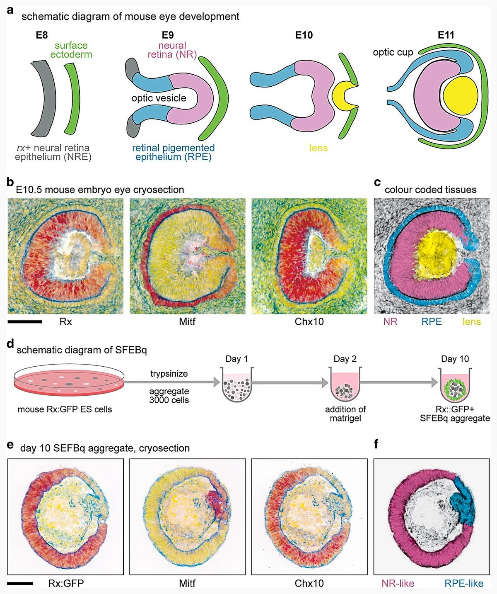
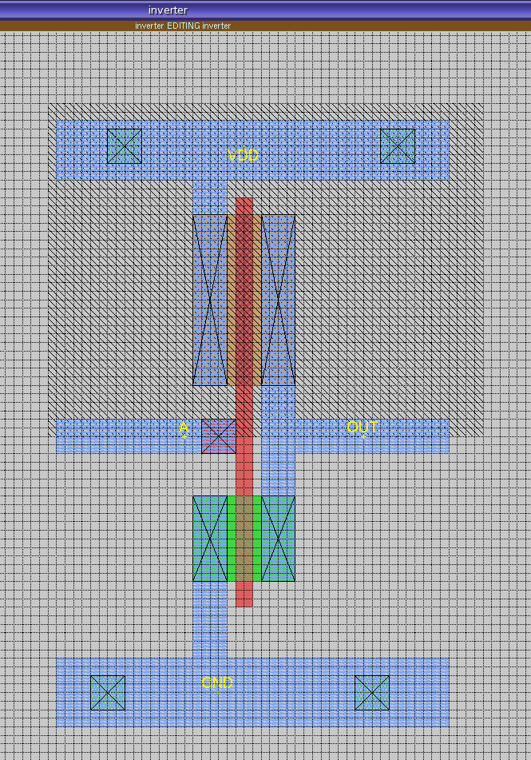

# VLSI Scaling & Advanced Semiconductor

> *Image: Jan Helebrant, CC0*

> *Microphoto of electronics circuit board*

> *Image: Jan Helebrant, CC0*

Capabilities in this domain:

> *Image: Zior79, CC BY-SA 4.0*

- [Vacuum Systems](vacuum-systems.md) — Pumps, chambers, gauges, and seals providing low-pressure environments for sputtering, evaporation, CVD, ion implantation, and e-beam lithography.

> *Image: 4300streetcar, CC BY 4.0*

- [Lithography](lithography.md) — Advanced patterning techniques beyond contact printing including projection steppers, DUV excimer laser systems, immersion lithography, and EUV with resolution enhancement techniques.

> *Image: Guiding light, Public domain*

- [Advanced Lithography](advanced-lithography.md) — Projection steppers/scanners (i-line 365 nm → 0.35 μm) through DUV (KrF 248 nm → 0.25 μm, ArF 193 nm → 0.13 μm) to EUV (13.5 nm for sub-10 nm features).

> *Image: The White House, Public domain*

- [Advanced Processes](advanced-processes.md) — Ion implantation (precise doping control), RIE and DRIE etching (Bosch process), atomic layer deposition (ALD, Angstrom-level control), CMP for global planarization, copper damascene interconnects with low-k dielectrics, multi-level metallization, and advanced solar cells (PERC, bifacial, fine-line metallization).

> *Image: ourworldindata.org, CC BY-SA 4.0*

- [Continuous Scaling](continuous-scaling.md) — Wafer size progression (2" → 4" → 6" → 8" → 12"), feature size reduction (10 μm → 3 μm → 1 μm → 0.35 μm → 0.13 μm → 7 nm).

> *Image: Jovianeye, CC BY-SA 3.0*

- [EDA, GPU Design & Advanced Packaging](eda-design.md) — Electronic Design Automation (logic synthesis, place and route, SPICE simulation, DRC), GPU architecture with billions of transistors, advanced packaging (wire bonding, flip-chip, chiplets, 3D stacking with TSVs), and software stack (drivers, compilers, libraries).

[↑ Back to Tech Tree](../index.md)
