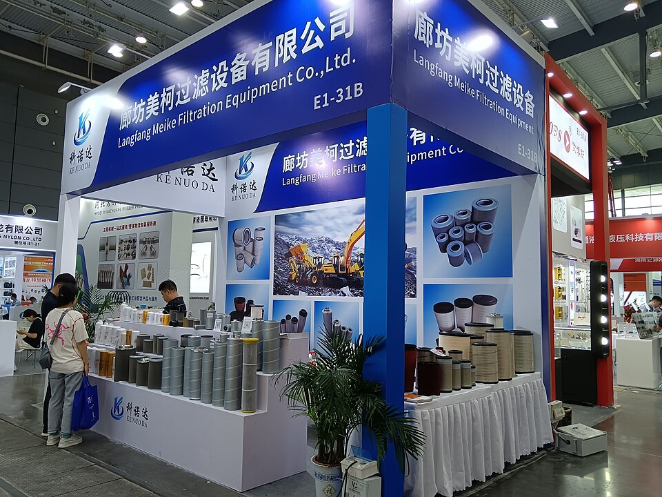

# Filtration Equipment

> **Node ID**: water.filtration-equipment
> **Domain**: [Water](./index.md)
> **Dependencies**: [`metals.iron-steel`](../metals/iron-steel.md), [`ceramics.pottery`](../ceramics/index.md), [`chemistry.cement`](../chemistry/cement.md)
> **Enables**: [`water.basic-treatment`](basic-treatment.md), [`water.sem-tech-water-treatment`](sem-tech-water-treatment.md), [`water.desalination`](desalination.md)
> **Timeline**: Years 5-25
> **Outputs**: filtered_water, strained_fluid
> **Critical**: No — basic filtration can be achieved with a bucket of sand, but engineered filtration equipment is necessary for reliable, high-throughput water treatment and industrial process filtration

## Overview

> *During filtration, water passes through filters, some made of layers of sand, gravel, and charcoal that help remove even smaller particles. Filtration and later chemical treatment (e.g., chlorine) played a role in reducing the number of waterborne disease outbreaks in the early 1900s.*

> *Image: USEPA Environmental-Protection-Agency, Public domain*

Filtration removes suspended solids from a fluid by passing it through a porous medium that captures particles while allowing the fluid to pass. In water treatment, filtration is the critical barrier between raw water and safe drinking water — after coarse solids are removed by settling, filtration captures the remaining fine particles, microorganisms, and turbidity that cause disease and foul downstream equipment.

This article covers filtration devices constructible with the materials and tools available in a bootstrap settlement:

- **Sand filter vessel**: The workhorse of water treatment — a contained bed of graded sand that removes particles from 10-100+ μm with a mature biological layer (slow sand) or 5-50 μm (rapid sand). Gravity-driven or pressure-fed.
- **Cartridge filter housing**: A pressure vessel holding a replaceable cylindrical filter element with a defined nominal pore rating (0.1-100 μm). Used as final polishing before [RO membranes](desalination.md), ED stacks, or distribution.
- **Strainer (basket filter)**: A coarse mesh screen (0.5-5 mm openings) in a pipe to catch large debris before [pumps](centrifugal-pump.md) and delicate equipment. Line-sized, cleanable, reusable.
- **Membrane filter**: Microporous or semipermeable membranes (0.001-0.5 μm) that remove bacteria, viruses, and dissolved ions. Includes microfiltration (MF), ultrafiltration (UF), and nanofiltration (NF). Requires [polymer film capability](../polymers/index.md).

Filtration is upstream of [basic treatment](basic-treatment.md) and [sem-tech treatment](sem-tech-water-treatment.md) in the water process chain. Without effective filtration, membranes clog, ion-exchange beds foul, and disinfection is unreliable.

**Filtration mechanisms**: Three mechanisms operate in all filter types:

- **Straining (sieving)**: Particles larger than the pore openings are physically blocked. Primary mechanism in mesh screens, cartridge filters, and membrane filters with defined pore sizes.
- **Depth filtration**: Particles are trapped within the tortuous interstitial spaces of a granular bed (sand, gravel, activated carbon) or fibrous matrix. Particles smaller than the nominal pore size are captured by interception, diffusion, and electrostatic adhesion.
- **Cake filtration**: Accumulated retained particles form a porous cake on the filter surface, which itself acts as the filtering medium. The cake often captures finer particles than the original filter medium. This is the dominant mechanism in sand filters after initial mat formation.

Head loss through a filter increases as solids accumulate. When head loss reaches the available driving pressure (gravity head or pump pressure), the filter must be cleaned or replaced. This defines the filter run time — the operating interval between cleanings.

## Prerequisites

- [Concrete](../chemistry/cement.md) or [ferrocement](../chemistry/cement.md) for gravity filter tank construction
- [Steel plate](../metals/iron-steel.md) for pressure filter vessels and cartridge housings
- Sand and gravel from quarry or river deposits (no manufacturing needed)
- [Polymers](../polymers/index.md) for cartridge filter elements and gasket materials
- [Rubber](../polymers/rubber.md) for gaskets and sealing

## Bill of Materials

| Material | Quantity | Specifications | Source | Alternatives |
|----------|----------|----------------|--------|-------------|
| Concrete or ferrocement (sand filter tank) | 2-10 m³ | 1:2:4 mix (cement:sand:gravel), for gravity filters | [Chemistry: Cement](../chemistry/cement.md) | Steel tank (pressure sand filters), HDPE tank |
| Steel plate (pressure vessel) | 20-100 kg | A36 or A285, 6-12 mm wall, for pressure sand filters and cartridge housings | [Iron & Steel](../metals/iron-steel.md) | Stainless steel (corrosive service) |
| Filter sand (silica sand) | 0.5-5 m³ | Effective size 0.15-0.55 mm, uniformity coefficient 1.5-3.0, for sand filter bed | Quarry or river | Crushed quartz, anthracite (dual-media filters) |
| Gravel (support bed) | 0.1-1.0 m³ | Graded 2-30 mm, layered coarse-to-fine under sand bed | Quarry or river | — |
| Stainless steel mesh (strainer) | 0.01-0.1 m² | Perforated 304 or 316 stainless, 0.5-5 mm hole diameter, 30-50% open area | [Metals](../metals/index.md) | Monel or Hastelloy (seawater) |
| Cartridge filter elements | 1-12 per housing | Polypropylene pleated or string-wound, 0.5-100 μm nominal rating | [Polymers](../polymers/index.md) | Ceramic elements (high-temperature, reusable) |
| Rubber gaskets | 1 set | EPDM or Buna-N, sized to flange diameter | [Rubber](../polymers/rubber.md) | PTFE envelope gaskets (chemical service) |
| Membrane elements (MF/UF) | 1-8 per housing | PVDF or PES hollow fiber, 0.01-0.5 μm pore size | [Polymers](../polymers/index.md) | Ceramic membrane elements |

## Process Description

### Gravity Sand Filter (Concrete Tank)

**Principle**: Raw water percolates downward through a bed of graded sand by gravity. Particles are removed by straining at the sand surface, depth filtration within the bed, and biological predation in the schmutzdecke (biological layer that forms on top of the sand). Slow sand filters (hydraulic loading 0.1-0.4 m/hour) rely primarily on the biological layer for pathogen removal. The schmutzdecke develops over 1-4 weeks and contains bacteria, protozoa, and other microorganisms that consume pathogens.

**Prerequisites**: [Concrete construction](../chemistry/cement.md), [sand and gravel](../mining/extraction.md), [perforated pipe](../polymers/index.md) or [ceramic drain tiles](../ceramics/index.md).

**Materials**: Concrete for tank (2-10 m³), silica sand (0.5-5 m³), graded gravel (0.1-1.0 m³), perforated underdrain pipe, inlet and outlet weir structures.

**Construction**:

1. **Construct the tank**: Build a rectangular or circular tank from reinforced concrete. Internal dimensions: filter bed area sized to the required flow rate. Hydraulic loading rate for slow sand: 0.1-0.4 m/hour. For rapid sand (with chemical coagulation): 5-15 m/hour. A slow sand filter serving 200 people at 100 L/person/day requires approximately 3 m² filter area. Tank depth: 1.5-2.0 m (0.6-1.5 m sand bed + 1.0 m water depth + 0.2 m freeboard).
2. **Install underdrain system**: Place perforated PVC pipes (15-25 mm diameter, 5 mm holes at 100 mm spacing on the underside) on the tank floor in a grid pattern (300-600 mm spacing between laterals). Connect laterals to a main collector pipe that exits the tank through a sealed penetration. The underdrain collects filtered water without creating channels in the sand.
3. **Layer gravel support bed**: Cover the underdrain with 150-300 mm of graded gravel. Bottom layer: 15-30 mm gravel, 100 mm deep. Middle layer: 5-15 mm gravel, 50-100 mm deep. Top layer: 2-5 mm gravel, 50 mm deep. Each layer must be leveled flat. The gravel prevents sand from entering and blocking the underdrain.
4. **Add filter sand**: Fill with silica sand to a depth of 600-1500 mm. Add sand in 150 mm layers, washing each layer to remove fines before adding the next. Target effective size (d₁₀): 0.15-0.35 mm for slow sand, 0.45-0.55 mm for rapid sand. Uniformity coefficient (d₆₀/d₁₀): 1.5-3.0. Sand too fine → excessive head loss, short filter runs. Sand too coarse → poor particle removal.
5. **Install inlet and outlet weirs**: Install an inlet weir (V-notch or rectangular) that distributes raw water gently across the sand surface without disturbing it. Install an outlet weir with a float valve that maintains 50-100 mm of water above the sand at all times — the biological layer (schmutzdecke) dies if it dries out.
6. **Commission**: Fill the filter slowly from the bottom up (backfill through the underdrain) to drive air out of the sand bed. Once filled, switch to top-down filtration at a reduced rate. For slow sand filters, the biological layer requires 1-4 weeks to develop. During ripening, the output is not safe for drinking.

**Calibration**: After ripening, measure filtered water turbidity with a turbidity tube or nephelometer. Target: <1 NTU for slow sand filter output. Measure head loss across the bed (water level above sand minus effluent level). A clean bed produces 0.2-0.5 m head loss. When head loss reaches 1.0-1.5 m, the filter needs scraping.

**Expected performance**: Turbidity removal: 90-99%. Bacterial removal: 95-99.9%. Flow rate: 0.1-0.4 m/hour hydraulic loading. Service interval: 1-3 months (scraping top 1-2 cm of sand). Filter media life: 5-10 years before full sand replacement needed.

**Strengths**:
- Constructible from local materials (sand, gravel, concrete) with no manufactured components
- Removes pathogens through biological action — no chemicals needed
- Extremely reliable with minimal maintenance (periodic sand scraping)

**Weaknesses**:
- Requires enormous area relative to throughput (1 m² per 50-200 people)
- Biological layer takes 1-4 weeks to develop after construction or cleaning
- Cannot handle very turbid water (>50 NTU) without pre-sedimentation
- Does not remove dissolved contaminants

### Pressure Sand Filter (Steel Tank)

**Principle**: Identical filtration mechanism to the gravity sand filter, but the filter bed is enclosed in a pressure vessel and the driving force is pump pressure rather than gravity. This allows higher hydraulic loading rates (5-15 m/hour), a more compact installation, and integration into pressurized piping systems. Backwashing is performed by reversing flow through the bed.

**Prerequisites**: [Steel pressure vessel fabrication](../metals/iron-steel.md), [welding](../machine-tools/welding-equipment.md), [pump for backwash](centrifugal-pump.md), [valve manifold](water-valves.md).

**Materials**: Steel plate for pressure vessel (20-100 kg), sand (0.5-2 m³), gravel (0.1-0.5 m³), 4 valves for manifold (inlet, outlet, backwash inlet, backwash waste).

**Construction**:

7. **Fabricate the pressure vessel**: Roll steel plate (6-12 mm thick) into a cylinder. Weld the longitudinal seam with full penetration (SAW). Weld dished heads (ellipsoidal or torispherical) to both ends. The top head includes a manway (300-400 mm diameter flanged opening) for sand access. Install flanged inlet, outlet, and drain connections. The vessel must be designed for the operating pressure (typically 3-10 bar) per pressure vessel code.
8. **Internal components**: Install an underdrain lateral system (hub and laterals, or a false bottom with nozzles) at the bottom of the vessel. Layer gravel and sand as described for the gravity filter. The sand bed depth is typically 600-900 mm. The freeboard above the sand allows 30-50% bed expansion during backwash.
9. **Piping and valves**: Connect inlet (raw water), outlet (filtered water), backwash inlet (reverse flow from bottom), and backwash waste (overflow to drain) to a valve manifold. Four valves: filter inlet, filter outlet, backwash inlet, backwash waste. Normal operation: open inlet and outlet, close backwash valves. Backwash: close inlet and outlet, open backwash inlet and waste.

**Backwash procedure**: Pressure sand filters require periodic backwashing to remove accumulated solids:

10. **Shut down filtration**: Close the filter inlet and outlet valves. The water in the vessel provides the backwash supply.
11. **Start backwash flow**: Open the backwash inlet valve (clean water from another filter or a backwash pump). Open the backwash waste valve. Flow reverses upward through the bed at 30-50 m/hour for 5-10 minutes. The upward flow fluidizes the sand bed, lifting and scouring the grains. Accumulated particles are released and carried to waste.
12. **Air scour (optional but recommended)**: Before water backwash, inject compressed air through the underdrain at 15-25 m/hour for 3-5 minutes. Air scour breaks up mudballs (agglomerated sand and silt) that water backwash alone cannot remove.
13. **Rinse to waste**: After backwash, run filtered water to waste for 2-5 minutes (first flush) to remove any remaining disturbed solids. Return to service.

**Expected performance**: Turbidity removal: 80-95%. Flow rate: 5-15 m/hour hydraulic loading. Operating pressure: 3-10 bar. Backwash interval: 12-48 hours (depending on raw water quality). Backwash water consumption: 10-20% of filtered volume.

**Strengths**:
- Compact relative to gravity sand — 5-15× smaller footprint for equivalent capacity
- Integrates into pressurized piping systems without gravity head requirements
- Backwash recovers filter capacity without manual labor

**Weaknesses**:
- Requires a backwash water supply at high flow rate (30-50 m/hour)
- Backwash consumes 10-20% of filtered volume
- Requires chemical coagulation pretreatment for best performance
- Does not remove dissolved contaminants

### Cartridge Filter Housing

**Principle**: A pressure vessel containing one or more replaceable cylindrical filter elements. Raw water enters the housing and flows outside-to-inside through the cartridge wall. Particles larger than the pore size are trapped on the cartridge surface or within the depth of the media. Clean water exits from the cartridge core. When the pressure drop across the cartridge reaches 0.7-1.0 bar (from a clean ΔP of 0.05-0.15 bar), the element is replaced.

**Prerequisites**: [Stainless steel fabrication](../metals/index.md), [cartridge elements](../polymers/index.md), [O-ring seals](../polymers/index.md).

**Materials**: Stainless steel housing body (304 for general water, 316L for corrosive service), 1-12 cartridge elements, O-ring seals, pressure gauges (inlet and outlet).

**Construction**:

14. **Fabricate the housing body**: Machine or weld a cylindrical pressure vessel from stainless steel. Length: 250-1000 mm (accommodating standard 10-inch or 40-inch cartridge elements). Diameter: sized for the number of elements (single or multi-round housing). Design pressure: 5-10 bar typical.
15. **Machine the internals**: Install a perforated plate at the bottom that seats the cartridge elements. Each element has a spring-loaded sealing mechanism (knife-edge seal or O-ring) that creates a positive seal between unfiltered (outside) and filtered (inside) chambers. Any bypass of unfiltered water renders the filter useless.
16. **Install inlet/outlet connections**: Inlet on the side (unfiltered water enters the housing and flows outside-to-inside through the cartridge). Outlet on the bottom or end cap (filtered water from the cartridge core). Install a pressure gauge on each side. Pressure drop across a clean element: 0.05-0.15 bar. Replace the element when pressure drop reaches 0.7-1.0 bar above clean.
17. **Seal the housing**: Install an O-ring on the housing closure (swing bolt or threaded cap). The closure allows cartridge replacement without disconnecting the piping.

**Expected performance**: Removal rating: 0.1-100 μm (element-dependent). Flow: 5-50 L/min per element. Pressure drop (clean): 0.05-0.15 bar. Element life: 1-6 months. Single-use elements — discarded after use.

**Strengths**:
- Precise, defined removal ratings from 0.1-100 μm
- Standard for protecting downstream equipment (membranes, instruments)
- Easy element replacement without tools (swing bolt or threaded cap)

**Weaknesses**:
- Consumable elements — require supply chain for replacements
- Not sustainable long-term without manufactured replacements
- Low dirt-holding capacity compared to sand filters (shorter service intervals)

### Inline Strainer (Basket Filter)

**Principle**: A coarse mesh screen (0.5-5 mm openings) mounted in a Y-shaped or basket-shaped body that catches large debris in the flow stream. Unlike cartridge filters, strainers are cleaned rather than replaced — the basket is removed, emptied, and reinstalled. They protect [pumps](centrifugal-pump.md), [control valves](water-valves.md), and heat exchangers from objects that would damage or clog them.

**Prerequisites**: [Cast iron or bronze body](../metals/iron-steel.md), [perforated stainless steel screen](../metals/index.md), [gasket material](../polymers/index.md).

**Materials**: Cast iron body (1-10 kg), stainless steel basket (0.01-0.1 m², 0.5-5 mm perforations), gasket, bolted cover.

**Construction**:

18. **Fabricate the body**: Cast or machine a Y-shaped or basket-shaped body from cast iron, bronze, or stainless steel. The body has a straight-through flow passage (inlet to outlet) with a branch opening that holds the strainer basket. The branch is sealed with a bolted cover or cap.
19. **Make the strainer basket**: Form a cylindrical or conical basket from perforated stainless steel sheet (0.5-5 mm hole diameter, 30-50% open area). Weld a flange at the basket top that seats against a gasket in the body. The basket must be removable for cleaning.
20. **Install in pipeline**: The strainer mounts in the pipeline with flanged or threaded ends. Install on the suction side of pumps (protects impellers from debris) and before delicate equipment (control valves, heat exchangers, membrane systems). Provide isolation valves on each side for basket removal without draining the pipeline.

**Expected performance**: Removal: 500-5000 μm (coarse debris). Pressure drop: 0.02-0.10 bar (clean). Service: weekly to monthly basket cleaning. Indefinite service life (cleanable).

**Strengths**:
- Protects pumps and valves from debris with minimal pressure drop
- Zero consumables — cleanable and reusable indefinitely
- Simple construction with no wearing parts

**Weaknesses**:
- Coarse filtration only — does not remove fine particles
- Basket must be removed and cleaned periodically
- Requires isolation valves for cleaning without pipeline shutdown

## Quantitative Parameters

| Parameter | Slow Sand Filter | Pressure Sand Filter | Cartridge Filter | Basket Strainer |
|-----------|-----------------|---------------------|-----------------|-----------------|
| Removal rating | 10-100+ μm (biological) | 5-50 μm | 0.1-100 μm (element-dependent) | 500-5000 μm |
| Turbidity removal | 90-99% | 80-95% | 95-99% | Coarse debris only |
| Flow rate | 0.1-0.4 m/hour | 5-15 m/hour | 5-50 L/min per element | Unlimited (line-sized) |
| Operating pressure | Gravity (0.1-0.3 bar) | 3-10 bar | 1-10 bar | Line pressure |
| Backwash/cleaning | Scraping top 1-2 cm | Reverse flow, 30-50 m/hour | Replace element | Remove and clean basket |
| Service interval | 1-3 months (scraping) | 12-48 hours (backwash) | 1-6 months (element life) | Weekly to monthly |
| Filter media life | 5-10 years | 3-5 years | Single-use elements | Indefinite |
| Typical application | Drinking water pretreatment | Industrial water treatment | RO/ED membrane protection | Pump protection |

### Detailed Design Parameters

| Parameter | Slow Sand | Pressure Sand | Cartridge (5 μm) | Cartridge (50 μm) | MF Membrane (0.1 μm) |
|-----------|----------|---------------|-------------------|--------------------|-----------------------|
| Pore size | 10-100+ μm | 5-50 μm | 5 μm nominal | 50 μm nominal | 0.1 μm |
| Flow per unit area | 0.1-0.4 m/hour | 5-15 m/hour | — | — | 50-150 L/m²/hour |
| Flow per element | — | — | 5-20 L/min | 10-50 L/min | — |
| Pressure drop (clean) | 0.2-0.5 m head | 0.5-2.0 m head | 0.05-0.15 bar | 0.02-0.10 bar | 0.1-0.5 bar |
| Terminal pressure drop | 1.0-1.5 m head | 2-3 m head | 0.7-1.0 bar | 0.7-1.0 bar | 1.0-2.0 bar |
| Bacterial removal | 95-99.9% | 50-80% | 90-99% (if ≤1 μm) | 10-30% | 99.99% |

## Scaling Notes

- **Household** (50-200 L/day): A single 0.2 m² slow sand filter at 0.2 m/hour produces approximately 1 m³/day — enough for 10-20 people. Construct from a concrete ring or ferrocement tank. No pumps, no backwash — just scrape the top 1-2 cm of sand monthly.
- **Small community** (5-50 m³/day): A bank of 2-4 slow sand filter beds (each 5-25 m²) operating in parallel. Rotate beds — one rests while others filter. Each bed produces 1-6 m³/day. Total area: 10-100 m². No energy input required if the source is at higher elevation than the filter.
- **Town** (50-500 m³/day): Pressure sand filters in steel vessels, backwashed by a dedicated backwash pump. A 1.0 m diameter pressure sand filter at 10 m/hour filters approximately 8 m³/hour (190 m³/day). Install 2-3 vessels for redundancy. Backwash consumes 10-20% of filtered volume.
- **Industrial** (500-5000 m³/day): Multiple large pressure sand filters (2-4 m diameter) in parallel, followed by cartridge polishing filters. Automatic backwash controlled by timer or head-loss differential across the bed. Pre-treatment with coagulant dosing improves filter run times by forming larger floc particles.
- **Membrane pre-treatment**: For [RO desalination](desalination.md) or [sem-tech ED](sem-tech-water-treatment.md), the filtration train is: coagulant dosing → dual-media pressure sand filter (5-15 m/hour) → cartridge guard filter (5 μm nominal) → membrane system. The 5 μm cartridge is the final barrier that prevents membrane fouling.

## Troubleshooting

| Problem | Probable Cause | Solution |
|---------|---------------|----------|
| Filtered water turbidity >5 NTU | Sand too coarse; biological layer not established; filter rate too high; cracked underdrain allowing bypass | Check sand grain size (target d₁₀ = 0.15-0.35 mm for slow sand). Allow ripening period. Reduce filtration rate. Inspect underdrain. |
| Head loss exceeds available pressure | Filter bed clogged; surface crust too thick; insufficient backwash frequency | For gravity sand: scrape surface layer. For pressure sand: increase backwash frequency and duration. Check for mudball formation (agglomerated sand and silt that resists backwashing). |
| Sand appearing in filtered water | Underdrain broken; gravel support layer disturbed; sand too fine for backwash rate | Inspect underdrain laterals. Re-layer gravel support bed. Reduce backwash rate to prevent sand carryover. |
| Cartridge filter pressure drop too high immediately after installation | Wrong pore size (too fine for the application); element collapsed; excessive flow rate per element | Verify element rating matches specification. Check element for damage. Reduce flow or add elements in parallel. |
| Short filter run times (clogging rapidly) | High raw water turbidity; inadequate pretreatment; mudballs in sand bed | Add pre-sedimentation or coarse screening before the filter. For pressure sand: apply air scour before backwash to break up mudballs. |
| Sand loss during backwash | Backwash rate too high; insufficient freeboard above sand bed | Reduce backwash rate. Increase freeboard to accommodate 50% bed expansion. Install a sand washer to recover lost media. |
| Filter output has fine sand particles | Underdrain nozzle damaged; gravel support layer mixed with sand | Inspect and replace damaged underdrain nozzles. Re-layer gravel support — place coarsest gravel on the bottom, finest on top. |
| Cartridge element collapses | Excessive pressure differential (>3.5 bar); flow rate too high for element rating | Replace element. Install a pressure gauge upstream and downstream. Replace element when ΔP reaches 0.7-1.0 bar, not at collapse. |
| Air binding (filter stops flowing) | Dissolved air coming out of solution in the filter bed; entrained air at inlet | Install an air release valve at the top of the filter housing. Pre-aerate raw water to remove dissolved gases before filtration. |
| Backwash does not clean the bed | Backwash rate too low (insufficient bed expansion); mudballs too large for water alone | Increase backwash rate. Add air scour (compressed air at 15-25 m/hour for 3-5 minutes before water backwash). Manually remove large mudballs during annual maintenance. |

## Safety

- **Confined space entry**: Sand filter tanks are confined spaces. Never enter without testing the atmosphere (O₂ >19.5%, no toxic gases), ventilating with a fan or blower for 15-30 minutes, and using a safety harness with a surface attendant. The schmutzdecke contains concentrated microorganisms including potential pathogens — wear gloves and wash thoroughly after contact.
- **Pressure vessel**: Pressure sand filter tanks are pressure vessels rated for 3-10 bar. Never open the manway while the vessel is pressurized. Verify zero pressure on the gauge before removing bolts. Use a pressure relief valve on the inlet to prevent overpressure during backwash.
- **Biological hazard**: Slow sand filter schmutzdecke contains concentrated microorganisms, including potential pathogens. Wear gloves when scraping the filter surface. Wash hands thoroughly after maintenance.
- **Cartridge filter handling**: Spent cartridge filters from chemical or industrial service may contain hazardous materials. Handle with gloves and dispose of according to the waste stream requirements of the captured contaminants.
- **Backwash water**: Backwash water from pressure sand filters contains concentrated suspended solids and may contain coagulant chemicals. Discharge to a settling basin — do not discharge directly to surface water without treatment.

## Quality Control

- **Turbidity monitoring**: Measure filtered water turbidity with a turbidity tube (low-tech) or nephelometric turbidimeter. Target: <1 NTU for slow sand filter output, <2 NTU for rapid pressure sand filter. Turbidity >5 NTU indicates filter breakthrough — the bed is overloaded or sand is too coarse.
- **Head loss tracking**: Record the head loss (pressure drop) across the filter bed daily during operation. A clean sand bed produces 0.2-0.5 m head loss. When head loss reaches 1.0-1.5 m (slow sand) or the terminal head loss limit (pressure sand, typically 2-3 m), the filter needs cleaning or backwash. Plotting head loss vs. time reveals the filter run pattern and helps optimize backwash scheduling.
- **Filter media inspection**: Annually, drain the filter and examine the sand bed surface. Look for mudballs (agglomerated sand and silt, 10-50 mm diameter), cracking, and shrinkage away from the walls. Mudballs indicate inadequate backwashing. Remove by hand-picking or air-scouring.
- **Particle count verification**: For cartridge filters protecting membranes or ED stacks, install a particle counter on the outlet. Target: <100 particles per mL larger than 5 μm for RO feed. Rising particle counts indicate cartridge bypass or element degradation.
- **Sand sieve analysis**: Before loading new sand, sieve a representative sample through standard sieves (2 mm, 1 mm, 0.5 mm, 0.25 mm, 0.15 mm). Plot the grain size distribution curve. Read d₁₀ (10% finer) and d₆₀ (60% finer). Effective size = d₁₀. Uniformity coefficient = d₆₀ / d₁₀. If the sand does not meet specification, wash or re-sieve before loading.

## Variations and Alternatives

### Activated Carbon Filter

A bed of granular activated carbon (GAC) that removes dissolved organic compounds, chlorine, taste, and odor by adsorption. GAC has an internal surface area of 500-1500 m²/g. Flow rate: 5-15 m³/hour per m³ of carbon bed. Empty bed contact time: 10-30 minutes for effective organic removal. Carbon exhausts over time (6-24 months depending on loading) and must be replaced or thermally reactivated at 800-1000°C.

**Applications**: Removing color, taste, odor, and trace organic contaminants from drinking water. Protecting [RO membranes](desalination.md) from chlorine damage (chlorine degrades polyamide membranes). Post-treatment polishing after [basic treatment](basic-treatment.md).

**Strengths**: Removes dissolved organics that sand and cartridge filters cannot. Simple gravity-bed construction identical to a sand filter.

**Weaknesses**: Carbon is a consumable — it exhausts and must be replaced. Biological growth on carbon beds can increase bacteria counts in the filtered water.

### Dual-Media Filter

A sand filter with two filter media layers: anthracite coal (0.8-2.0 mm effective size, 300-600 mm deep) on top of silica sand (0.4-0.8 mm, 300 mm deep). The coarse anthracite provides depth filtration for large particles, while the fine sand provides surface filtration for smaller particles. This combination produces longer filter runs (less frequent backwash) and higher filtration rates (10-20 m/hour) than single-media sand alone.

**Applications**: Pre-treatment before [desalination](desalination.md) RO systems. High-rate municipal water treatment with chemical coagulation.

**Strengths**: Higher throughput and longer filter runs than single-media sand. Better coarse particle capture in the anthracite layer reduces sand bed loading.

**Weaknesses**: Requires anthracite coal (not available everywhere) and careful media selection to maintain interlayer stability during backwash. If the anthracite density is too close to sand, the layers mix and the dual-media benefit is lost.

### Bag Filter

A fabric bag (polypropylene or polyester felt, 1-100 μm nominal) mounted in a steel housing. The bag captures particles as fluid passes through the fabric wall. Lower cost than cartridge housings for equivalent capacity. Bags are disposable or washable (for coarser ratings).

**Applications**: Pre-filtration before cartridge filters. Coolant filtration in metalworking. Bulk water filtration at industrial scale.

**Strengths**: Large filtration area per housing — handles high flow with low pressure drop. Lower replacement cost than pleated cartridges.

**Weaknesses**: Less precise removal rating than pleated cartridges. Bag rupture releases all captured solids downstream. Not suitable for sanitary (drinking water) applications.

### Membrane Filtration (Microfiltration/Ultrafiltration)

Microporous membranes (PVDF or PES hollow fiber, 0.01-0.5 μm pore size) that remove bacteria, viruses, and fine colloids by size exclusion. Operated in dead-end or crossflow configuration. Dead-end MF/UF produces 99.99% bacterial removal and 90-99% viral removal. Requires a pump (0.5-3 bar for MF, 1-5 bar for UF) and periodic backwash with clean water.

**Prerequisites**: [Polymer film capability](../polymers/index.md) for membrane production, [pump](centrifugal-pump.md), [compressed air](../gas-handling/compressor.md) for air-scour backwash, [cartridge pre-filtration](#cartridge-filter-housing).

**Applications**: Drinking water treatment replacing sand filtration. Pre-treatment for RO and ED systems. Industrial process water. Wastewater reuse.

**Strengths**: Absolute removal barrier for bacteria and most viruses (0.01 μm UF). Consistent, verifiable water quality. Compact footprint compared to sand filtration.

**Weaknesses**: Membranes foul and require regular backwash (every 15-60 minutes) and periodic chemical clean (weekly to monthly). Membrane replacement every 3-7 years. Higher energy consumption than gravity sand (requires pump pressure). Requires [polymer manufacturing capability](../polymers/index.md).

## References

- [Basic Water Treatment](basic-treatment.md) — slow sand filtration for drinking water
- [SEM Tech Water Treatment](sem-tech-water-treatment.md) — cartridge pre-filtration for ED stacks
- [Desalination](desalination.md) — media filtration and cartridge guards for RO
- [Ceramics](../ceramics/index.md) — ceramic filter elements for household water treatment
- [Chemistry: Cement](../chemistry/cement.md) — concrete tank construction for gravity filters
- [Water Valves](water-valves.md) — valve manifolds for filter backwash control
- [Centrifugal Pump](centrifugal-pump.md) — backwash pumps for pressure sand filters
- [Polymers](../polymers/index.md) — cartridge filter elements and membrane materials

---
*Part of the [Bootciv Tech Tree](../../index.md) • [Water](./index.md) • [All Domains](../../index.md)*
