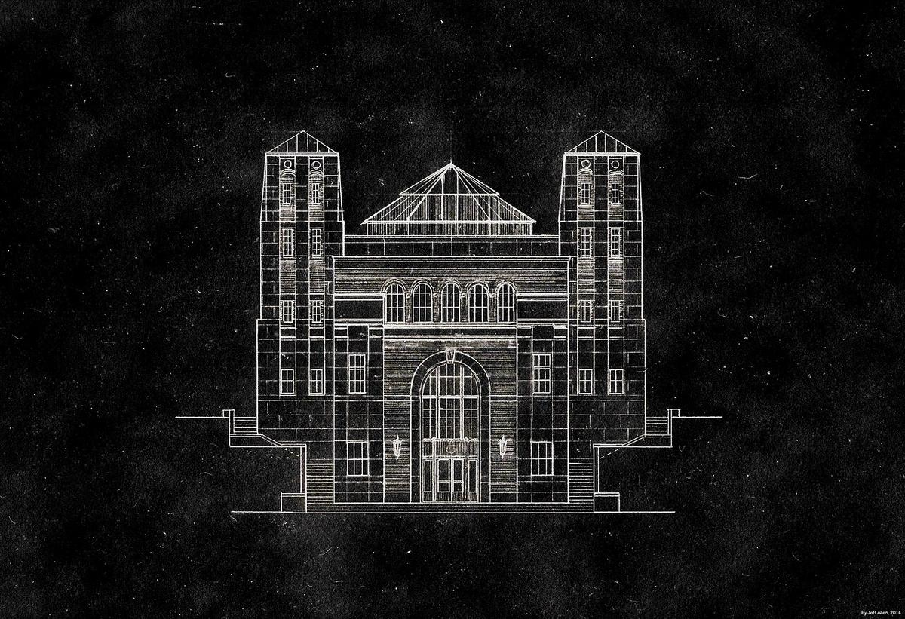
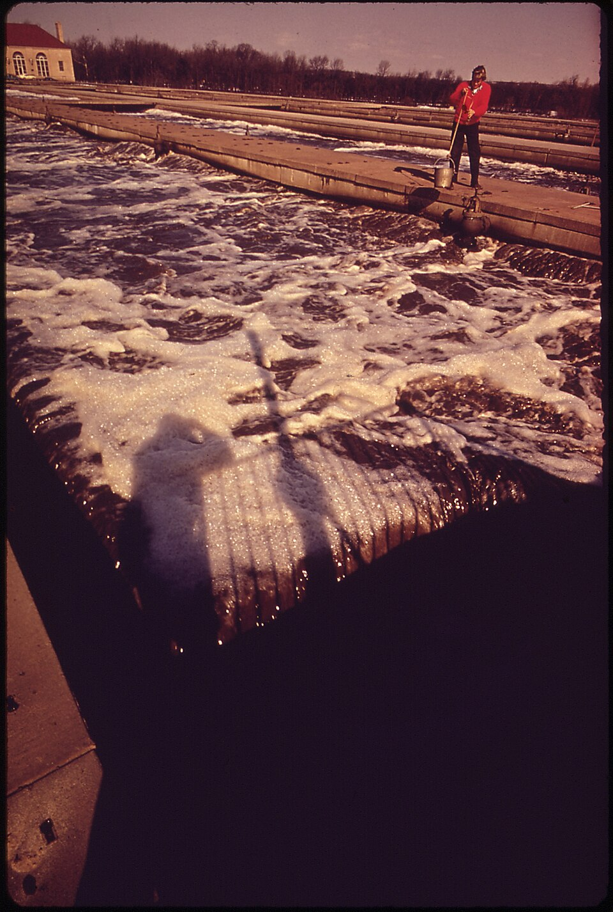
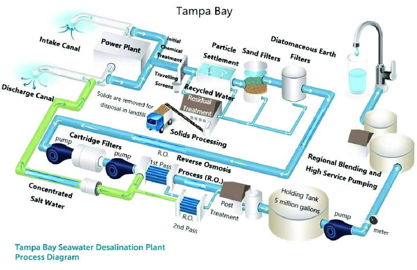
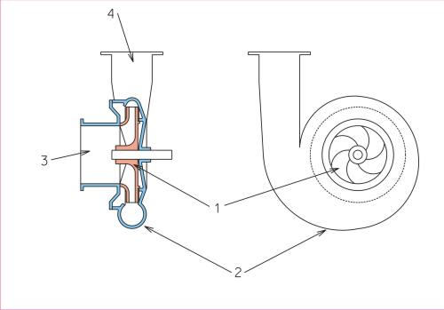
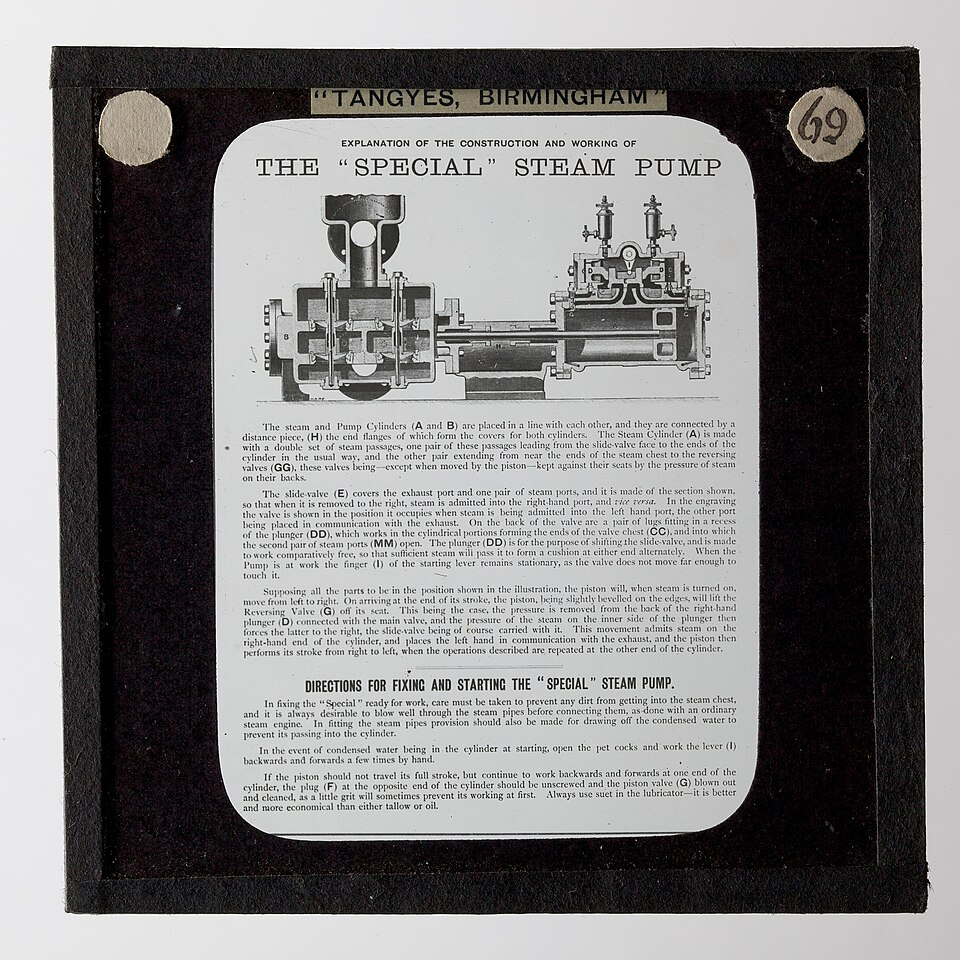
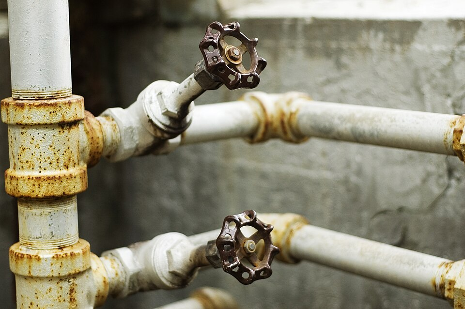
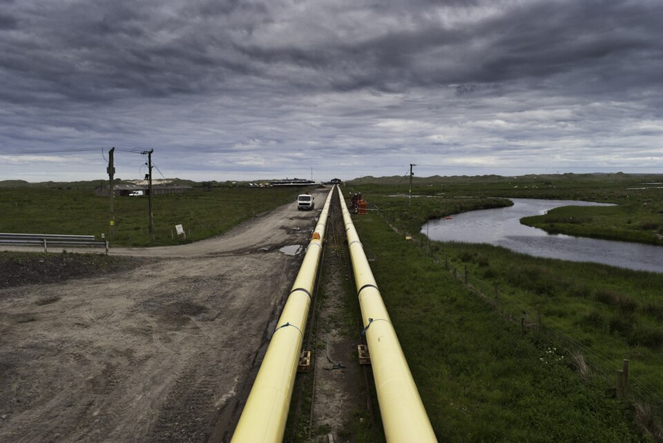

# Water Infrastructure

> *RC Harris Water Treatment Plant - Filtration Building - South Elevation*

> *Image: Jamaps, CC BY-SA 4.0*

Capabilities in this domain:

<!-- TODO: source image for Water Procurement -->
- [Water Procurement](procurement.md) — wells, rainwater harvesting, spring development, surface water collection
<!-- TODO: source image for Water Distribution -->
- [Water Distribution](distribution.md) — aqueducts, pipes, gravity-fed and pressurized systems, reservoirs
<!-- TODO: source image for Basic Water Treatment -->
- [Basic Water Treatment](basic-treatment.md) — slow sand filtration, chlorination, boiling, solar disinfection

> *Image: David Dixon, CC BY-SA 2.0*

- [Sewage Collection & Treatment](sewage.md) — sewage collection, primary and secondary treatment, sludge disposal
<!-- TODO: source image for Desalination -->
- [Desalination](desalination.md) — reverse osmosis, multi-stage flash distillation, electrodialysis

> *Image: Shen Yizhi; Wei Minrui; Hou Bowen, CC BY 4.0*

- [SEM Tech Water Treatment](sem-tech-water-treatment.md) — membrane desalination and purification

> *Image: Jonasz at Polish Wikipedia, CC BY-SA 3.0*

- [Centrifugal Pump](centrifugal-pump.md) — Rotodynamic pumps for water supply, circulation, and industrial fluid transfer at moderate heads and flows.

> *Image: Unknown authorUnknown author, Public domain*

- [Positive Displacement Pump](positive-displacement-pump.md) — Piston, diaphragm, and gear pumps for precise dosing and high-pressure fluid transfer.

> *Image: SwarmCheng, CC BY-SA 4.0*

- [Water Valves](water-valves.md) — Gate, globe, ball, check, and pressure-reducing valves for controlling water flow in distribution systems.

> *Image: Massachusetts. Metropolitan District Water Supply Commission; Cushman, Allerton R., 1907-1999, Public domain*

- [Pipe Fabrication](pipe-fabrication.md) — Metal and plastic pipe manufacturing, threading, welding, and jointing for fluid distribution systems.

> *Image: Federal Bureau of Investigation, Public domain*

- [Filtration Equipment](filtration-equipment.md) — Sand filters, cartridge filters, membrane housings, and associated equipment for water and process fluid filtration.
[↑ Back to Tech Tree](../index.md)
